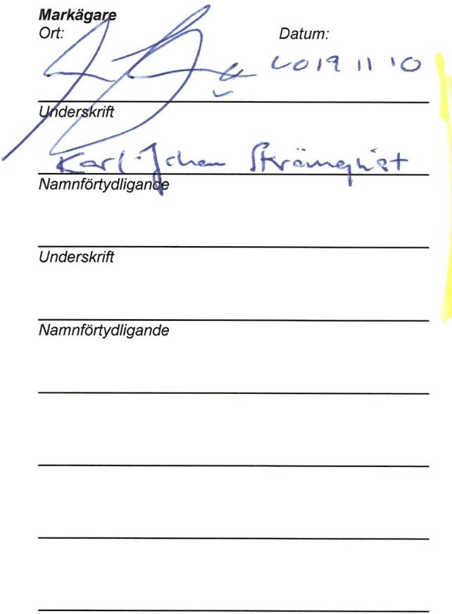
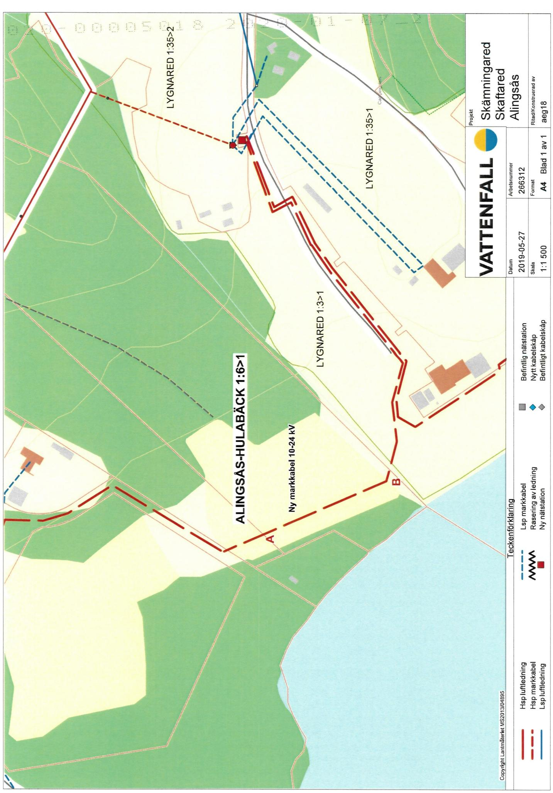

Lantmateriet Fastighetsinskrivning SE76180Norrtalje Telefon: 0771-636363

Arendenr: D-2020-00005018   
Inskrivningsdatum: 2020-01-07   
Innehall: Avtalsrattighet   
Fastighet: ALINGSAS ALINGSAS-HULABACK 1:6

# Enligt ansokan har foljande inskrivningsatgard beviljats:

Avtalsservitut Kraftledning D-2020-00005018:1

Om rattigheten upphor helt eller delvis ska rattighetshavaren ansoka om att inskrivningen ska tas bort.   
Det ska goras inom tre manader fran att rattigheten upphort.

Besluti detta arende har fattats av Semir Lagumdzija.

# Kostnadsspecifikation:

Expeditionsavgift 375 SEK

Fragor rorande beslut eller ev. avgifteri arendet besvaras av Fastighetsinskrivningen enligt kontaktuppgifter langst upp pa denna sida.

I de fall originalhandlingar, som lamnats in i samband med ansokan ska returneras (ex.   
kopebrev), gors detta i separat forsandelse.

# Delta i var kundnöjdhetsundersökning

Vad tycker du som kund om Lantmateriet? Beratta genom at svara pa nagra fragor och var med och   
tavla om biobijetter.Tack for hjalpen!   
Till enkaten: www.lantmateriet.se/kundsvar

Om du har en smarttelefon kan du anvanda den for attlasa av QR-koden och komma tll enkaten.

# Markupplatelseavtal avseende elektrisk starkströmsanläggning

<table><tr><td rowspan=1 colspan=5>imark (jordkabel)                     □i luft (luftledning)                     □nätstation</td></tr><tr><td rowspan=1 colspan=5>Belastad fastighet</td></tr><tr><td rowspan=1 colspan=3>Fastighet (fastighetsagarens)Alingsas-Hulaback 1:6</td><td rowspan=3 colspan=2>Kontaktperson (namn, adress, telefon)Karl-Johan StromqvistPojkevägen 244195 AlingsasOriginalavtalet skickas till kontaktpersonen</td></tr><tr><td rowspan=1 colspan=1>KommunAlingsas</td><td rowspan=1 colspan=2>LänVastra Götaland</td></tr><tr><td rowspan=1 colspan=3>Fastighetsagare (namn, personnummer/organisationsnummer)Karl-Johan Strömqvist, 19851212Vid fler delagare se separat delagarbilaga</td></tr><tr><td rowspan=1 colspan=3>Förmansfastighet</td><td rowspan=1 colspan=2>Projektsinformation</td></tr><tr><td rowspan=1 colspan=3>Fastighet (ledningsagarens)Begonian 10</td><td rowspan=2 colspan=2>Projektnamn:            Skamningared - SkaftaredProjektnummer (NIS):   266312Ledningslitera:Transformator (nr):</td></tr><tr><td rowspan=1 colspan=2>KommunVanersborg</td><td rowspan=1 colspan=1>LänVästra Götaland</td></tr><tr><td rowspan=1 colspan=3>Ledningsagare (namn, organisationsnummer)Vattenfall Eldistribution AB, Org.nr 556417-0800</td><td rowspan=1 colspan=2>Ansvarig Projektledare: Hans Lundqvist</td></tr><tr><td rowspan=1 colspan=5>Ersattning</td></tr><tr><td rowspan=1 colspan=4>Total ersattning enligt bifogat varderingsprotokoll:</td><td rowspan=1 colspan=1>1395kr</td></tr><tr><td rowspan=1 colspan=3>Utanordning34005860</td><td rowspan=1 colspan=1>Datumaiaoa</td><td rowspan=1 colspan=1>SignaturD</td></tr></table>

# s1 Upplatelsens omfattning

Fastighetsgaren meder ledinggren rt t nlg ch frl framtid bibhlla samtat vid beho foa elektrisk starkstromsledning med en systemspanning av hogst $2 4 \times 1$ dels lufledning jmte tilhorande anordningar sasom stolpar,， stag, linor ta benämnt ledningen.

b) Fastighetsagaren upplater för luftledningen ett utrymme om $1 2 m$ horisontell bredd i skogsmark (skogsgata) och erforderligt utrymmei ovrig mark samt for markkabeln ett utrymme om $4 m$ horisontell bredd i skogsmark (skogsgata) och 1 m bredd iovrig mark (schaktbredd). For transformatorstation upplates ett utrymme om $\boldsymbol { \mathfrak { o } } \times \boldsymbol { \mathfrak { o } } \mathrm { ~ m ~ }$

For ledningens anlggande, tilsyn, underhall,reparationoch föryelse, far vid varje tilflle erforderligt omrdeyias.

c) Fastightne eingaegnne ffeingn fllisapa fälld vegetation förblir fastighetsagarens egendom.

d) Fastigtfiii underhl repratioch frelvaidledninggarehaaemndetaanskeutan sentiglgenhet, ia fastighetsagaren givna anvisningar betraffande rtten a ta vǎg.

# $\ S 2$ Föreskrifter

a) Ledningsagaren ska utova rattigheterna sa att egendomen inte betungas mer n nödvandigt.

b) Markaeeheteafgsina soalvidiune ledningens anlaggande efter anlaggandet ska kunna utovas ovanfor markkabeln.

Markabesgarfgspsaatoal sruksetdeidunktenfr eninesnlandef a i kmbinatinmed sosbruktrer ssouna transporteinebr atmarkabeuppenbartriserara saas s atgärderna omedelbart avbrytas och ledningsagaren kontaktas.

Markabel a inomvgmre fensidvg forgs p sdant  a omal ynechunderhall vgen efe nlgnde inte forsvaras.

c) ochnarmaste byggnadsel uppg til mint $5 m$ Avstandet mellan stolpe med transfomator och brnnbar byggnadsdel eer pplag ska uppga till minst 15 m. Motsvarande matt for transformatorstation är minst $\textsf { s m }$

frn al uteingippl irlarivn markkabeln sa att reparation och underhall försvaras.

d) sakkunnig personal anvisa eller vidta limpliga skyddsatgärder.

einsi anvisade skyddsatgarderna.

# 3 Tillträde

Ledningsagaren far omedelbart ta i ansprak de i enlighet med $\ S$ 1 upplatna rättigheterna. Tiltrade anses ha skett da anlaggande av elle staknings- och matningsarbeten.

# $\ S 4$ Ersättning

a) tillmpas vid tidpunkten for tiltrade.

overenskommelse om ersattning traffats och erforderlig koncession och ovriga tillstand erhallits.

Har tiltrade agt rum innan ersattningen erlggs, ska ersattning for intrang upprknas enligt 4 kap $4 \ S$ expropriationslagen fran den dag tiltriefiiiunefaneelini ng expropriationslagen utga pa det upprknade beloppet fran och med tiltrdesdagen til och med betalningsdagen.

b) Frsvfinilele

ersattning erlagts tidigare.

Nar abonnemangsförhallande föreligger ska ersattning dock inte betalas föor obetydlig skada.

Uppkoe erin r  si frsteengertinen suti estansoie ska behandlas enligt detta stycke.

d) med rattighetshavaren for bestammande av den ersattning som denne ar berättigad til.

Kan overenskommelseom eratning inte trfas,ska tvisten avgoras vid ledningsforrattning om sdan pgrellerv

# $\$ 5$ Virkeshantering mm.

Ledninggaeintrid franleennatmainfoatiifastietsgaefrestenderi att inom skalig tid svara for avverkningen.

leningrefaerkingneingarefveniaranetietngreain falls utanfor engangsersatt skogsgata.

fara forinsetsangreinerfiesrasotereerernobetyigolgenet fendeanvndningpst.

# s 6 Ledningsförrattning m.m.

Detta avtal far laggas till grund for beslut om ledningsratt sasom overenskommelse enligt $1 4 \ S$ forsta stycket ledningsrattslagen. Avtalet fal overlatelse ellerupplatelseavgendomen ellera ledningen berord del drav goraforbehal omdetta avtals bestand.

Omledninggarenmd tod avdennabestmmelensker ledninsrt bitrer fastighetsgarenratighetshavaren anoan.

Leninvelinaie skyldigheteridetta avtal.

# $\$ 8$ Borttagande av ledning

Oeingenentaieingsinestileef f meiif ii samband harmed tillse att markkabeln med tilihorande anordningar tas bort.

$\ S 9$ Särskilda bestammelser

# S 10 Förekomst av arrende/nyttjanderätt/servitut

pa annat satt?

Nej

ratt berors.

Av detta avtal har tva likalydande exemplar upprattats och utvaxlats mellan parterna.

Ledningsägare Ort:

Datum:

# Underskrift

<table><tr><td rowspan=1 colspan=6>FASTIGHET /SAMFALLIGHET Samt PROJEKTINFORMATION                                                       Version 2019 (2018.12.20)</td></tr><tr><td rowspan=1 colspan=1>Fastighetsbeteckning:Kommun:Fastighetsnummer:Kontaktperson &amp; adress:</td><td rowspan=1 colspan=3>Alingsas-Hulabäck 1:6                                     Projektnummer:Alingsas                                                       Ledning:Koncessionslöpnr:Karl-Johan Stromqvist                                 Varderingstidpunkt:Pojkevägen 3, 441 95 Alingsas                      Varderingsman &amp; foretag:</td><td rowspan=1 colspan=2>2663122019-02-12aeg18</td></tr><tr><td rowspan=1 colspan=4>1. SCHABLONERSATTNING FOR MARKLEDNING IAKER, BETE, IMPEDIMENT(Ej SkogSimpediment)</td><td rowspan=1 colspan=2></td></tr><tr><td rowspan=1 colspan=3>Beskrivning (typ, placering, etc)</td><td rowspan=1 colspan=1>Lǎngd</td><td rowspan=1 colspan=1>Bredd</td><td rowspan=1 colspan=1>Ersäittning</td></tr><tr><td rowspan=1 colspan=3>Ny markkabel 10-24kV, A-B</td><td rowspan=1 colspan=1>80m</td><td rowspan=1 colspan=2>1m               319kr</td></tr><tr><td rowspan=1 colspan=6>Summa:          319kr</td></tr><tr><td rowspan=1 colspan=6>2.SCHABLONERSATTNING FOR NATSTATIONER OCH KABELSKAP (Ej inom detaljplan)</td></tr><tr><td rowspan=1 colspan=2>Beskrivning (typ, placering, yta, etc)</td><td rowspan=1 colspan=2>Typ och markslag</td><td rowspan=1 colspan=1>Antal</td><td rowspan=1 colspan=1>Ersättning</td></tr><tr><td rowspan=1 colspan=2></td><td rowspan=1 colspan=2></td><td rowspan=1 colspan=2></td></tr><tr><td rowspan=1 colspan=6>Summa:             kr</td></tr><tr><td rowspan=1 colspan=6>3.ERSATTNING FOR HiNDER I AKERMARK - För ersattningsberakning se bilaga</td></tr><tr><td rowspan=1 colspan=5>Beskrivning (typ, placering, etc)</td><td rowspan=1 colspan=1>Ersäittning</td></tr><tr><td></td><td></td><td></td><td></td><td></td><td></td></tr><tr><td rowspan=1 colspan=6>Summa:             kr</td></tr><tr><td rowspan=1 colspan=6>4 a. ERSATTNING FOR LEDNING I SKOGSMARK - För ersattningsberakning se bilaga</td></tr><tr><td rowspan=1 colspan=5>Beskrivning (typ, placering,etc)</td><td rowspan=1 colspan=1>Ersättning</td></tr><tr><td></td><td></td><td></td><td></td><td></td><td rowspan=1 colspan=1></td></tr><tr><td rowspan=1 colspan=6>Summa:</td></tr><tr><td rowspan=1 colspan=6>4 b. ROTNETTO (Ersatts separat) - För ersattningsberakning se bilaga</td></tr><tr><td rowspan=1 colspan=6>Anvinds för berkning avpaslag (25%enligt expropriationslagen samt20% srskild ersittning förverenskommelse)</td></tr><tr><td rowspan=1 colspan=6>Totalt rotnetto enligt bilaga:                                                      Ersaittning for rotnetto regleras i bilaga</td></tr><tr><td rowspan=1 colspan=6>5. ERSATTNING FOR ÖVRIGT INTRANG - FOr ersättningsberäkning se bilaga</td></tr><tr><td rowspan=1 colspan=5>Beskrivning (typ, placering, etc)</td><td rowspan=1 colspan=1>Ersättning</td></tr><tr><td></td><td></td><td></td><td></td><td></td><td rowspan=1 colspan=1></td></tr><tr><td rowspan=1 colspan=6>Summa:          -kr</td></tr><tr><td rowspan=1 colspan=6>6 a. ERSATTNING FOR LEDNINGISKOGSMARK ENLIGT STORSKOGSBRUKSAVTALET</td></tr><tr><td rowspan=1 colspan=3>Beskrivning (typ, placering, etc)                   Omrade:</td><td rowspan=1 colspan=1>Lǎngd</td><td rowspan=1 colspan=1>Bredd</td><td rowspan=1 colspan=1>Ersättning</td></tr><tr><td rowspan=1 colspan=3></td><td rowspan=1 colspan=1></td><td rowspan=1 colspan=2></td></tr><tr><td rowspan=1 colspan=6>Summa:             kr</td></tr><tr><td rowspan=1 colspan=6>6 b. ERSATTNING FOR INTRANG INOM VAGANLAGGNING ENLIGT STORSKOGSBRUKSAVTALET</td></tr><tr><td rowspan=1 colspan=3>Beskrivning (typ, placering, etc)</td><td rowspan=1 colspan=1>Längd</td><td rowspan=1 colspan=1>Zon</td><td rowspan=1 colspan=1>Ersättning</td></tr><tr><td rowspan=1 colspan=3></td><td rowspan=1 colspan=1></td><td rowspan=1 colspan=2></td></tr><tr><td rowspan=1 colspan=6>Summa:          - kr</td></tr><tr><td rowspan=1 colspan=6>7. SAMMANSTALLNING</td></tr><tr><td rowspan=1 colspan=6>Tillagg enligt expropriationslagen:           80krSarskild ersattning för overenskommelse:          80krTillig for minimiersattning:         916kr</td></tr><tr><td rowspan=1 colspan=6>TOTAL ERSATTNING       1395 kr</td></tr></table>

Fstig utgar ranta enligt 6 s rntelagen. Tilfalliga skador regleras vid skadetillfäillet.

Ovanstaende godknns ochersittning sitts in pa följiande konto (vriga delgare redovisas pa foliande sida/sidor)

Fastighetsigare (födelsedatum/org.nr) Ägd andel Ersättning Fastighetsggarens godkännande   
Karl-Johan Strömqvist, 19851212 1 1395,00kr   
Banknamn: Clearingnr: Kontohummer, Pg/Bg, BAN& SWIFT\*: SEB 0067508 0738262667 k-kpsnu