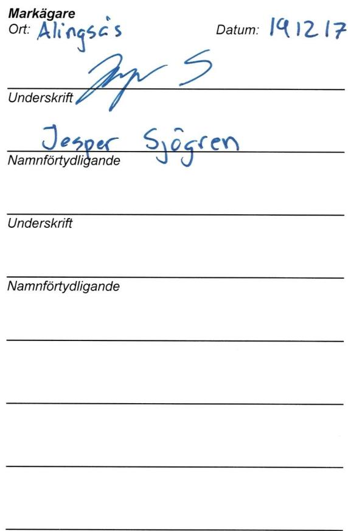

Lantmateriet Fastighetsinskrivning SE76180Norrtalje Telefon: 0771-636363

Arendenr: D-2020-00040677   
Inskrivningsdatum: 2020-01-31   
Innehall: Avtalsratighet   
Fastighet: ALINGSASLYGNARED1:3   
Sökande: 556417-0800,Vattenfall EIdistributionAB

# Enligt ansokan har foljande inskrivningsatgard beviljats:

Avtalsservitut Kraftledning D-2020-00040677:1

Om rattigheten upphor helt eller delvis ska rattighetshavaren ansoka om att inskrivningen ska tas bort.   
Det ska goras inom tre manader fran att rattigheten upphort.

Besluti detta arende har fattats av Sara Olsson.

# Kostnadsspecifikation:

Expeditionsavgift 375 SEK

Fragor rorande beslut eller ev. avgifter i arendet besvaras av Fastighetsinskrivningen enligt kontaktuppgifter langst upp pa denna sida.

I de fall originalhandlingar, som lamnats in i samband med ansokan ska returneras (ex.   
kopebrev), gors detta i separat forsandelse.

# Delta i var kundnojdhetsundersökning

Vad tycker du som kund om Lantmateriet? Beraitta genom att svara pa nagra fragor och var med och   
tavla om biobiljetter.Tack for hjalpen!   
Till enkaten:www.lantmateriet.se/kundsvar

Om du har en smarttelefon kan du anvanda den for att lasa av QR-koden och komma til enkaten.

# Markupplatelseavtal avseende elektrisk starkstromsanlaggning

<table><tr><td rowspan=1 colspan=5>imark(jordkabel)                      i luft (luftledning)                      natstation</td></tr><tr><td rowspan=1 colspan=5>Belastad fastighet</td></tr><tr><td rowspan=1 colspan=3>Fastighet (fastighetsagarens)Lygnared 1:3</td><td rowspan=3 colspan=2>Kontaktperson (namn, adress, telefon)Alingsas kommun44195 AlingsasOriginalavtalet skickas till kontaktpersonen</td></tr><tr><td rowspan=1 colspan=1>KommunAlingsas</td><td rowspan=1 colspan=2>LänVastra Götaland</td></tr><tr><td rowspan=1 colspan=3>Fastighetsagare (namn, personnummer/organisationsnummer)Alingsas Kommun,212000-1553Vid fler delagare se separat delagarbilaga</td></tr><tr><td rowspan=1 colspan=3>Förmansfastighet</td><td rowspan=1 colspan=2>Projektsinformation</td></tr><tr><td rowspan=1 colspan=3>Fastighet (ledningsagarens)Begonian 10</td><td rowspan=2 colspan=2>Projektnamn:            Skämningared-SkaftaredProjektnummer (NIS):   266312Ledningslittera:Transformator (nr):</td></tr><tr><td rowspan=1 colspan=2>KommunVanersborg</td><td rowspan=1 colspan=1>LänVastra Götaland</td></tr><tr><td rowspan=1 colspan=3>Ledningsagare (namn, organisationsnummer)Vattenfall EIdistribution AB, Org.nr 556417-0800</td><td rowspan=1 colspan=2>Ansvarig Projektledare:</td></tr><tr><td rowspan=1 colspan=5>Ersattning</td></tr><tr><td rowspan=1 colspan=4>Total ersattning enligt bifogat varderingsprotokoll:</td><td rowspan=1 colspan=1>5701kr</td></tr><tr><td rowspan=1 colspan=3>Utanordning</td><td rowspan=1 colspan=1>Datum200114</td><td rowspan=1 colspan=1>Signatur</td></tr></table>

Srskienn viveeneluteaialtietotsarau(2)pnteltprias \*\*Omerstningens totalsummaejverstierre()prcentavatueltprisaselpperallsminimiertning ptotalt $1 3 9 5 k r$ (id:)

# 1 Upplatelsens omfattning

Fastighetsgaren meder ledinggaren rt t anlgg och frl framtid bibehalla samtat vidbeho forya elektrisk starkstromsledning med en systemspǎnning av hogst $2 4 \times 1 .$ ,dels luftledning jamte tilhorande anordningar sasom stolpar， stag， linor, tsf benämnt ledningen.

b) Fastighetsagaren upplater for luftledningen ett utrymme om $^ { 1 2 \mathsf { m } }$ horisontell breddi skogsmark (skogsgata) och erforderligt utrymmei ovrig mark samt for markkabeln ett utrymme om $4 \textrm { m }$ horisontell bredd iskogsmark (skogsgata) och 1 m bredd i ovrig mark (schaktbredd). For transformatorstation upplates ett utrymme om $6 \times 6 m$

For ledningensanlgande, illsy, underhll reparationch foryelse, fr vivare ilflleerforderit mrdeyas.

c) Fastighetgarened eingaentagndnuch fraeeffeninlistaoppa vegatifflliailiingi fälld vegetation förblir fastighetsagarens egendom.

d) astigetfaiiii underhal reparationchforelevaid leninggarehaaenmndeansutan sentigolgehet,i fastighetsagaren givna anvisningar betraffande ratten att ta vag.

# $\ S 2$ Foreskrifter

a) Ledningsagaren ska utova rattigheterna sa att egendomen inte betungas mer an nodvandigt.

b) Markabelsaerhbetemar fgaspsdantsabrkningmetoeremark soromalavidtiduntenf ledningens anlaggande efter anlaggandet ska kunna utovas ovanfor markkabeln.

Markab sgar fgspsanaoalassruketeunktenfr eningensnlgandeefr f ikombinationmedsosbrkstrderssomtunga transportinebratmarkabelnuppenbatrikeraraskadas sadc atgarderna omedelbart avbrytas och ledningsagaren kontaktas.

87 Överlatelse av ledningen

L skyldigheteri detta avtal.

# s8 Borttagande av ledning

eingnagiingistienenef samband harmed tillse att markkabeln med tilihorande anordningar tas bort.

# 9 Sarskilda bestammelser

# S 10 Förekomst av arrende/nyttjanderatt/servitut

pa annat satt?

# Nej

ratt berors.

Ledningsagare Ort:

Datum:

Underskrift

Namnförtydligande

Ovanstaende godknns och ersittning satts in pa foljiande konto (vriga delagare redovisas pa foliande sida/sidor)   

<table><tr><td rowspan=1 colspan=5>FASTIGHET / SAMFALLIGHET Samt PROJEKTINFORMATION                                                       Version 2019 (2018.12.20)</td></tr><tr><td rowspan=1 colspan=1>Fastighetsbeteckning:Kommun:Fastighetsnummer:Kontaktperson &amp; adress:</td><td rowspan=1 colspan=1>Lygnared 1;3AlingsasAlingsas kommun441 81 Alingsas</td><td rowspan=1 colspan=2>Projektnummer:Ledning:Koncessionslöpnr:Varderingstidpunkt:Varderingsman &amp; foretag:</td><td rowspan=1 colspan=1>2663122019-02-12aeg18</td></tr><tr><td rowspan=1 colspan=4>1. SCHABLONERSATTNING FOR MARKLEDNING IAKER, BETE, IMPEDIMENT (Ej skogSimpediment)</td><td rowspan=1 colspan=1></td></tr><tr><td rowspan=1 colspan=3>Beskrivning (typ,placering, etc)</td><td rowspan=1 colspan=1>Lǎngd</td><td rowspan=1 colspan=1>Bredd</td></tr><tr><td rowspan=1 colspan=3>Ny markkabel0,4-1 kVNy markkabel 10-24kV</td><td rowspan=1 colspan=1>5m371m</td><td rowspan=1 colspan=1>1m1m</td></tr><tr><td rowspan=1 colspan=5>Summa:        1501kr</td></tr><tr><td rowspan=1 colspan=5>2. SCHABLONERSATTNING FOR NATSTATIONER OCH KABELSKAP (Ej inom detaljplan)</td></tr><tr><td rowspan=1 colspan=2>Beskrivning typ,placering, yta, etc)</td><td rowspan=1 colspan=2>Typ och markslag</td><td rowspan=1 colspan=1>Antal</td></tr><tr><td rowspan=1 colspan=2>Ny nätstation</td><td rowspan=1 colspan=2>Natstation-Impediment</td><td rowspan=1 colspan=1>1</td></tr><tr><td rowspan=1 colspan=5>Summa:        2300kr</td></tr><tr><td rowspan=1 colspan=5>3. ERSATTNING FOR HINDER IAKERMARK - For ersattningsberakning se bilaga</td></tr><tr><td rowspan=1 colspan=4>Beskrivning (typ,placering,etc)</td><td rowspan=1 colspan=1>Ersaittning</td></tr><tr><td></td><td></td><td></td><td></td><td rowspan=1 colspan=1></td></tr><tr><td rowspan=1 colspan=5>Summa:              kr</td></tr><tr><td rowspan=1 colspan=5>4 a. ERSATTNING FOR LEDNING I SKOGSMARK -FOr ersttningsberäkning se bilaga</td></tr><tr><td rowspan=1 colspan=4>Beskrivning (typ,placering,etc)</td><td rowspan=1 colspan=1>Ersaittning</td></tr><tr><td></td><td></td><td></td><td></td><td rowspan=1 colspan=1></td></tr><tr><td rowspan=1 colspan=5>Summa:              kr</td></tr><tr><td rowspan=1 colspan=5>4 b. ROTNETTO (Ersatts separat) - För ersattningsberakning se bilaga</td></tr><tr><td rowspan=1 colspan=5>Anvands för berkning av paslag (25%enligt expropriationslagen samt 20%srskildersittning for overenskommelse)</td></tr><tr><td rowspan=1 colspan=5>Totalt rotnetto enligt bilaga:                                                     Ersattning for rotnetto regleras i bilaga</td></tr><tr><td rowspan=1 colspan=5>5. ERSATTNING FOR ÖVRIGT INTRANG -For ersattningsberakning se bilaga</td></tr><tr><td rowspan=1 colspan=4>Beskrivning(typ,placering,etc)</td><td rowspan=1 colspan=1>Ersättning</td></tr><tr><td></td><td></td><td></td><td></td><td rowspan=1 colspan=1></td></tr><tr><td rowspan=1 colspan=5>Summa:             kr</td></tr><tr><td rowspan=1 colspan=5>6 a. ERSATTNING FOR LEDNING ISKOGSMARK ENLIGT STORSKOGSBRUKSAVTALET</td></tr><tr><td rowspan=1 colspan=3>Beskrivning (typ, placering, etc)                   Omrade:</td><td rowspan=1 colspan=1>Lǎngd</td><td rowspan=1 colspan=1>Bredd</td></tr><tr><td rowspan=1 colspan=3></td><td rowspan=1 colspan=1></td><td rowspan=1 colspan=1></td></tr><tr><td rowspan=1 colspan=5>Summa:             kr</td></tr><tr><td rowspan=1 colspan=5>6 b. ERSATTNING FOR INTRANG INOM VAGANLAGGNING ENLIGT STORSKOGSBRUKSAVTALET</td></tr><tr><td rowspan=1 colspan=3>Beskrivning (typ, placering, etc)</td><td rowspan=1 colspan=1>Lángd</td><td rowspan=1 colspan=1>Zon</td></tr><tr><td rowspan=1 colspan=3></td><td rowspan=1 colspan=1></td><td rowspan=1 colspan=1></td></tr><tr><td rowspan=1 colspan=5>Summa:</td></tr><tr><td rowspan=1 colspan=5>7. SAMMANSTALLNING</td></tr><tr><td rowspan=1 colspan=5>Tillagg enligt expropriationslagen:          950krSarskild ersättning for overenskommelse:         950 krTilagg for minimiersattning:          - kr</td></tr><tr><td rowspan=1 colspan=5>TOTAL ERSATTNING       5701kr</td></tr></table>

F utgar ranta enligt 6  rantelagen. Tilfalliga skador regleras vid skadetilfallet.

Fastighetsigare (födelsedatum/org.nr) Ågd andel Ersäittning Fastighetsagarens godkannande Underskrift/Datum:   
Alingsas kommun, 212000-1553 1 5701,00kr 191217   
Sparbenken Alinssis Clearingnr: 20   
Referens: Telefonnummer: E-post:   
Explogtering 0322-616211 jesper.Sjogen@ clngse.e