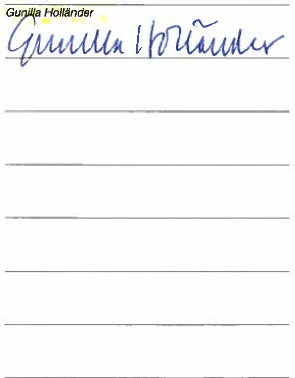
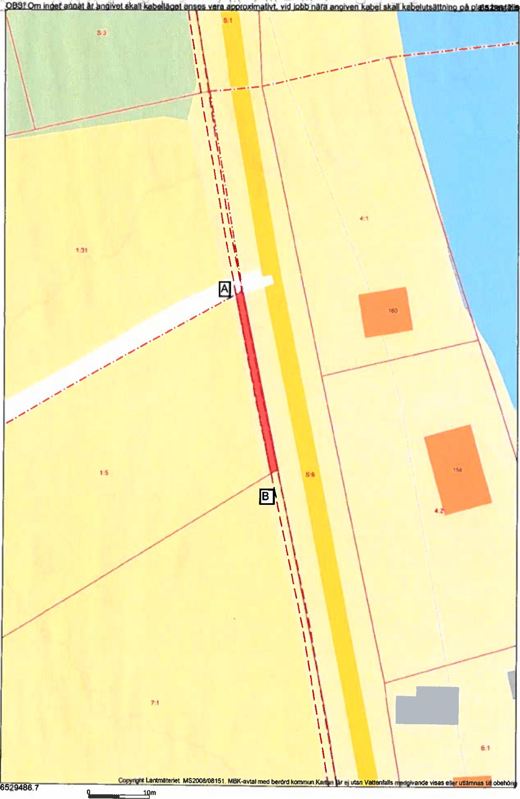

Lantmateriet Fastighetsinskrivning SE 761 80 Norrtalje Telefon: 0771-63 63 63

Arendenr: D-2020-00047813 Inskrivningsdatum: 2020-02-05 Innehall: Avtalsrättighet Fastighet: ASKERSUND ASKERSUNDSBY 1:5

# Enligt ansökan har följande inskrivningsatgärd beviljats:

Avtalsservitut Kraftledning D-2020-00047813:1

Om ratigheten upphor helt eller delvis ska ratighetshavaren ansoka om att inskrivningen ska tas bort.   
Det ska göras inom tre manader fran att rätigheten upphort.

Beslut i detta ärende har fattats av Annelie Karlsson.

# Kostnadsspecifikation:

Expeditionsavgift 375 SEK

Fragor rörande beslut eller ev. avgifter i ärendet besvaras av Fastighetsinskrivningen enligt kontaktuppgifter langst upp pa denna sida.

I de fall originalhandlingar, som lämnats in I samband med ansökan ska returneras (ex.   
köpebrev), görs detta i separat försandelse.   
Delta i var kundnöjdhetsundersǒkning   
Vad tycker cdu som kund om Lantmäteriet? Beratta genom at svara pa nagra fragor och var med och   
tavla om biobiljetter. Tack for hjalpen!   
Till enkäten: www.lantmateriet.se/kundsvar

Om du har en smarttelefon kan du anvanda den för attlisa av QR-koden och komma til enkaten.

# Markupplatelseavtal avseende elektrisk starkstromsanlaggning

<table><tr><td rowspan=1 colspan=5>imark (jordkabel)                     nätstation</td></tr><tr><td rowspan=1 colspan=5> Belastad fastighet</td></tr><tr><td rowspan=1 colspan=3>Fastighet (fastighetsagarens)Askersundsby 1:5</td><td rowspan=3 colspan=2>Kontaktperson (namn, adress, telefon)Gunilla HolländerAskersundsby Västra Gardsjötorp 409696 91 AskersundOniginalavtalet skickas til kontaktpersonen</td></tr><tr><td rowspan=1 colspan=1>KommunAskersund</td><td rowspan=1 colspan=2>LǎnÖrebro</td></tr><tr><td rowspan=1 colspan=3>Fastighetsagare (namn, personnummer/organisationsnummer)Gunilla Holländer. 19450704Vid ffer delāgare se separat delāgarbilaga</td></tr><tr><td rowspan=1 colspan=3> Förmansfastighet</td><td rowspan=1 colspan=2>Projektsinformation</td></tr><tr><td rowspan=1 colspan=3>Fastighet (ledningsagarens)Nyköpings Bruk 6</td><td rowspan=2 colspan=2>Projektnamn:            Norra Hunna VindkraftProjektnummer (NIS):   268759Ledningslittera:Transformator (nr):</td></tr><tr><td rowspan=1 colspan=2>KommunNyköping</td><td rowspan=1 colspan=1>LǎnSödermanland</td></tr><tr><td rowspan=1 colspan=3>Ledningsǎgare (namn, organisationsnummer)Vattenfall Eldistribution AB, Org.nr 556417-0800</td><td rowspan=1 colspan=2>Ansvarig Projektledare: Magnus Bengtsson</td></tr><tr><td rowspan=1 colspan=5>Ersattning</td></tr><tr><td rowspan=1 colspan=4>Total ersattning enligt bifogat värderingsprotokoll:</td><td rowspan=1 colspan=1>1 395 kr</td></tr><tr><td rowspan=1 colspan=3>Utanordning</td><td rowspan=1 colspan=1>Datum191205</td><td rowspan=1 colspan=1>SignaturCA</td></tr></table>

Srskidrnviderseluaal0ieotsau20)peliael Omerinoauaeersie()prcauelpriseles nieringpal5.

# 51 Upplatelsens omfattning

a) Fastighetsagaren medger ledningsagaren rtt at anligga och foral framtid bibhala samtat id behov foyaelektrisk stakstromslening(markabel) meden systemspnning avhogst24k.jmte tilhorandeanordingar ssom transfoatorer som ledningen redovisas pa bifogad kartskiss och/eller blivit utstakadpá marken alt nedan benamnt ledningen.

b) Fasighetsgaren uppater for ledningen et utrymmeom4mhorisontll breddiskogsmark (skgsgata),1 m bredivrig mark (schaktbredd) samt $0 \times 0 m$ for transformatorstation.

For ledningens anlggande tilsyn, underhall,reparationoch foyelse, far vid varje tilfale erforderligt omradenytias.

c) Fastighetsgaren medger ledningsgaren rat atpa egendomen nu och framdeles fllaller kvista trdoch vegetation somr ellerkan bli hinderli frledningensanlggnde tilsynunderharparation， foyelseoch drit.Atgrdera r ufrsmed intervall somr anpassadetillet rationelltunderha. Fallda trdochfalldvegtationfrbli fastighetsgarensegendm.

d) Fastighetsgarenmedger ledninggaren rtaterforderligomaningga tiltrdetileendomen frledningens anlande tilsunderhreparationchfyelsearidnngarnharatdenmndeanseuanvsentiolgeneti av fastighetsagaren givna anvisningar betraffande rätten at ta vag.

# $\$ 2$ Föreskrifter

) Ledningsǎgaren ska utova rätigheterna sa at egendomen inte betungas mer an nǒdvandi b) Fastighetsaren r intendramakanvndningenuppfra byggdller annananlninganornaupplagelle iknans tecknande gllande skerhetsforeskriter far inte brǎnnbar byggnadsdel eller upplag finas nǎmare n 5 m fran transfommatorstation.

Byggnad eler annan anlggning far inte utan ledningsagarens medgivande och mnade instrukioner uppforas pa nare avstndnm frnmaabentehellrutan eninarens mdivandepplageleikadeaors ellearkin andras ovanfor markkabein sa att reparation och underhal forsvaras.

c) Fastighetarenrintetaneningarensd idinmtademedivandvatrd somkanmedfra farafien eller sommdfr aledningenanvallaskadap personeler eendom. Exempel sdngrdr atflard， sprng grava,schaktaller pa annat stndra marknivn.Viduorandeav sdanatgard aligger det ledningsgaren at rdovisa iedningens strackning och att genom sakkunnig personal anvisa eller vidta lampliga skyddsatgarder.

Om fasihetsgaresr nmofrndadmaaningcntevsrommar sa syddsatrderanisaseller vidtas av ledningsagaren utan kostnad for fastighetsgaren. Ledningsagaren svarar d aven for de merkostnader som uppkommer til fölid av de anvisade skyddsátgǎrderna.

d) Markabel skaikerch betesmark folggaspa sdant stat brukingsmetoer avkemark omr nomala vid tidpunkten for ledningens anlaggande efter anlaggandet ska kunna utovas ovanfor markkabeln.

Markabel skaiskogsmark forlaggas pa sadant satattnormala skogsbruksmetoder id idpunkten for ledningensanlggande efer anlandet ska kunnautovasividmarkkabelnoch noala transporter ska knnaskevermarkkabelnDa besria makalandenikobinatond sbrukstrdr ssomuna trnspoerinbra markbeppebariseraratt skadas ska dock atgarderna omedelbart avbrytas och ledningsǎgaren kontaktas.

Markabel ska inom vǎgomrade fr enskid vag förggas pà sadant stt at nomalt nytiande och underhal av vägen efer anlaggandet inte forsvaras.

# s3 Tiltrade

Ledningsagaren far omedelbart ta $\mathrm { i }$ ansprak dei enlighet med $5$ 1 upplatna rattigheterna. Tiltrade anses ha sket dà anlaggande avellraverkningforledingenboratMedaerning sadintfrsts boragandeavenstaa trdchveettion samband med staknings- och matningsarbeten.

# $\$ 4$ Ersattning

a) Ersaninilppltelencfresiedetaalsetalassintrnerincnnerini grunderna i expropriationslagen. Ersttningen r en engangsersatning som ska beraknas med de varderingsmetoderfr ledningsintrang som allmant tilmpas vid tidpunkten for tiltrade.

Ersatningen ska,savida inte lagartsellerinteckningsfhallandenaegendomen utor hinder,utetalassenast re manader efter det at overenskommelse om ersattning traffats och erforderlig koncession och ovriga tilstand erhallits.

Har ilinerninneaerinitpprkasenipeatisan dag ilrdetseddndefineniliuntenrfadavverenskmmelseertninnDrilanta enligt expropriationslagen utga pa det upprknade beloppet fran och med tiltdesdagen tiloch med betalningsdagen.

b) For skadr somkanuppkmmavidoch sofidavleningens anlande tilsyunderha,parationochfryele inteomfattas avengangseratningska eritningbetalas varje srskitfall.Skador ska reglerassnarast eftr skadans uppkomst.

Ersatning fororidig awerkning ska betalas for trad som fls utanfor engangsersatt skogsgataom ledningsgren inte kan visa att sadan ersattning erlagts tidigare.

Nar abonnemangsforhalande foreligger ska ersätning dock inte betalas for obetydlig skada.

c) Uppkommerfrga omerstning fr skada som visar sig forsteter engngserstningens slutiga bestmmandeochsomdid intekunnat forutses ska denna fraga pa fastighetsgarens begaran upptas tilfrhandling.Eventuella skadori folidav elektromagnetiska falt ska behandlas enligt detta stycke.

1) Ar egendomen eller del darav som berors av upplatelsen belastad av arrende/nytianderatservitut, ska sarskil överenskommelse trfas med rattighetshavaren for bestammande av den ersatning som denne ar beratigad til.

e)Kan overenskommelseom ertning int rlfas, ska isten avgoras vid ledningsforittning omsadan pagarellerav dmstol.

# $\beta 5$ Virkeshantering mm.

Ledninggarensminterskidaslranlederannat，mnfoationilastihetsarenmrestneerki samband med nyanlagning och underhal.Ledningsgaren ska ven,om sá kan ske enligt dennes bedomning,erbjuda fastighetsagaren at inom skǎlig tid svara for aerkningen.

Om ledningsgaren inte mar erbjudandeomawerkning ellerom fastighetsgaren inteatar sigat sara for averkningen sararedinggarnfraekningeneingarenvensarafiratandetvike.Ledinsarenadid innanerkingnufrsmaerandeompavietVidndelsroiningsado snteruande masedast för trad som fals utanfor engangsersa skogsgata.

Nar ledningsgaren ffor awerkningen aliger det denne at tilse at vike och averkningsrester inte kvarlmnas inom fastigheten sa at fara for insektsangrepp,hinder for vikestranspoter eler mer an obetydlig olgenhet for pagaende markanvandning uppstar.

# s6 Ledningsförrättning m.m.

Dettaatal r ggsirundr beslutom ledningsrtssomverenskommelseenli14frstasycket ledninsrttslaen. Avtaletaeatitinskivassom seitt.nanedinsesutt uniakatelleraaletinsrits fstigetarn skyldig at vidveratelse eller upplatelseavegendomen eller av ledningen berrddel drav gora forbehall om deta avtals bestand.

Om ledningsagaren med stod av denna bestmmelse ansoker om ledningsrat bitrader fastighetsagaren-/ratighetshavaren ansokan.

# 57 Överlatelse av ledningen

Ledninggarenha rt och skylighea idvertelseav leningen sta dennegaren sit stallebetraffande rttigheter och skyldigheteri detta aval.

# S 8 Borttagande av ledning

Omdingen peranent ags ur ittr si edngsgarnap siekstd ilseatgendomen efias rnlaa oidning meddelade ratigheter avseende ledningen.Omdet behovs franalmneler enskid sypunktska ledningsgareni samband hammed tilse att ledningen med tilhörande anordningar tas bort.

$\$ 9$ Särskilda bestammelser

# $\mathfrak { s }$ 10 Forekomst av arrende/nyttjanderattservitut

Ar egendomen ller del drav som berors av ledningen elle v anan anlggning som omatasav detaavtal utarrenderadeller uppláten pá annat satt?

Sasom arrendatorrattighetshavareav ovan nmnda egendom goknner agvi forestaende avtal i ll delariden omattning min/var ratt berors.

Askersunels by 2antbruh AB Leamerf Eihavsanr Arrendatorns/ratighetshavdrens namnteckning Arrendatorns/rättighetshavarens namnfortydigande

av detta avtal har tva likalydande exemplar upprattats och utvaxlats mellan parterna

Ledningsägare Ort:

Datum:

Markagare Ort: Datum: Asker swnel 20190704

# Underskrift

Namnfortydligande

FASTIGHET / SAMFALLIGHET SaMt PROJEKTINFORMATION Version 2019 (2018.12.20) Fastighetsbeteckning: Askersundsby 1:5 Projektnummer: 268759 Kommun: Askersund Ledning: Fastighetsnummer: 6 Koncessionslopnr Kontaktperson & adress: Gunil Hollander, Askersyndsby Vastra Varderingstidpunkt: 2019-05-09 Gardsjōtorp 409, 696 91 Askersund Varderingsman & foretag: Magnus Bengtsson, Enicon AB   
1. SCHABLONERSATTNING FOR MARKLEONINGIAKER, BETE, IMPEDIMENT (E] SkOgSImpedIment)   
Beskrivning (typ, placering,etc) Lāngd Bredd Ersittning Jordkabel 24kV fran A-B enligt bifogad karta 30m 1m 120 r Summa: 120 kr   
2. SCHABLONERSATTNING FOR NATSTATIONER OCH KABELSKAP (Ej inOm detalplan)   
Beskrivning(typ，placering,ytet) Typ och markslag Antal Ersaittning Summa: -kr   
3. ERSATTNiNG FOR HiNDER1AKERMARK - För ersSttingsberkning se bilaga   
Beskrivning (typ, placering, etc) Ersittning Summa: -kr   
4 a. ERSATTNiNG FOR LEDNING I SKOGSMARK - F&r ersittningsberakning se bilaga   
Beskrivning,aceg Ersaitning Summa: kr 4 b. ROTNETTO (Erstts separat) For erstnlngsberkning se bilaga   
Anvinds forberkningapaslag(25%enlixprpriationslagen mt 20%srsid ertning orverenskommelse) Totalt rotnetto enligt biaga Ersittning for rotnetto reglerasi bllag   
5. ERSATNING FOROVRIGT INTRANG-Frersitningsberkning se blaga   
Beskrivningtyplacerigt) Ersüttning Summa: .kr   
6 a. ERSATTNING FOR LEDNING ISKOGSMARK ENLIGT STORSKOGSBRUKSAVTALET   
Beskrivning(typ,placeringt Omrade: Lǎngd Bredd Ersittning Summa: - kr   
6 b. ERSATTNING FOR INTRANG INOM VAGANLAGGNING ENLIGT STORSKOGSBRUKSAVTALET   
Beskrivning(yp,placeringet Lāngd Zon Ersattning Summa: .kr   
7. SAMMANSTALLNING Tiligg enligt expropriations agen. 30kr Sirskild ersitningfroverenskommelse 30kr Tilag for minimiersattning: 1215 kr TOTAL ERSATTNING 1395 kr

ronta enligt 6  rantelagen Tilfllig skador regleras vid skadetilfallet.

# Ovanstende godkinns och ersttning sitts inp foliande konto (ovriga delagare redovisas pd foliande sida/sidor)

Fastighetsgare (fodelsedatum/org.nr) Apd andelErsitning Fastighetsagarens godkonnande Gunilla Hollǎnder, 19450704 1 135t704 EB Referens: 1556539 gunilla.hollancleragmailon