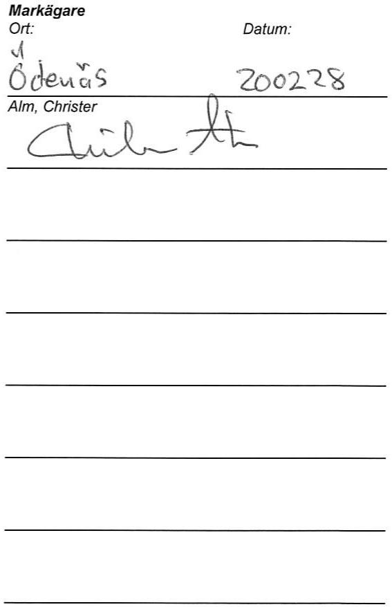
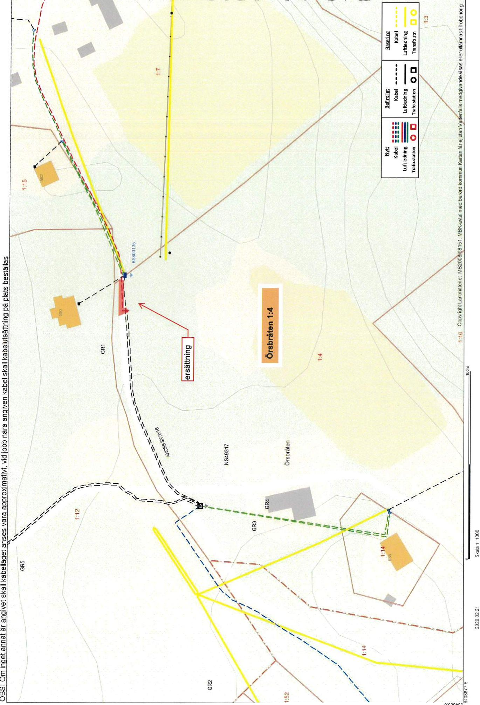

# Markupplatelseavtal avseende elektrisk starkstromsanlaggning

imark (jordkabel) natstation

<table><tr><td rowspan=1 colspan=5>Belastad fastighet</td></tr><tr><td rowspan=1 colspan=3>Fastighet (fastighetsagarens)Orsbraten 1:4</td><td rowspan=3 colspan=2>Kontaktperson (namn, adress, telefon)AIm, ChristerODENAS ORSBRATEN 53544195 ALINGSASOriginalavtalet skickas till kontaktpersonen</td></tr><tr><td rowspan=1 colspan=1>KommunAlingsas</td><td rowspan=1 colspan=2>LänVastra Gotaland</td></tr><tr><td rowspan=1 colspan=3>Fastighetsagare (namn, personnummer/organisationsnummer)AIm,Christer19690305-5678Vid fler delagare se separat delagarbilaga</td></tr><tr><td rowspan=1 colspan=3>Förmansfastighet</td><td rowspan=1 colspan=2>Projektsinformation</td></tr><tr><td rowspan=1 colspan=3>Fastighet (ledningsagarens)Begonian 10</td><td rowspan=2 colspan=2>Projektnamn:            ORSBRATENProjektnummer (NIS):   270166Ledningslittera:          TT49-L493Transformator (nr):</td></tr><tr><td rowspan=1 colspan=2>KommunVanersborg</td><td rowspan=1 colspan=1>LänVastra Götaland</td></tr><tr><td rowspan=1 colspan=3>Ledningsagare (namn, organisationsnummer)Vattenfall EIdistribution AB, Org.nr 556417-0800</td><td rowspan=1 colspan=2>Ansvarig Projektledare: Ola Bolander</td></tr><tr><td rowspan=1 colspan=5>Ersättning</td></tr><tr><td rowspan=1 colspan=4>Total ersattning enligt bifogat varderingsprotokoll!:</td><td rowspan=1 colspan=1></td></tr><tr><td rowspan=1 colspan=3>Utanordning</td><td rowspan=1 colspan=1>Datum2020-00-16</td><td rowspan=1 colspan=1>Signatur</td></tr></table>

Srskilening vidveneutaiviketotaru()prenaaelprisa \*\*Omerstningens totlsumaverstige e(3)procentavatueltprisaselp erhalls inimierstning totalt $1 3 9 5 k r$ i

# S1 Upplatelsens omfattning

Fastighetsgarenmedger ledningsgarenrataanlggachforal framtidbibehalla samtatt vibehovfornyaelektrisk starkströmsledning (markkabel) med en systemspanning av hogst $2 4 \times 1$ jamte tillhorande anordningar sasom transformatorer, ledningen redovisas pa bifogad kartskiss och/eller blit utstakad pa marken, alt nedan benmnt ledningen.

) Fastighetsagaren upplater för ledningen ett utrymme om $4 \textrm { ‰}$ horisontell bredd i skogsmark (skogsgata), 1 m breddi övrig mark (schaktbredd) samt ${ \boldsymbol { 0 } } \times { \boldsymbol { 0 } } ~ { \mathsf { m } }$ för transformatorstation.

Forledningensnlggnde,tillsy,undehl reparationchfrelsefrvidareilflleerforderligres.

c) Fastightane inaeenfrelesllisan bihinenileliofeAsteal anpassadetill tt rationellt underhall. Fallda tradoch falldvegetation forbli fastighetsagarens egendom.

d) Fastigete infaniililin， underhal,reparationchforyeleavid ledningsgareartdenmandaan skeutan vsentigolgenhet, aka fastighetsagaren givna anvisningar betraffande ratten att ta vag.

# $\ S 2$ Föreskrifter

a) Ledningsagaren ska utova rattigheterna sa att egendomen inte betungas mer an nodvandigt.

b) Fastigheteintnaanninppfaennnningnoruplagelia ledningenilleenigviariunkllanetfreriteents.Enigvidiunktenfeaas tecknande gallande sakerhetsforeskriter far inte brannbar byggnadsdel eller upplag finnas narmare n $5 \textrm { m }$ fran transformatorstation. Bygngiiaeinafast $_ { 3 } \textrm { \textmu m }$ franmakaetellefaneninaensevpplagll iandorellerkivnndsfr markkabeln sa att reparation och underhall forsvaras.

c) Fastighetsaenfintaneinarenitedvaiatrndfaafeingnlr eller $p \dot { \mathsf { a } }$ annatna akivnViurnenrdliee eningarnareviseingens stcnin att genom sakkunnig personal anvisa eller vidta lampliga skyddsatgarder.

Ofastietsfrniinetasatili de anvisade skyddsatgarderna.

d) Markbereteargspsasabruknineteasooalavidunktenf ledningens anlaggande efter anlaggandet ska kunna utovas ovanfor markkabeln.

Marb assafrgaspsntaalasrusetrvidunkenfreinensane anlaggandet ska kua utovas invid markabeln och normala transporter ska kunn ske ver markkabeln Da besvria ska dock atgarderna omedelbart avbrytas och ledningsagaren kontaktas.

Maf inte försvaras.

# 3 Tilltrade

Ledningsagaren far omedelbart ta i ansprak deienlighet med $\ S \uparrow$ upplatna rattigheterna. Tiltrade anses ha skett da anlggande av med staknings- och matningsarbeten.

# 4 Ersattning

a) Erstniniflppelsreietaetalsintnerinnerin grundernai expropriationslagen.Ersatningen r enengangsersatning som ska beraknas med de vrderingsmetoderfor ledningsintrang som allmant tillampas vid tidpunkten for tiltrde.

att overenskommelse om ersattning trafats och erforderlig koncession och ovriga tilstand erhallts.

Har tiltrade gt rum innan ersattningen erlggs, ska erattning for intrang upprknas enligt4ap $4 \ S$ expropriationslagen frn den dag tiltrdetskeddeenligtefiionen $\ S 3$ til idpunkten for traffande avoverenskommelse om ersattningen.Dartill ska rnta enligt expropriationslagen utga pa det upprknade beloppet fran och med iltdesdagen til ochmedbetalningsdagen.

b) Frsaeigilueaoelin Eratninfierinaeaf utaeratiaeniia sadan ersattning erlagts tidigare.

Nar abonnemangsforhallande foreliger ska ersattning dock inte betalas föor obetydlig skada.

c) Uppkome fraersin frsoii foreenngersninenssluaestandcsointe falt ska behandlas enligt detta stycke.

d) Aregenelleeeestaeeeeitriesel traffas med rattighetshavaren for bestmmande avden ersattning som denne r berattigad il.

e)Kanveresmelerininetraffasa istenrasvid edingrtningaelleto.

# $\$ 5$ Virkeshantering mm.

Ledningarenintsrsida foranlederannatmainfomationilastighetsgarenfrestendaverin samband mednyanlaggning ochunderhall.Ledningsgaren ska ven,om sa kan ske enligt dennes bedmning,erbjuda fastighetsagaren att inom skalig tid svara för avverkningen.

Oleinaineinestitaiiafveine ingafeineeieafiataaieinga falls utanföor engangsersatt skogsgata.

Neiiii

# 6 Ledningsförrittning m.m.

Detta avtal far laggas till grund for beslut om ledningsratt sasom overenskommelse enligt $1 4 \ S$ forsta stycket ledningsrattslagen. Avtalet overlatelellr pplatelseavegendomen ellerav ledningen berrd del drav ora forbehallomdettaavtals bestnd.

Omledninggaenstdnaestmeleaseedingt bie astighegaen-rietsavarena.

# s7 Överlatelse av ledningen

Leingegiveinaislet skyldigheteri detta avtal.

880Bortagandeavledning508742020- 0-1

Oeinneenaiiingasiest inenefa i meddelarigeeeeeinndeevfnalnellenidutsalinaenand tillse att ledningen med tilhorande anordningar tas bort.

$\ S 9$ Särskilda bestammelser

# S 10 Förekomst av arrende/nyttjanderätt/servitut

Aregendenelleelsorleingenellenangning sataeatal utareneller upplaten pa annat satt?

#

Sasoaenatorrttighetsaaevanmagnner agifrestenatalilllaelenatnin min/var ratt berors.

Av detta avtal har tva likalydande exemplar upprattats och utväxlats melln parterna.

Ledningsägare Ort:

Datum:

# Underskrift

Namnförtydligande

<table><tr><td rowspan=1 colspan=5>FASTIGHET /SAMFALLIGHET Samt PROJEKTINFORMATION                                                       Version 2019 (2018.12.20)</td></tr><tr><td rowspan=1 colspan=1>Fastighetsbeteckning:Kommun:Fastighetsnummer:Kontaktperson &amp; adress:</td><td rowspan=1 colspan=1>ORSBRATEN 1:4ALINGSASALM CHRISTERODENASÖRSBRATEN 535 44195ALINGSAS</td><td rowspan=1 colspan=2>Projektnummer:Ledning:Koncessionslöpnr:Varderingstidpunkt:Varderingsman &amp; företag:</td><td rowspan=1 colspan=1>NIS2701662019-12-12Yunis Aziz, Vinnergi Ab 190909</td></tr><tr><td rowspan=1 colspan=4>1. SCHABLONERSATTNING FOR MARKLEDNING I AKER, BETE, IMPEDIMENT (Ej skogsimpediment)</td><td rowspan=1 colspan=1></td></tr><tr><td rowspan=1 colspan=4>Beskrivning (typ, placering, etc)                                                               Lǎngd</td><td rowspan=1 colspan=1>Bredd</td></tr><tr><td rowspan=1 colspan=4>Jordkabel enligt markering pa bifogad karta.                                                 115m</td><td rowspan=1 colspan=1>1m              459kr</td></tr><tr><td rowspan=1 colspan=5>Summa:          459 kr</td></tr><tr><td rowspan=1 colspan=5>2.SCHABLONERSATTNING FOR NATSTATIONER OCH KABELSKAP (Ej inom detaljplan)</td></tr><tr><td rowspan=1 colspan=2>Beskrivning (typ, placering, yta, etc)</td><td rowspan=1 colspan=2>Typ och markslag</td><td rowspan=1 colspan=1>Antal</td></tr><tr><td rowspan=1 colspan=2></td><td rowspan=1 colspan=2></td><td rowspan=1 colspan=1></td></tr><tr><td rowspan=1 colspan=5>Summa:</td></tr><tr><td rowspan=1 colspan=5>3. ERSATTNING FOR HINDER IAKERMARK - FOr ersattningsberakning se bilaga</td></tr><tr><td rowspan=1 colspan=4>Beskrivning (typ, placering, etc)</td><td rowspan=1 colspan=1>Ersättning</td></tr><tr><td></td><td></td><td></td><td></td><td rowspan=1 colspan=1></td></tr><tr><td rowspan=1 colspan=5>Summa:              kr</td></tr><tr><td rowspan=1 colspan=5>4 a. ERSATTNING FOR LEDNINGI SKOGSMARK - För ersittningsberäkning se bilaga</td></tr><tr><td rowspan=1 colspan=4>Beskrivning (typ, placering, etc)</td><td rowspan=1 colspan=1>Ersättning</td></tr><tr><td></td><td></td><td></td><td></td><td rowspan=1 colspan=1></td></tr><tr><td rowspan=1 colspan=5>Summa:              kr</td></tr><tr><td rowspan=1 colspan=5>4 b. ROTNETTO (Ersitts separat) - För ersättningsberakning se bilaga</td></tr><tr><td rowspan=1 colspan=5>Anvinds för berdkning av paslag (25%enligt expropriationslagen samt 20% srskid ersittning for overenskommelse)</td></tr><tr><td rowspan=1 colspan=5>Totalt rotnetto enligt bilaga:                                                      Ersattning for rotnetto regleras i bilaga</td></tr><tr><td rowspan=1 colspan=5>5. ERSATTNING FOR ÖVRIGT INTRANG - För ersättningsberakning se bilaga</td></tr><tr><td rowspan=1 colspan=4>Beskrivning (typ,placering, etc)</td><td rowspan=1 colspan=1>Ersättning</td></tr><tr><td></td><td></td><td></td><td></td><td rowspan=1 colspan=1></td></tr><tr><td rowspan=1 colspan=5>Summa:           - kr</td></tr><tr><td rowspan=1 colspan=5>6 a. ERSATTNING FOR LEDNING ISKOGSMARK ENLIGT STORSKOGSBRUKSAVTALET</td></tr><tr><td rowspan=1 colspan=3>Beskrivning (typ, placering, etc)                   Omrade:</td><td rowspan=1 colspan=1>Lǎngd</td><td rowspan=1 colspan=1>Bredd</td></tr><tr><td rowspan=1 colspan=3></td><td rowspan=1 colspan=1></td><td rowspan=1 colspan=1></td></tr><tr><td rowspan=1 colspan=5>Summa:             kr</td></tr><tr><td rowspan=1 colspan=5>6 b. ERSATTNING FOR INTRANG INOM VAGANLAGGNING ENLIGT STORSKOGSBRUKSAVTALET</td></tr><tr><td rowspan=1 colspan=3>Beskrivning (typ, placering, etc)</td><td rowspan=1 colspan=1>Längd</td><td rowspan=1 colspan=1>Zon</td></tr><tr><td rowspan=1 colspan=3></td><td rowspan=1 colspan=1></td><td rowspan=1 colspan=1></td></tr><tr><td rowspan=1 colspan=5>Summa:             kr</td></tr><tr><td rowspan=1 colspan=5>7.SAMMANSTALLNING</td></tr><tr><td rowspan=1 colspan=5>Tilagg enligt expropriationslagen:         115krSarskild ersattning föröverenskommelse:         115krTillagg for minimiersattning:         707 kr</td></tr><tr><td rowspan=1 colspan=5>TOTAL ERSATTNING       1395 kr</td></tr></table>

utgar ränta enligt $6 \ : \xi$ rantellagen. Tillfilliga skador regleras vid skadetilfllet.

branschens allmanna avtalsvillkor.

Ovanstendegodknnsoch ersittning sitts in p filjiande konto(vrig delgare redoviss p foljiande sida/sidr)

AIm Christer Fastighetsigare (födelsedatum/org.nr) 1 Agd andel Ersättning 1395,00kr 200107 Banknamn: Clearingnr:   
Shandabmben 9150 2265011   
Referens: 10766334925 chroalm@gmail.com

<table><tr><td rowspan=1 colspan=5>Fastighetsägare (födelsedatum/org.nr)             Agd andel     Ersattning    Fastighetsagarens godkannande</td></tr><tr><td rowspan=1 colspan=2></td><td rowspan=1 colspan=1></td><td rowspan=1 colspan=1>kr</td><td rowspan=1 colspan=1>Underskrift/Datum:</td></tr><tr><td rowspan=1 colspan=2>Banknamn:</td><td rowspan=1 colspan=2>Clearingnr:</td><td rowspan=1 colspan=1>Kontonummer, Pg/Bg, IBAN &amp; SWIFT*:</td></tr><tr><td rowspan=1 colspan=1>Referens:</td><td rowspan=1 colspan=3>Telefonnummer:</td><td rowspan=1 colspan=1>E-post:</td></tr></table>

<table><tr><td rowspan=1 colspan=5>Fastighetsügare (fodelsedatum/org.nr)             Agd andel     Ersüttning    Fastighetsagarens godkannande</td></tr><tr><td rowspan=1 colspan=2></td><td rowspan=1 colspan=1></td><td rowspan=1 colspan=1>kr</td><td rowspan=1 colspan=1>Underskrift/Datum:</td></tr><tr><td rowspan=1 colspan=2>Banknamn:</td><td rowspan=1 colspan=2>Clearingnr:</td><td rowspan=1 colspan=1>Kontonummer, Pg/Bg, IBAN &amp; SWIFT *:</td></tr><tr><td rowspan=1 colspan=1>Referens:</td><td rowspan=1 colspan=3>Telefonnummer:</td><td rowspan=1 colspan=1>E-post:</td></tr></table>

<table><tr><td rowspan=1 colspan=5>Fastighetsägare (fodelsedatum/org.nr)              Agd andel     Ersättning    Fastighetsagarens godkannande</td></tr><tr><td rowspan=1 colspan=2></td><td rowspan=1 colspan=1>…</td><td rowspan=1 colspan=1>kr</td><td rowspan=1 colspan=1>Underskrift/Datum:</td></tr><tr><td rowspan=1 colspan=2>Banknamn:</td><td rowspan=1 colspan=2>Clearingnr:</td><td rowspan=1 colspan=1>Kontonummer, Pg/Bg, IBAN &amp; SWIFT*:</td></tr><tr><td rowspan=1 colspan=1>Referens:</td><td rowspan=1 colspan=3>Telefonnummer:</td><td rowspan=1 colspan=1>E-post:</td></tr></table>

<table><tr><td rowspan=1 colspan=5>Fastighetsägare (födelsedatum/org.nr)              Agd andel     Ersättning    Fastighetsagarens godkännande</td></tr><tr><td rowspan=1 colspan=2></td><td rowspan=1 colspan=1></td><td rowspan=1 colspan=1>kr</td><td rowspan=1 colspan=1>Underskrift/Datum:</td></tr><tr><td rowspan=1 colspan=2>Banknamn:</td><td rowspan=1 colspan=2>Clearingnr:</td><td rowspan=1 colspan=1>Kontonummer, Pg/Bg, BAN &amp; SWIFT*:</td></tr><tr><td rowspan=1 colspan=1>Referens:</td><td rowspan=1 colspan=3></td><td rowspan=1 colspan=1>E-post:</td></tr></table>

<table><tr><td colspan="2">Fastighetsügare (fodelsedatum/org.nr)</td><td>Ågd andel</td><td>Ersäittning Underskrift/Datum:</td><td>Fastighetsagarens godkännande</td></tr><tr><td colspan="2"></td><td></td><td>kr</td><td></td></tr><tr><td colspan="2">Banknamn: ………</td><td colspan="2">Clearingnr:</td><td>Kontonummer, Pg/Bg, IBAN &amp; SWIFT *:</td></tr><tr><td rowspan="2">Referens:</td><td colspan="3">Telefonnummer:</td><td>E-post:</td></tr><tr><td colspan="3"></td><td></td></tr></table>

<table><tr><td colspan="2">Fastighetsigare (födelsedatum/org.nr)</td><td>Agd andel</td><td>Ersüttning</td><td>Fastighetsagarens godkannande Underskrift/Datum:</td></tr><tr><td colspan="2"></td><td></td><td>kr</td><td></td></tr><tr><td colspan="2">Banknamn:</td><td>Clearingnr:</td><td></td><td>Kontonummer, Pg/Bg, IBAN &amp;SWIFT*</td></tr><tr><td>Referens:</td><td colspan="3">Telefonnummer:</td><td>E-post:</td></tr></table>

<table><tr><td colspan="2">Fastighetsägare (födelsedatum/org.nr)</td><td>Agd andel</td><td>Ersüttning</td><td>Fastighetsügarens godkannande</td></tr><tr><td colspan="2"></td><td></td><td>kr</td><td>Underskrift/Datum:</td></tr><tr><td colspan="2">Banknamn:</td><td>Clearingnr:</td><td></td><td>Kontonummer, Pg/Bg, IBAN &amp; SWIFT *:</td></tr><tr><td>Referens:</td><td colspan="3">Telefonnummer:</td><td>E-post:</td></tr></table>

\*For att kunna göra en utbetalning tillutlindskt konto behovs IBAN-nummer och bankens SWiFT-kod.

VARDERINGSPROTOKOLL   

<table><tr><td rowspan=1 colspan=6>FASTIGHET /SAMFALLIGHET Samt PROJEKTINFORMATION                                                       Version 2019 (2018.12.20)</td></tr><tr><td rowspan=1 colspan=1>Fastighetsbeteckning:Kommun:Fastighetsnummer:Kontaktperson&amp;adress:</td><td rowspan=1 colspan=3>ORSBRATEN 1:4                                         Projektnummer:ALINGSAS                                                    Ledning:Koncessionslopnr:Alm,Christer                ODENAS               Varderingstidpunkt:ORSBRATEN 535, 44195ALINGSAS                 Varderingsman &amp; företag:</td><td rowspan=1 colspan=2>NIS2701662020-02-21Yunis Aziz, Vinnergi AB 190909</td></tr><tr><td rowspan=1 colspan=4>1. SCHABLONERSATTNING FOR MARKLEDNING IAKER, BETE, IMPEDIMENT (Ej kogsimpediment)</td><td rowspan=1 colspan=2></td></tr><tr><td rowspan=1 colspan=3>Beskrivning (typ,placering, etc)</td><td rowspan=1 colspan=1>Lǎngd</td><td rowspan=1 colspan=1>Bredd</td><td rowspan=1 colspan=1>Ersättning</td></tr><tr><td rowspan=1 colspan=3>Jordkabel enligt markering pa bifogad karta.</td><td rowspan=1 colspan=1>20m</td><td rowspan=1 colspan=2>1m                80kr</td></tr><tr><td rowspan=1 colspan=6>Summa:           80kr</td></tr><tr><td rowspan=1 colspan=6>2.SCHABLONERSATTNING FOR NATSTATIONER OCH KABELSKAP (Ej inom detaljplan)</td></tr><tr><td rowspan=1 colspan=2>Beskrivning (typ,placering, yta,et)</td><td rowspan=1 colspan=2>Typ och markslag</td><td rowspan=1 colspan=1>Antal</td><td rowspan=1 colspan=1>Ersättning</td></tr><tr><td rowspan=1 colspan=2></td><td rowspan=1 colspan=2></td><td rowspan=1 colspan=2></td></tr><tr><td rowspan=1 colspan=6>Summa:             kr</td></tr><tr><td rowspan=1 colspan=6>3. ERSATTNING FOR HINDER I AKERMARK - For ersattningsberakning se bilaga</td></tr><tr><td rowspan=1 colspan=5>Beskrivning (typ,placering, etc)</td><td rowspan=1 colspan=1>Ersattning</td></tr><tr><td></td><td></td><td></td><td></td><td></td><td rowspan=1 colspan=1></td></tr><tr><td rowspan=1 colspan=6>Summa:             kr</td></tr><tr><td rowspan=1 colspan=6>4 a. ERSATTNING FOR LEDNING I SKOGSMARK - För ersattningsberakning se bilaga</td></tr><tr><td rowspan=1 colspan=5>Beskrivning (typ, placering, etc)</td><td rowspan=1 colspan=1>Ersattning</td></tr><tr><td></td><td></td><td></td><td></td><td></td><td rowspan=1 colspan=1></td></tr><tr><td rowspan=1 colspan=6>Summa:             kr</td></tr><tr><td rowspan=1 colspan=6>4 b. ROTNETTO (Ersatts separat) - För ersättningsberäkning se bilaga</td></tr><tr><td rowspan=1 colspan=6>Anvands for berkning av paslag (25%enligt expropriationslagen samt20% srskild ersattning för overenskommelse)</td></tr><tr><td rowspan=1 colspan=6>Totalt rotnetto enligt bilaga:                                                     Ersattning for rotnetto regleras i bilaga</td></tr><tr><td rowspan=1 colspan=6>5. ERSATTNING FOR OVRIGT INTRANG - För ersittningsberakning Se bilaga</td></tr><tr><td rowspan=1 colspan=5>Beskrivning (typ, placering, etc)</td><td rowspan=1 colspan=1>Ersättning</td></tr><tr><td></td><td></td><td></td><td></td><td></td><td rowspan=1 colspan=1></td></tr><tr><td rowspan=1 colspan=6>Summa:             kr</td></tr><tr><td rowspan=1 colspan=6>6 a. ERSATTNING FOR LEDNING I SKOGSMARK ENLIGT STORSKOGSBRUKSAVTALET</td></tr><tr><td rowspan=1 colspan=3>Beskrivning (typ,placering, etc)                   Omrade:</td><td rowspan=1 colspan=1>Lǎngd</td><td rowspan=1 colspan=1>Bredd</td><td rowspan=1 colspan=1>Ersättning</td></tr><tr><td rowspan=1 colspan=3></td><td rowspan=1 colspan=1></td><td rowspan=1 colspan=2></td></tr><tr><td rowspan=1 colspan=6>Summa:             kr</td></tr><tr><td rowspan=1 colspan=6>6 b. ERSATTNING FOR INTRANG INOM VAGANLAGGNING ENLIGT STORSKOGSBRUKSAVTALET</td></tr><tr><td rowspan=1 colspan=3>Beskrivning (typ, placering, etc)</td><td rowspan=1 colspan=1>Längd</td><td rowspan=1 colspan=1>Zon</td><td rowspan=1 colspan=1>Ersättning</td></tr><tr><td rowspan=1 colspan=3></td><td rowspan=1 colspan=1></td><td rowspan=1 colspan=2></td></tr><tr><td rowspan=1 colspan=6>Summa:</td></tr><tr><td rowspan=1 colspan=6>7. SAMMANSTALLNING</td></tr><tr><td rowspan=1 colspan=6>Tillagg enligt expropriationslagen:          20krSarskild ersattning for överenskommelse:          20krTillagg for minimiersttning:        1275kr</td></tr><tr><td rowspan=1 colspan=6>TOTAL ERSATTNING       1395kr</td></tr></table>

stigl utgar rǎnta enligt $^ { 6 \ : \delta }$ rantelagen. Tilflliga skador regleras vid skadetilfallet.

anstaende godknnsoch ersittning sitt in pa fljiande konto (vriga delgare redovisas pa filjiande sida/sidor)   

<table><tr><td colspan="2">Fastighetsägare (fodelsedatum/org.nr)</td><td>Agd andel</td><td>Ersüttning</td><td>Fastighetsagarens godkannande</td><td></td></tr><tr><td colspan="2">Alm, Christer</td><td></td><td>1395,00kr</td><td>Underskrift/Datum: </td><td>200228</td></tr><tr><td colspan="2">Banknamn: Skamdia</td><td>Clearingnr: 9iso</td><td></td><td colspan="2">Kontonummer, Pg/Bg, IBAN &amp; SWIFT*: 2265011 E-post:</td></tr><tr><td>Referens:</td><td colspan="3">Telefonnummer: 6766-334925</td><td>chvoalm@ gma'l.con.</td></tr><tr><td colspan="2">Fastighetsägare (födelsedatum/org.nr)</td><td>Agd andel</td><td>Ersäittning</td><td colspan="2">Fastighetsägarens godkännande</td></tr><tr><td colspan="2"></td><td></td><td>kr</td><td colspan="2">Underskrift/Datum:</td></tr><tr><td colspan="2">Banknamn:</td><td>Clearingnr:</td><td></td><td colspan="2">Kontonummer, Pg/Bg, IBAN &amp;SWIFT*:</td></tr><tr><td>Referens:</td><td colspan="3">Telefonnummer:</td><td colspan="2">E-post:</td></tr></table>

<table><tr><td colspan="2">Fastighetsägare (fodelsedatum/org.nr)</td><td>Agd andel </td><td>Ersäittning</td><td>Fastighetsagarens godkännande</td></tr><tr><td colspan="2"></td><td></td><td>kr</td><td>Underskrift/Datum:</td></tr><tr><td colspan="2">Banknamn:</td><td>Clearingnr:</td><td></td><td>Kontonummer, Pg/Bg, IBAN &amp;SWIFT*:</td></tr><tr><td>Referens:</td><td colspan="3">Telefonnummer:</td><td>E-post:</td></tr></table>

<table><tr><td colspan="2">Fastighetsägare (fodelsedatum/org.nr)</td><td>Agd andel</td><td>Ersättning</td><td>Fastighetsägarens godkännande</td></tr><tr><td colspan="2"></td><td></td><td>kr</td><td>Underskrift/Datum:</td></tr><tr><td colspan="2">Banknamn:</td><td>Clearingnr:</td><td></td><td>Kontonummer, Pg/Bg, IBAN &amp; SWIFT*:</td></tr><tr><td>Referens:</td><td colspan="3">Telefonnummer: </td><td>E-post:</td></tr></table>

<table><tr><td colspan="2">Fastighetsägare (fodelsedatum/org.nr)</td><td>Agd andel</td><td>Ersättning</td><td>Fastighetsügarens godkannande</td></tr><tr><td colspan="2"></td><td></td><td>kr</td><td>Underskrift/Datum:</td></tr><tr><td colspan="2">Banknamn:</td><td>Clearingnr:</td><td></td><td>Kontonummer, Pg/Bg, IBAN &amp; SWIFT*</td></tr><tr><td>Referens:</td><td colspan="3">Telefonnummer:</td><td>E-post:</td></tr></table>

<table><tr><td colspan="2">Fastighetsigare (fodelsedatum/org.nr)</td><td>Agd andel</td><td>Ersäittning</td><td>Fastighetsagarens godkännande</td></tr><tr><td colspan="2"></td><td></td><td>kr</td><td>Underskrift/Datum:</td></tr><tr><td colspan="2">Banknamn:</td><td>Clearingnr:</td><td></td><td>Kontonummer, Pg/Bg, IBAN &amp; SWIFT*:</td></tr><tr><td>Referens:</td><td colspan="3">Telefonnummer:</td><td>E-post:</td></tr></table>

<table><tr><td colspan="2">Fastighetsägare (födelsedatum/org.nr)</td><td>Agd andel</td><td>Ersüttning</td><td>Fastighetsägarens godkännande</td></tr><tr><td colspan="2"></td><td></td><td>kr</td><td>Underskrift/Datum:</td></tr><tr><td colspan="2">Banknamn:</td><td></td><td></td><td>Kontonummer, Pg/Bg, IBAN &amp; SWIFT*:</td></tr><tr><td>Referens:</td><td colspan="3">Telefonnummer:</td><td>E-post:</td></tr></table>

<table><tr><td colspan="2">Fastighetsäigare (fodelsedatum/org.nr)</td><td>Ågd andel</td><td>Ersüttning</td><td>Fastighetsägarens godkannande</td></tr><tr><td colspan="2"></td><td></td><td>kr</td><td>Underskrift/Datum:</td></tr><tr><td colspan="2">Banknamn: Telefonnummer:</td><td>Clearingnr:</td><td></td><td>Kontonummer, Pg/Bg, IBAN &amp; SWIFT*:</td></tr><tr><td>Referens:</td><td colspan="3"></td><td>E-post:</td></tr></table>

For att kunna göra en utbetalning til utlindskt konto behövs IBAN-nummer och bankens SWIFT-koc

Lantmateriet Fastighetsinskrivning SE 761 80 Nortalje Telefon: 0771-63 63 63

Arendenr: D-2020-00150874 Inskrivningsdatum: 2020-04-17 Innehall: Avtalsratighet Fastighet: ALINGSAS ORSBRATeN 1:4

# Enligt ansokan har foljiande inskrivningsatgärd beviljats:

Avtalsservitut Krafledning D-2020-00150874:1

Om ratigheten upphor helt eller delvis ska rätighetshavaren ansoka om at inskrivningen ska tas bort.   
Det ska göras inom tre manader fran att ratigheten upphört.

Beslut i detta ärende har fattats av Linda Karsson.

# Kostnadsspecifikation:

Expeditionsavgift 375 SEK

Fragor rorande beslut eller ev. avgifter i arendet besvaras av Fastighetsinskrivningen enligt kontaktuppgifter längst upp pa denna sida.

#

I de fall originalhandlingar, som limnats in i samband med ansökan ska returneras (ex.   
köpebrev), gors detta i separat forsandelse.   
Delta ivar kundnöjdhetsundersòkning   
Vad tycker du som kund om Lantmäteriet? Beräitta genom at svara på nágra fragor och var med och   
tavla om biobiljetter. Tack for hjalpen!   
Till enkaten: www.lantmateret.se/kundsvar

Om du har en smarttelefon kan du använda den för att läsa av QR-koden och komma til enkaten.