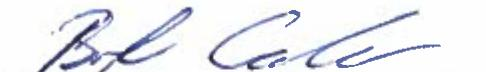
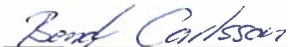
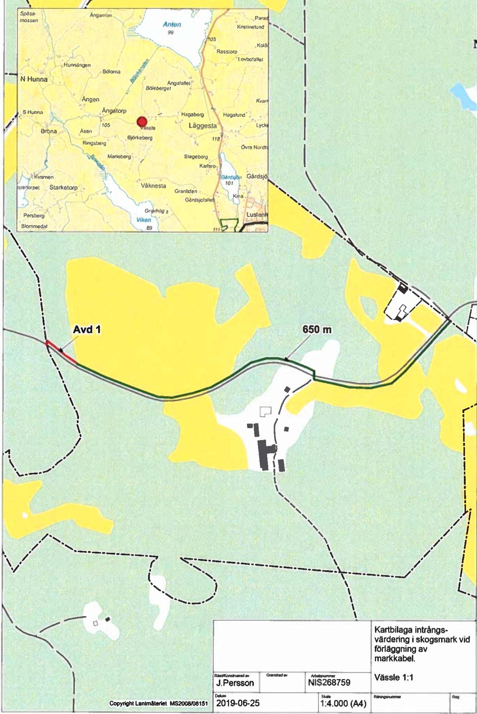

Lantmateriet Fastighetsinskrivning SE 761 80Norrtälje Telefon: 0771-63 63 63

Arendenr: D-2020-00213476   
Inskrivningsdatum: 2020-05-29   
Innehall: Avtalsrättighet   
Fastighet: ASKERSUND VASSLE 1:1   
Sökande: 556417-0800, Vattenfall Eldistribution AB

# Enligt ansökan har följande inskrivningsatgärd beviljats:

Avtalsservitut Kraftledning D-2020-00213476:1

Om ratigheten upphor helt eller delvis ska ratighetshavaren ansöka om att inskrivningen ska tas bort.   
Det ska göras inom tre manader fran att rättigheten upphört.

Beslut i detta ärende har fattats av Monica Andersson.

# Kostnadsspecifikation:

Expeditionsavgift 375 SEK

Fragor rörande beslut eller ev. avgifter i ärendet besvaras av Fastighetsinskrivningen enligt kontaktuppgifter tängst upp pa denna sida.

#

I de fall originalhandlingar, som lamnats in i samband med ansökan ska returneras (ex.   
köpebrev), görs detta i separat försandelse.

# Delta i var kundnöjdhetsundersökning

Vad tycker du som kund om Lantmateriet? Beratta för oss genom at svara pa nagra fragor. Du kan dessutom vara med och tävla om biobiljetter genom attlamna ett förbattringsförslag. Tack för hjalpen! Ga tilundersokningen har: www.lantmateriet.se/kundsvar

Om du har en smarttelefon kan du anvanda den föor attlasa av QR-koden och komma tll enkaten.

# Markupplatelseavtal avseende elektrisk starkströmsanläggning

tmark Cordkabel)147natstaton2-05-21

<table><tr><td rowspan=1 colspan=5>Belastad tastighet</td></tr><tr><td rowspan=1 colspan=3>Fastighet (fastighetsagarens)Vässle 1:1</td><td rowspan=3 colspan=2>Kontaktperson (namn, adress, telefon)Andreas HagerudAngatorp Vassle 227696 91 AskersundOniginalavtalet skickas till kontaktpersonen</td></tr><tr><td rowspan=1 colspan=1>KommunAskersund</td><td rowspan=1 colspan=2>LǎnÖrebro</td></tr><tr><td rowspan=1 colspan=3>Fastighetsagare (namn, personnummer/organisationsnummer)Andreas Hagerud, 19760807Anja Hagerud, 19781122Vid fler delagare se separat delagarbilaga</td></tr><tr><td rowspan=1 colspan=3>Förmansfastighet</td><td rowspan=1 colspan=2>Projektsinformation</td></tr><tr><td rowspan=1 colspan=3>Fastighet (ledningsagarens)Nyköpings Bruk 6</td><td rowspan=2 colspan=2>Projektnamn:            Norra Hunna VindkraftProjektnummer (NIS):   268759Ledningslittera:Transformator(nr):</td></tr><tr><td rowspan=1 colspan=2>KommunNyköping</td><td rowspan=1 colspan=1>Länsödermanland</td></tr><tr><td rowspan=1 colspan=3>Ledningsǎgare (namn, organisationsnummer)Vattenfall Eldistribution AB, Org.nr 556417-0800</td><td rowspan=1 colspan=2>Ansvarig Projektledare: Magnus Bengtsson</td></tr><tr><td rowspan=1 colspan=5>Ersättning</td></tr><tr><td rowspan=1 colspan=4>Total ersattning enligt bifogat varderingsprotokoll:</td><td rowspan=1 colspan=1>3 152 kr</td></tr><tr><td rowspan=1 colspan=3>Utanordning</td><td rowspan=1 colspan=1>Datum</td><td rowspan=1 colspan=1>SignaturC</td></tr></table>

Srskidergvidernseludma100vitotsvar(0)prnauelprss Omeratingns otaaeersire(3)prenaakuelprisaselpes nierinptal5

# s1 Upplatelsens omfattning

a) Fastighetsagaren medger ledningsagaren ratat anlgga och fr al framtid bibehalla samt att vid behov förnya elektrisk starkstromsledning (markkabel) med en systemspanning av hogst $\pmb { 2 4 } \pmb { 1 4 7 }$ jamte tilhorande anordningar sasom transformatorer som ledningen redovisas pa bifogd kartskiss ocheller blivit utstakad pá maken,alt nedan benmnt ledningen.

) Fastighetsgarenupplater fr ledningen et utymeom4m horisontel bred isosmark (skogsgata),1mbreddvrimark (schaktbredd) samt $\ 0 \times 0 m$ for transfomatorstation.

For ledningens anlaggande tilsyn, underhall,reparation och fonyelse ar vidvarje tilfalleerforderigt omrade nytias.

c) Fastighetsagaren medgerledninggaren tt a pa egendomenuochframdeles fall elle kvista trd chvegetation somr ellerkanblihinderifreningensanlgandeilsyundehalrepartion,fryelseochritAtrdea frutfrase intervallsomr anpassade tile rationelt nderhat.Fllda tradoch lldvegetation forbli fastighetsagarensegendm

d) Fastighetsgaren medgerledingsgarent a ierforderigomfatningga tiltde ilgendomenfr ledningensanlade tilsunderpratinyelvaideinrehaadndetnskeutnsentilenet av fastighetsagaren givna anvisningar betrifande ratten at ta vag.

# $\beta 2$ Föreskrifter

a) Ledningsagaren ska utova rätigheterna sa att egendomen inte betungas mer an nodvändigt.

b) Fastighetsgaren rintendra markanvndningenupporabyggnad ellrnananlggninganordna uppagelle iknande tecknande gǎlande skerhetsforeskrifter far inte brnnbar byggnadsdel eller upplag finnas nǎmmare n 5m fran transformatorstation.

Byggnad ellr annan anlggning far inte utan ledningsagarens medgivande och imnade instruktioner uppforas pá nmmare avstand än $\beta \ m$ fran markabeln Inte heller far utan ledningsagarens medgivande upplag eller liknande anordnas eller marknivan andras ovanföor markkabeln sa att reparation och underhál försvaras.

c) Fastighetsgaren frinteutanledningagarnigd id inhmtademedivandevidaatrdsomkan meforafarafrleingn eller som medfrtt dningen kan valla skadapaperson ellergendom. Exempel pa sadan atgrdr a fllard sprnga grǎva, schakta ler pa annat satndra maknivan. Vid utfrande av sadan atgard ligger det ledningsgaren at redovisa ledningens strackning och att genom sakkunnig personal anvisa eller vidta lampliga skyddsatgarder.

Om fasighetsgarens atrd msinomoforndrad makanvndningchinte avser tomtmark kaskyddstrder anvisas eller vidtas av ledningsagaren utan kostnad for fastighetsagaren. Ledninggaren svarar da ven fr de merkostnader som uppkommer til folid av de anvisade skyddsatgarderna

Markabel skaiker-och betesmark oraggas p sdant stt at brukningsmetoderavakemark somr nomala vid tidunkten for ledningens anlaggande efter anlaggandet ska kunna utōvas ovanfor markkabeln.

Markabel ska iskogsmak forgasp sadant stt at nomala skogsbruksmetoder vid tidpunkten for ledningns anlaggande effer anggandet ska kunnautovasinvid markabeln ochnomala transpoter ska unn ske ver markkaben. Da beria markorhalandenikombination med skogsbrukatgrder ssomtungatransporerinner atmarkabelnuppenbart riskerarat skadas ska dock atgardera omedelbart avbrytas och ledningsagaren kontaktas.

Markabel ska inom vǎgomrade tör enskild ǎg föraggas pà sadant sat att normalt nytiande och underhallav vagen etter anlaggandet inte forsvaras.

# $\$ 3$ Tillträde

Ledningsgarenromedelbara ansprak deienlighet meduppltnartiheterna.Tlreansesha sket angande avellraerkningfingenps.Medaerkningadockineforstsoragadeaenstaka chveettion samband med staknings- och matningsarbeten.

# $\$ 4$ Ersättning

Erstingilldppltelsenchesteaatalaetalasinterningannersineni grundernai expropriationslagen. Ersatningen r en engangsersatning som ska beraknas med de varderingsmetoderfr ledningsintrang som allmant tillampas vid tidpunkten for tiltrade.

Ersattningenska, savidainte lagfarts-ller inteckningforhalandenaegendomen utr hinderutbetalas senast remanader efter det at overenskommelse om ersttning trafats och erforderlig koncession och vriga tilstand erhalits.

Har tilltade agt rum innan ersattningen erlaggs, ska ersattning for intrang upprǎknas enligt 4 kap $4 \ S$ expropriationslagen fran den dag tiltrdetskeddeenligt efinitioneni $\$ 3$ til tidpunkten for traffande av Overenskommelse om ersattningen, Darillska ranta enigt expropriationslagen utga pa det upprknade beloppet frn och med tiltdesdagen tiloch medbetalningsdagen.

b) For skadorsoanppkmmavidchsomfolav ledningensangganeilundehalreparatinochforyelsecs inteomfatas avengngserstningska erstning betalasivarjesrskit fal. Skador skaregleras snarast eftr skadans uppkomst.

Ersatting for foridig awerkning ska betala fr rd som fll utanforengangsersattskogsgataom ledningsgaren inte kan visa att sadan ersattning erlagts tidigare.

Nar abonnemangsförhallande föreligger ska ersattning dock inte betalas för obetydlig skada.

c) Uppkommer raga om ersningfor skada som visar sig forst efer engangerstningens sluia bestmmandeoch som did inte kunnat forutes ska denna fraga pa fastighetsagarens begaran uptas til forhanding.Eventuella skador til fojdav elektromagnetiska falt ska behandlas enligt detta stycke.

d) Ar egendomen eller del därav som berors av upplatelsen belastad av arende/nytianderattservitut, ska srskild overenskommelse trafas med rattighetshavaren for bestammande av den ersattning som denne ar beratigad til.

e)Kan verenskommelse om ersttning inte trafas, ska tvisten avgras vid ledningsförritning om sadan pagar eler av domstol.

# $\beta 5$ Virkeshantering mm.

Ledninggarensintsrsidak frnlederannatmnainfationistigetsgrenmfrestendeaerking samband med nyanliggning och underhall Ledningsagaren ska ven,om sa kan ske enligt dennes bedomning.erbjud fastighetsagaren at inom skalig tid svara for awverkningen.

Om ledningagaren inte lmnar erjudande om averkningler om fastighetsgareninte tar sig atsvara fr aerkningen sarar einggarenfrawerkningnedinggarenrvensarafrivartagandtaviet.Ledinsaren said innanaerkningenursmaerbjdndeom kpavviketVdundehllriningsa dockdanterbjdandemnas endast för trad som falls utanfor engangsersatt skogsgata.

Nar ledningsgaren tfor avverkningen aliger det denne at ilse att virke och awerkningsrester inte kvarlmnas inom fastigheten sá at fara for insektsangrepp，hinder for virkestransporter eller mern obetydligolgenhet fr pagaende markanvandning uppstar.

# 5 6 Ledningstörrattning m.m.

Detta avtal far lǎggas til grund for beslut om ledningsrǎt sasom overenskommelse enligt $1 4 5$ torsta stycket ledningsrattslagen. Ataletraleatit insivassoeritutnnanleninseslutetunnitlaga kraelertaletinkivitsrfastihetarn skyldiga vidvertelseeller upplateleav egendomenelerv ledningen berrddel drav ra frbhllodeta atals bestand.

Om ledningsägaren med stǒd av denna bestǎmmelse ansöker om ledningsrät bitrder fastighetsagaren-/ratighetshavaren ansokan.

# $\$ 7$ Overlatelse av ledningen

Ledningsgarenhar  ch sylighet a vidveratelseav leningenstdenyegarensistlle betrifande rtieter och skyldigheteri detta avtal.

# 5 8 Borttagande av ledning

Om ledningnpermanent tagitsur difttar sig ledninggarena p sinbekostnad tilseat egendomenbefiasrnlaga ordning meddelade ratigheter avseende ledningen.Om det behos fran lmn elle enskild ypunkt ska ledningsgaren samband harmed tillse attledningen med tilhorandeanordningar tas bort

# S 10 Förekomst av arrende/nyttjanderättservitut

Aregendmen elle el rav som berrs a ledningen eler  annn anlgning somofattas avdetta avtal utarrenderad eller upplaten pa annat satt?

Nei

Sasom arendatorrattighetshavareav ovan nmda egendom godanner agi forestende avtal ila delariden omattning min/var ratt berors.

Arrendatorns/rattighetshavarens namnteckning

Arrendators/rattighetshavarens namnförtydligande

Av detta avtal har tva likalydande exemplar upprattats och utvaxlats mellan parterna.

Ledningsagare Ort:

Datum:

# Underskrift

Markägare   
Or: Datum: 2u/1y-19   
  
AnjidHagerud T 24/1-19

Namnfortydligande

VARDERINGSPROTOKOLL   

<table><tr><td rowspan=1 colspan=5>FASTIGHET / SAMFALLIGHET Samt PROJEKTINFORMATION                                                         Version 2019 (2018.12.20)</td></tr><tr><td rowspan=1 colspan=1>Fastighetsbeteckning:Kommun:Fastighetsnummer:Kontaktperson &amp; adress:</td><td rowspan=1 colspan=1>Vassle 1:1Askersund12Andreas Hagerud, Angatorp Vassle 227, 696 91Askersund</td><td rowspan=1 colspan=2>Projektnummer:Ledning:Koncessionslopnr:varderingstidpunkt:Varderingsman &amp; företag:</td><td rowspan=1 colspan=1>2687592019-07-12Magnus Bengtsson, Enicon AB</td></tr><tr><td rowspan=1 colspan=4>1. SCHABLONERSATTNING FOR MARKLEDNING | AKER, BETE, IMPEDIMENT (Ej SkOgSimpediment)</td><td rowspan=1 colspan=1></td></tr><tr><td rowspan=1 colspan=4>Beskrivning (typ, placering, etc)                                                                lǎngd</td><td rowspan=1 colspan=1>Bredd</td></tr><tr><td rowspan=1 colspan=5>Jordkabel 24kV fran A - B enligt bifogad karta (underliggande vagförening)Summa:           kr</td></tr><tr><td rowspan=1 colspan=5>2. SCHABLONERSATTNING FOR NATSTATIONER OCH KABELSKAP (E InOm detajplan)</td></tr><tr><td rowspan=1 colspan=2>Beskrivning (typ, placering yta,etc)</td><td rowspan=1 colspan=2>Typ och markslog</td><td rowspan=1 colspan=1>Antal</td></tr><tr><td rowspan=1 colspan=2></td><td rowspan=1 colspan=2></td><td rowspan=1 colspan=1></td></tr><tr><td rowspan=1 colspan=5>Summa:          .kr</td></tr><tr><td rowspan=1 colspan=5> 3. ERSATTNING FOR HINDER IAKERMARK - För ersattnIngsberkning se bilaga</td></tr><tr><td rowspan=1 colspan=4>Beskrivning (yp, placering, etc)</td><td rowspan=1 colspan=1>Ersottning</td></tr><tr><td></td><td></td><td></td><td></td><td rowspan=1 colspan=1></td></tr><tr><td rowspan=1 colspan=5>Summa:           kr</td></tr><tr><td rowspan=1 colspan=5>4 a. ERSATTNiNG FOR LEONING I SKOGSMARK - For ersattningsberakning se bilaga</td></tr><tr><td rowspan=1 colspan=4>Beskrivning(typ,placeringet)</td><td rowspan=1 colspan=1>Ersattning</td></tr><tr><td rowspan=1 colspan=4>Ersittningenligt intrangsvardering</td><td rowspan=1 colspan=1>1464 kr</td></tr><tr><td rowspan=1 colspan=5>Summa:        1464 kr</td></tr><tr><td rowspan=1 colspan=5>4 b. ROTNETTO (Ersatts separat)- För ersattnlngsberkning se bilaga</td></tr><tr><td rowspan=1 colspan=5>Anvinds for berākningav pasiog (25%enligt expropriationslogen samt 20%srskildersittning for verenskommelse)</td></tr><tr><td rowspan=1 colspan=5>Totalt rotnetto enligt bilaga                   3188kr                         Ersöttning for rotnetto regleras i bilaga</td></tr><tr><td rowspan=1 colspan=5>5.ERSATTNING FOR OVRIGT INTRANG- För ersttningsberkning se bilaga</td></tr><tr><td rowspan=1 colspan=4>Beskrivning (typ,placering,ete)</td><td rowspan=1 colspan=1>Ersättning</td></tr><tr><td></td><td></td><td></td><td></td><td rowspan=1 colspan=1></td></tr><tr><td rowspan=1 colspan=5>Summa:          .kr</td></tr><tr><td rowspan=1 colspan=5>6 a. ERSATTNING FOR LEDNING ISKOGSMARK ENLIGT STORSKOGSBRUKSAVTALET</td></tr><tr><td rowspan=1 colspan=3>Beskrivning (typ, placering etc)                   Omrade:</td><td rowspan=1 colspan=1>Lāngd       Bredd</td><td rowspan=1 colspan=1>Ersattning</td></tr><tr><td rowspan=1 colspan=3></td><td rowspan=1 colspan=1></td><td rowspan=1 colspan=1></td></tr><tr><td rowspan=1 colspan=5>Summa:          .kr</td></tr><tr><td rowspan=1 colspan=5>6 b. ERSATTNING FOR INTRANG INOM VAGANLAGGNING ENLIGT STORSKOGSBRUKSAVTALET</td></tr><tr><td rowspan=1 colspan=3>Beskrivning (typ, placering, etc)</td><td rowspan=1 colspan=1>Lǎngd</td><td rowspan=1 colspan=1>Zon</td></tr><tr><td rowspan=1 colspan=5>Summa:           kr</td></tr><tr><td rowspan=1 colspan=5>7. SAMMANSTALLNING</td></tr><tr><td rowspan=1 colspan=5>Tilgg enligt expropriationslagen:        1163 krSarskild ersattning for overenskommelse:         525 krTilg for minimiersattning.         - kr</td></tr><tr><td rowspan=1 colspan=5>TOTAL ERSATTNING       3 152 kr</td></tr></table>

F rānta enligt $6 5$ röntelagen. Tilfallig skador regleras vid skadetilfallet.

Ovanstaende godknns och ersittning sitts in pd foljinde konto (ovriga delagare redovisas p foliande sida/sidor)   

<table><tr><td colspan="2">Fastighetsǎgare (fodelsedatum/org.nr)</td><td>Agd andel</td><td>Ersāttning Underskrift/Datym:</td><td>Fastighetsagarens godk&amp;nnande</td></tr><tr><td>Andreas Hagerud, 19760807</td><td></td><td>1/2</td><td>1576,00 kr</td><td>24/11-19</td></tr><tr><td colspan="2">Banknamn: CANSFOnSAKRING</td><td>Clearingnr: 9020</td><td></td><td>Kontonummer,Pg/Bg.BAN &amp; SWiFT* 188s6 49</td></tr><tr><td>Referens:</td><td colspan="3">Telefonnummer: 07O-624</td><td>E-post ahacenw6 xah00.60</td></tr><tr><td colspan="2">Fastlghetsögare (fodelsedatum/org.nr)</td><td>Agd andel</td><td>Ersättning</td><td>Fastighetsfgarens godkǎnnande Underskrift/Datum:</td></tr><tr><td>Anja Hagerud, 19760807</td><td></td><td>1/2</td><td>1576,00 kr</td><td>24/11-19</td></tr><tr><td colspan="2">Banknomn: LANSFERSAKRING</td><td>Clearingnr 902u</td><td></td><td>Kontonummer, Pg/Bg. 1BAN &amp; SWiFT 18es69</td></tr><tr><td rowspan="2">Referens:</td><td colspan="3">Telefonnummer: C7O-2525012</td><td>E-post: anfa. kastana @hcmail.com</td></tr><tr><td colspan="3"></td><td colspan="1"></td></tr></table>

<table><tr><td colspan="2">Fastighetsfgare (födelsedatum/org.nr)</td><td colspan="2">Agd andel Ersöttning</td><td>Fastighetsdigarens godkānnande Underskrift/Datum:</td></tr><tr><td colspan="2"></td><td colspan="2"></td><td>kr</td></tr><tr><td colspan="2">Banknomn:</td><td colspan="2">Clearlngnr:</td><td>Kontonummer, Pg/Bg,IBAN&amp; SWIFT </td></tr><tr><td rowspan="2">Referens:</td><td>Telefonnummer:</td><td colspan="2"></td><td>E-post:</td></tr><tr><td colspan="3"></td><td></td></tr></table>

<table><tr><td colspan="2">Fastighetsdgare (fodelsedatum/org.nr)</td><td>Agd andel</td><td>Ersattning</td><td>Fastighetsdgarens godkinnande</td></tr><tr><td colspan="2"></td><td></td><td>kr</td><td>Underskrift/Datum:</td></tr><tr><td colspan="2">Banknamn:</td><td>Clearingnr:</td><td></td><td>Kontonummer, Pg/Bg, IBAN &amp; SWIFT</td></tr><tr><td>Referens:</td><td>Telefonnummer:</td><td></td><td>E-post:</td><td></td></tr></table>

<table><tr><td colspan="2">Fastighetsdigare (födelsedatum/org.nr)</td><td>Agd andel</td><td>Ersdittning</td><td>Fastighetsdgarens godkinnande</td></tr><tr><td colspan="2"></td><td></td><td>kr</td><td>Underskrift/Datum:</td></tr><tr><td colspan="2">Banknamn:</td><td>Clearingnr:</td><td></td><td>Kontonummer, Pg/Bg.IBAN &amp; SWiFT*:</td></tr><tr><td>Referens:</td><td colspan="3">Telefonnummer:</td><td>E-post</td></tr></table>

<table><tr><td colspan="2">Fastlghetsdgare (födelsedatum/org.nr)</td><td>Ägd andel</td><td>Ersdittning</td><td>Fastighetsǎgarens godkǎnnande</td></tr><tr><td colspan="2"></td><td></td><td>kr</td><td>Underskrift/Datum:</td></tr><tr><td colspan="2">Banknamn:</td><td>Clearingnr:</td><td></td><td>Kontonummer, Pg/8g, IBAN&amp; SWiFT</td></tr><tr><td>Referens:</td><td colspan="3">Telefonnummer:</td><td>E-post:</td></tr></table>

<table><tr><td rowspan=1 colspan=5>Fastighetsdgare (fodelsedatum/org.nr)              Agd andel     Ersāttning    Fastighetsǎgarens godkönnande</td></tr><tr><td rowspan=1 colspan=2></td><td rowspan=1 colspan=1></td><td rowspan=1 colspan=1>kr</td><td rowspan=1 colspan=1>Underskrift/Datum:</td></tr><tr><td rowspan=1 colspan=2>Banknamn:</td><td rowspan=1 colspan=2>Clearingnr:</td><td rowspan=1 colspan=1>Kontonummer, Pg/Bg,IBAN&amp;SWIFT</td></tr><tr><td rowspan=1 colspan=1>Referens:</td><td rowspan=1 colspan=3>Telefonnummer:</td><td rowspan=1 colspan=1>E-post:</td></tr></table>

<table><tr><td colspan="2">Fastighetsgare (födelsedatum/org.nr)</td><td>Agd andel</td><td>Ersdttning</td><td>Fastighetsǎgarens godkdnnande</td></tr><tr><td colspan="2"></td><td></td><td>kr</td><td>Underskrift/Datum:</td></tr><tr><td colspan="2">Banknamn:</td><td>Clearingnr:</td><td></td><td>Kontonummer, Pg/Bg,IBAN&amp; SWFT:</td></tr><tr><td>Referens:</td><td colspan="3">Telefonnummer:</td><td>E post:</td></tr></table>

For artkunno goro en utbetolning tillutlndskt konto behovs BAN-nummer och bankens SWiFT-kot

# Andreas, Anja Hagerud Angatorp Vassle 227 69691 Askersund

<table><tr><td colspan="5">Utskick v1.0.1</td></tr><tr><td>Objektnummer NIS268759</td><td>Objektnamn Norra Hunna Vindkraft</td><td>Datum 2019-04-29</td><td>Markǎgamr 12</td><td>Ledningslittra</td></tr><tr><td>Agare</td><td></td><td></td><td></td><td></td></tr><tr><td>Andreas, Anja Hagerud</td><td></td><td>Fastigh.nr 12</td><td>Fastighet Vassle 1:1</td><td>Andel</td></tr></table>

# Ersattningserbjudande 1.1

<table><tr><td>Objektnr NIS268759</td><td>Objektnamn Norra Hunna Vindkraft</td><td>Datum 2019-04-29</td><td>Markagarnr 12</td><td>Ledningslittra</td></tr><tr><td>Fastigh.nr</td><td>Fastighet</td><td>Agare</td><td></td><td>Andel</td></tr><tr><td>12</td><td>Vassle 1:1</td><td>Andreas, Anja Hagerud</td><td></td><td></td></tr></table>

# Försaljning

Undertecknad säljer harmed 9st träd pa rot enligt bifogad stamplingslangd: 8,6m3sk

<table><tr><td>Rotnetto 3188 kr</td></tr><tr><td>Moms 797 kr SUMMA 3985 kr</td></tr></table>

# Villkor Villkor

KopareVatenfal EisributionAB.parenmdgives atiamed silenfitisponerabeintiarchpplagpae.   
Dar skada uppkommer pa saljarens ker, ing, vag, hagn eller dylikt ar kōparen skyldig attersatta densamma.

aren ger rtt ttinom ramen for gallande lagstitning antigen karlimna awerkningsafll iskogen llertilarata deta.

Koparenger rit atefereget val sily awerkach borforslairket ellerfrsalaetsmma p rot. Skogskydsansvaretilar koparen eller den han forordnar.

Sadasellees soceinannaalsaldeaals tisarenaid parenr sgaerse uppkom san visafaltilaratndegrundriaanttetondigterngelle ikbirorimiost trden lmnas, underförutsittning attde barkasp sdant stt at riskforinsektsskador p kvarstende skog euppstr.

atuer ta llVatenalEsibtiopsaipostallr bankonto inklusive clearing-nummer.

Jag / vi accepterar ersttning och vilkor enligt ovanstaende.

Av skattelagstiftningsskal måste moms/VAT nr anges for att Vattenfall Eldistribution skall betala ut momsbeloppet

# Andreas, Anja Hagerud Angatorp Vassle 227 69691 Askersund

# Ersattningserbjudande v10.1

<table><tr><td>Objektnr NIS268759</td><td>Objektnamn Norra Hunna Vindkraft</td><td>Datum 2019-04-29</td><td>Markagarnr 12</td><td>Ledningslittra</td></tr><tr><td>Fastigh.nr</td><td>Fastighet</td><td>Agare</td><td></td><td>Andel</td></tr><tr><td>12</td><td>Vassle 1:1</td><td>Andreas, Anja Hagerud</td><td></td><td></td></tr></table>

# Tillvaratagande i egen regi

Undertecknad förbinder sig at tillvarata 9st trad.

Fordyrad awerkning

3446 kr

# SUMMA

3446 kr

Vlikor Villkor

Tillvaratagande iegen regi innebar attfastighetsigaren forbinder sig att, mot ersattning för fördyrad awerkningskostnad, själv ombesorja avverkning och tilvaratagande av den rotstaende skogen som stamplats.

Undertecknad fastighetsagare forbinder sig att tilvarata träden som ar redovisadei bifogad stamplingslangd. Vid avverkningen ansvarar fastighetsägaren for skogsskyddet enligt gallande lagar och föreskrifter. Vi villsarskilt göra Er uppmarksamma pǎ att om Er fastighet berors av omraden med hǒga naturvarden kan det finnas restriktioner for avverkning inom det skyddade omradet.

Fastghetsgarenger ritt at avakta med awerkningtill des att grvningsentreprenad har etablerat sigpa arbetsplatsen. Traffas överenskommelse mellan fastighetsgare och utforande entreprenor om at trd som ej utgor tekniskt hinder ej behover fillas har Vattenfal inga synpunkter pa detta.

För att underitta och skynda pa utbetalningen skulle Vattenfal Eldistribution AB uppskatta at ni tydigt anger bank, plus/bankgiro eller bankonto inklusive clearing-nummer.

Jag/Vi accepterar ersattning och villkor enligt ovanstaende:

Andreas, Anja Hagerud A3n 2/1-19 Ort och datum Ungerskrit Underskrit   
902.18e5649 Plusgiro/Bankgiro Bank Namnfortydligande Namnfortydligande 197608076613 Telefon MomsVAT-Nummer /11.19 Ort och datum Undebskih Underskrit   
24.18e6u9 NSC ANA HED Plusgiro/Bankgino Bank Namnfortydigande Namnförtydigande 07025250几 197011224083 Telefon MomsVAT - Nummer

<table><tr><td colspan="4">Stämplingslängd v1.0.1</td></tr><tr><td>Objektnr NIS268759</td><td>Objektnamn Norra Hunna Vindkraft</td><td>Datum Markägarnr 2019-04-29 12</td><td>Lednlngslittra</td></tr><tr><td rowspan="2">Fastigh.nr 12</td><td>Fastighet</td><td>Agare</td><td>Andel</td></tr><tr><td>Vassle 1:1</td><td>Andreas, Anja Hagerud</td><td></td></tr></table>

# I skogsgatan

<table><tr><td rowspan="2">Summering</td><td colspan="2">I skogsgatan</td><td colspan="2">Utanför skogsgatan</td></tr><tr><td>Antal</td><td>m3sk</td><td>Antal</td><td>m3sk</td></tr><tr><td>Tall</td><td>1</td><td>3.4</td><td>0</td><td>0.0</td></tr><tr><td>Björk</td><td>2</td><td>1.5</td><td>0</td><td>0.0</td></tr><tr><td>Ovrigt löv</td><td>6</td><td>3.7</td><td>0</td><td>0.0</td></tr><tr><td>SUMMA</td><td>9</td><td>8.6</td><td>0</td><td>0.0</td></tr></table>

<table><tr><td colspan="6">Intrångsvärdering v10i</td></tr><tr><td>Objektnr NIS268759</td><td>Objektnamn Norra Hunna Vindkraft</td><td>Datum Markagarnr 2019-04-29 12</td><td colspan="3">Ledningslittra</td></tr><tr><td>Fastigh.nr 12</td><td>Fastighet Agare Vassle 1:1</td><td>Andreas, Anja Hagerud</td><td colspan="3">Andel</td></tr><tr><td>Fastighet Vassle 1:1 Vässle 1:1-011</td><td colspan="6">Bestànd Skikt Areal SI Alder Trf Kr. Markv Marky Fört.avv Fort.avv (ha) H100 (T;G;L%) (kr/ha) (kr/best) (kr/ha) (kr/best) 897 15363</td></tr><tr><td></td><td colspan="6">0,026 G32 5 0:10;901,00 34507</td></tr><tr><td>SUMMA</td><td colspan="6">0,026 897 399</td></tr><tr><td>Ersättning enligt 2018 ars Skogsnorm Markvarde skog</td><td colspan="6">Ersttning</td></tr><tr><td colspan="7">897kr Totalt</td></tr><tr><td colspan="7">Fortidig awverkning 399 kr</td></tr><tr><td colspan="7">Storm &amp; torkskador 0,86 m3sk 168 kr 1464 kr</td></tr><tr><td colspan="7">SUMMA</td></tr></table>

