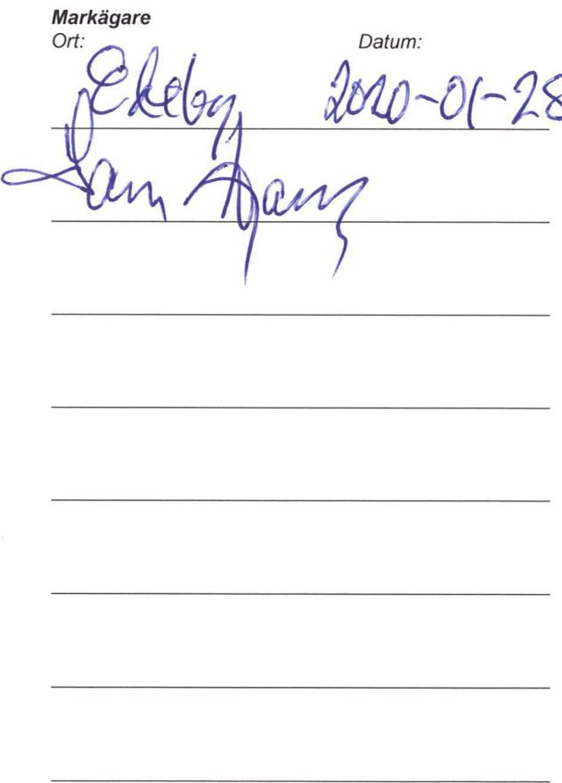
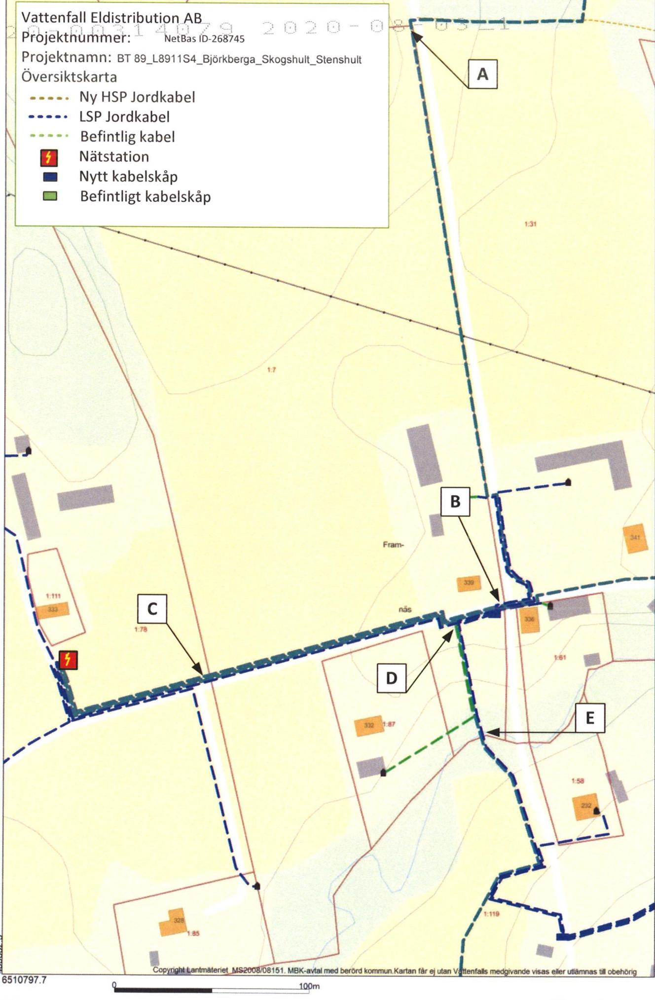

Lantmateriet Fastighetsinskrivning SE76180Norrtalje Telefon:0771-636363

Arendenr: D-2020-00314079   
Inskrivningsdatum: 2020-08-03   
Innehall: Avtalsratighet   
Fastighet: ASKERSUNDSTORAFORSA1:7   
Sökande: 556417-0800,VattenfallEIdistributionAB

# Enligt ansokan har följande inskrivningsatgard beviljiats:

AvtalsservitutKraftledning D-2020-00314079:1

Om ratigheten upphor heltller delvis ska ratighetshavaren ansoka om att inskrivningen ska tas bort.   
Det ska goras inom tre manader fran att rattigheten upphört.

Besluti detta arende har fattats av Monica Andersson.

# Kostnadsspecifikation:

Expeditionsavgift 375 SEK

Fragor rorande beslut eller ev. avgifter i arendet besvaras av Fastighetsinskrivningen enligt kontaktuppgifter langst upp pa denna sida.

I de fall originalhandlingar, som lamnats ini samband med ansökan ska returneras (ex.   
köpebrev), gors dettai separat forsandelse.

# Delta i var kundnöjdhetsundersökning

Vad tycker du som kund om Lantmateriet? Beratta for oss genom att svara pa nagra fragor. Du kan dessutom ara med och tavla om biobiljetter genom att amna ett forbattringsforslag.Tack for hjalpen! Ga tll undersokningen har: www.lantmateriet.se/kundsvar

Om du har en smarttelefon kan du anvanda den för at lasa av QR-koden och komma til enkaten.

# Markupplatelseavtal avseende elektrisk starkstromsanlaggning

<table><tr><td rowspan=1 colspan=5>imark (jordkabel)                     nätstation</td></tr><tr><td rowspan=1 colspan=5>Belastad fastighet</td></tr><tr><td rowspan=1 colspan=3>Fastighet (fastighetsagarens)Stora Forsa 1:7</td><td rowspan=3 colspan=2>Kontaktperson (namn, adress, postnummer, ort)Lars WargEdeby Säteri15392 HOLOOriginalavtalet skickas till kontaktpersonen</td></tr><tr><td rowspan=1 colspan=1>KommunAskersund</td><td rowspan=1 colspan=2>LänÖrebro</td></tr><tr><td rowspan=1 colspan=3>Fastighetsagare (namn, personnummer/organisationsnummer)Lars Warg,19460205-2930Vid fler delagare se separat delagarbilaga</td></tr><tr><td rowspan=1 colspan=3>Förmansfastighet</td><td rowspan=1 colspan=2>Projektsinformation</td></tr><tr><td rowspan=1 colspan=3>Fastighet (ledningsagarens)Nyköpings Bruk 6</td><td rowspan=2 colspan=2>Projektnamn:           BjörkebergaSkogshult StenshulProjektnummer (NIS):   268745Ledningslittera:          BT89_L8911S4Transformator (nr):</td></tr><tr><td rowspan=1 colspan=2>KommunNyköping</td><td rowspan=1 colspan=1>LanSödermanland</td></tr><tr><td rowspan=1 colspan=3>Ledningsagare (namn, organisationsnummer)Vattenfall Eldistribution AB, Org.nr 556417-0800</td><td rowspan=1 colspan=2>Ansvarig Projektledare:Oscar Björnson</td></tr><tr><td rowspan=1 colspan=5>Ersättning</td></tr><tr><td rowspan=1 colspan=4>Total ersattning enligt bifogat varderingsprotokoll!</td><td rowspan=1 colspan=1>9600kr</td></tr><tr><td rowspan=1 colspan=3>Utanordning</td><td rowspan=1 colspan=1>Datum10/5-20</td><td rowspan=1 colspan=1>Signatur</td></tr></table>

# $\ S 1$ Upplatelsens omfattning

a) Fastighetsgaren medger ledningsgaren rta anlga ch forl framtid bibehllasam at viehov forya elektrisk starkstromsledning (markkabel) med en systemspanning av hogst $2 4 \ k V .$ jamte tilhorande anordningar sasom transformatorer, ledningen redovisas pa bifogadkartskiss och/eller blit utstakad pa marken, alt nedan benamnt ledningen.

b) Fastighetsagaren upplater for ledningen ett utrymme om $4 \mathsf { m }$ horisontell breddi skogsmark (skogsgata)，1 m breddi övrig mark (schaktbredd) sarmt ${ \boldsymbol { 0 } } \times { \boldsymbol { 0 } } \ { \boldsymbol { \mathsf { m } } }$ for transformatorstation.

r ledningensanlggnde, ilsy underhall,reparationchfoyelse,fr vidvaretilfilleerforerigt omr c) anpassade tillett rationellt underhall. Fallda tradoch falldvegetation forblir fastighetsagarens egendom.

d) astige i underhal reparationchforyele,varid ledningsgarenhar aten mndettanskutanvsentigolgenhet, ia fastighetsagaren givna anvisningar betraffande ratten att ta vag.

# $\ S 2$ Föreskrifter

a) Ledningsagaren ska utova rattigheterna sa at egendomen inte betungas mer an nödvandigt.

b) Fastigetnaningfenginrppl i ledningnihlaeeniidariunkllaeeetsfreeentEnlivid iunktenfatas tecknande gällande sakerhetsforeskrifter far inte brannbar byggnadsdel eller upplag finnas narmare an $\textsf { 5 m }$ fran transformatorstation.

Bygngiiaeinavaiefast $_ { 3 \textrm { m } }$ fran maeeelteininlagelle inde rselle anivnsr markkabeln sa att reparation och underhall forsvaras.

c) Fastigetentinaifinlr att genom sakkunnig personal anvisa eller vidta lampliga skyddsatgärder.

Ofastietfati aledinastfstieingaaenfest i de anvisade skyddsatgarderna.

Marae aeretesark fasanabrukningeteravearsnoalai iunktenf ledningens anlaggande efter anlaggandet ska kunna utovas ovanfor markkabeln

Markaear fgaoaassset  iuktenf eingenaganer anlaggandet ka kunna utovasinvid markkabeln och normala transporter ska kunna ske Over markabeln. Da besarliga ska dock atgarderna omedelbart avbrytas och ledningsagaren kontaktas.

Ma f inte försvaras.

# 3 Tilitrade

Ledningsagaren far omedelbart ta i ansprak dei enlighet med $^ { \mathsection }$ 1 upplatna rattigheterna. Tiltrade anses ha sket da anlaggande av med staknings-och matningsarbeten.

# $\ S 4$ Ersättning

) grundernai expropriationslagen. Ersttningen r en engngsersitning som ska beraknas med de varderingsmetoderfor ledningsintrang som allmant tillampas vid tidpunkten for tiltrade.

E attoverenskommelse om ersattning traffats och erforderlig koncession och ovriga tilstand erhalits.

Har tiltrade agt rum innan ersattningen erlggs,ska ersattning for intrang uppraknas enligt $4 k a p 4 \ S$ expropriationslagen fran den dac tiltrdet skeddeenligtdefinitioneni $\ S \ S$ till tidpunkten for traffande av Overenskommelse om ersattningen.Daril ska ranta enli expropriationslagen uta pa det upprknadebeloppet franoch med tiltrdesdagen til ochmedbetalningsdagen.

b) a.

sadan ersattning erlagts tidigare.

Nar abonnemangsförhallande föreligger ska ersattning dock inte betalas for obetydlig skada.

c) Uppke faerig f aoiiforfenersningnsestansoe falt ska behandlas enligt detta stycke.

d) regeneeeeelstaeeeersveee traffas med rattighetshavaren for bestammande av den ersattning som denner berattigad til.

e)Kanerenselernin infs, aistenavs videinsfrninsnples.

# $\$ 5$ Virkeshantering mm.

Leningarenintersidlfornleeat,ainfoatioistighetaenfrestenaeri samband med nyanlaggning och underhal. Ledningsgaren skaven, om sa kan ske enligt dennes bedomning,erbjud fastighetsagaren att inom skalig tid svara for avverkningen.

falls utanfor engangsersatt skogsgata.

N atfarfsetnristnsoeeneilgeneendearnningpst.

# $\$ 6$ Ledningsforrattning m.m.

Detta avtal far laggas til grund for beslut om ledningsratt sasom overenskommelse enligt $1 4 \ S$ forsta stycket ledningsrattslagen. Avtalel overlatelse elle upplatelseavegendomen eller av ledningen berord del drav gra forbehall odetta atals bestand.

Omldingaendstenesteleaeleingsite fastietaen-tgethvaren a.

# $\ S 7$ Overlatelse av ledningen

skyldigheteri detta avtal.

# $\$ 8$ Borttagande av ledning

tillse att ledningen med tilhorande anordningar tas bort.

# S 10 Förekomst av arrende/nyttjanderätt/servitut

Aregennelleeseeineellelning sataatal taeeller upplaten pa annat satt?

Ja□ Nej

min/var rätt berors.

Ledningsägare Ort:

Underskrift

Datum:

<table><tr><td rowspan=1 colspan=6>FASTIGHET / SAMFALLIGHET Samt PROJEKTINFORMATION                                                       Version 2020 (2020.01.08)</td></tr><tr><td rowspan=1 colspan=1>Fastighetsbeteckning:Kommun:Fastighetsnummer:Kontaktperson &amp; adress:</td><td rowspan=1 colspan=3>Stora Forsa 1:7                                           Projektnummer:Askersund                                                      Ledning:Koncessionslöpnr:Lars Warg                                             Varderingstidpunkt:Edeby Sateri 153 92 HOLO                         Varderingsman &amp; foretag:</td><td rowspan=1 colspan=2>268745BT89_L8911S42020-01-20UIfNilsson Lill Rejlers SverigeAB</td></tr><tr><td rowspan=1 colspan=4>1. SCHABLONERSATTNING FOR MARKLEDNINGIAKER, BETE, JORDBRUKSIMPEDIMENT, SamtOVRIG MARK UTANFOR DETALPLAN</td><td rowspan=1 colspan=2>ANFOR DETALPLAN</td></tr><tr><td rowspan=1 colspan=3>Beskrivning (typ, placering, etc)</td><td rowspan=1 colspan=1>Lǎngd</td><td rowspan=1 colspan=1>Bredd</td><td rowspan=1 colspan=1>Ersättning</td></tr><tr><td rowspan=1 colspan=3>A-BHogspnning enligt kartaB-C Högspänning enligt kartaD-E Högspänning enligt karta</td><td rowspan=1 colspan=1>244m164m61m</td><td rowspan=1 colspan=1>1m1m1m</td><td rowspan=1 colspan=1>992kr667kr248kr</td></tr><tr><td rowspan=1 colspan=6>Summa:        1906kr</td></tr><tr><td rowspan=1 colspan=6>2. SCHABLONERSATTNING FOR NATSTATIONER, KABELSKAP och SJOKABELSKYLTAR (Ej inom detaljplan)</td></tr><tr><td rowspan=1 colspan=2>Beskrivning (typ, placering, yta, etc)</td><td rowspan=1 colspan=2>Typ och markslag</td><td rowspan=1 colspan=1>Antal</td><td rowspan=1 colspan=1>Ersättning</td></tr><tr><td rowspan=1 colspan=2>Kabelskap</td><td rowspan=1 colspan=2>Kabelskap-Ovrig mark</td><td rowspan=1 colspan=1>1</td><td rowspan=1 colspan=1>500kr</td></tr><tr><td rowspan=1 colspan=6>Summa:          500kr</td></tr><tr><td rowspan=1 colspan=6>3. ERSATTNING FOR HINDER IAKERMARK - För ersattningsberkning se bilaga</td></tr><tr><td rowspan=1 colspan=5>Beskrivning (typ, placering, etc)</td><td rowspan=1 colspan=1>Ersäittning</td></tr><tr><td></td><td></td><td></td><td></td><td></td><td rowspan=1 colspan=1></td></tr><tr><td rowspan=1 colspan=6>Summa:              kr</td></tr><tr><td rowspan=1 colspan=6>4 a. ERSATTNING FOR LEDNING I SKOGSMARK - För ersttningsberakning se bilaga</td></tr><tr><td rowspan=1 colspan=5>Beskrivning (typ, placering, etc)</td><td rowspan=1 colspan=1>Ersättning</td></tr><tr><td></td><td></td><td></td><td></td><td></td><td rowspan=1 colspan=1></td></tr><tr><td rowspan=1 colspan=6>Summa:          -kr</td></tr><tr><td rowspan=1 colspan=6>4 b. ROTNETTO (Ersatts separat)-FOr ersattningsberakning se bilaga</td></tr><tr><td rowspan=1 colspan=6>Anvands för berkning avpaslag (25%enligt epropriationslagen samt 20% srskid ersttning förverenskommelse)</td></tr><tr><td rowspan=1 colspan=6>Totalt rotnetto enligt bilaga:                                           Ersattning for rotnetto regleras i bilaga</td></tr><tr><td rowspan=1 colspan=6>5. ERSATTNiNG FOR OVRIGT INTRANG -FOr ersattningsberäkning se bilaga</td></tr><tr><td rowspan=1 colspan=5>Beskrivning (typ, placering, etc)</td><td rowspan=1 colspan=1>Ersättning</td></tr><tr><td rowspan=1 colspan=5>Ersittning för enstaka träd</td><td rowspan=1 colspan=1>2417kr</td></tr><tr><td rowspan=1 colspan=6>Summa:         2417kr</td></tr><tr><td rowspan=1 colspan=6>6 a. ERSATTNING FOR LEDNING ISKOGSMARK ENLIGT STORSKOGSBRUKSAVTALET</td></tr><tr><td rowspan=1 colspan=3>Beskrivning (typ, placering, etc)                    Omrade:</td><td rowspan=1 colspan=1>Lǎngd</td><td rowspan=1 colspan=1>Bredd</td><td rowspan=1 colspan=1>Ersättning</td></tr><tr><td rowspan=1 colspan=3></td><td rowspan=1 colspan=3>Summa:          . kr</td></tr><tr><td rowspan=1 colspan=6>6 b. ERSATTNING FOR INTRANG INOM VAGANLAGGNING ENLIGT STORSKOGSBRUKSAVTALET</td></tr><tr><td rowspan=1 colspan=3>Beskrivning (typ, placering, etc)</td><td rowspan=1 colspan=1>Längd</td><td rowspan=1 colspan=1>Zon</td><td rowspan=1 colspan=1>Ersattning</td></tr><tr><td rowspan=1 colspan=3></td><td rowspan=1 colspan=1></td><td rowspan=1 colspan=1></td><td rowspan=1 colspan=1></td></tr><tr><td rowspan=1 colspan=6>Summa:              kr</td></tr><tr><td rowspan=1 colspan=6>7. SAMMANSTALLNING</td></tr><tr><td rowspan=1 colspan=6>Summa intrangsersattning:        4823 krTillagg enligt expropriationslagen:        1206kr</td></tr><tr><td rowspan=1 colspan=6>Särskild ersattning vid överenskommelse:        1206krGrundersattning vid överenskommelse:        2365kr</td></tr><tr><td rowspan=1 colspan=6>TOTAL ERSATTNING       9600kr</td></tr></table>

stig utgar ranta enligt 6s rantelagen. Tilfalliga skador regleras vid skadetilfället.

<table><tr><td colspan="2">Fastighetsagare (personnr/org.nr)</td><td>Agd andel</td><td>Ersättning</td><td>Fastighetsagarens godkannande</td></tr><tr><td colspan="2">Lars Warg, 19460205-2930.</td><td></td><td>9600,00kr</td><td>220-01-28</td></tr><tr><td colspan="2">nn: Doodeu</td><td>Clearingnr: 3000</td><td></td><td>Kontonummer, Pg/Bg, IBANSWIFT 30000109909</td></tr><tr><td rowspan="3">Referens:</td><td>Telefonnummer:</td><td></td><td>E-post:</td></tr><tr><td></td><td></td><td></td></tr></table>