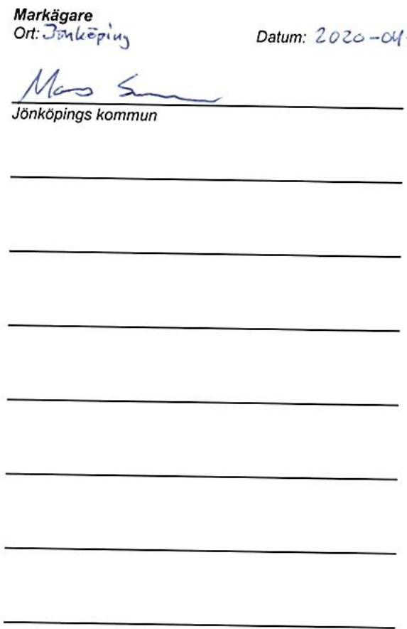
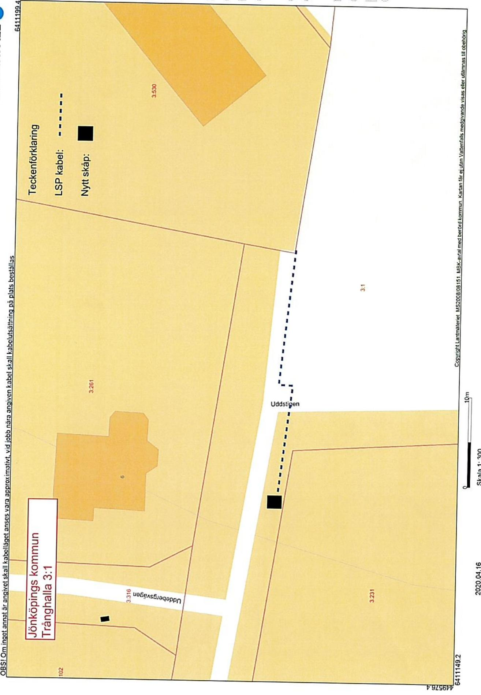

Lantmateriet Fastighetsinskrivning SE761 80Norrtalje Telefon: 0771-63 6363

Arendenr: D-2020-00400144 Inskrivningsdatum: 2020-09-29 Innehall: Avtalsrätighet Fastighet: JONKOPING TRANGHALLA3:1

# Enligt ansokan har foljande inskrivningsatgärd beviljats:

Avtalsservitut KraftledningD-2020-00400144:1

Om rattigheten upphor helt eller delvis ska ratighetshavaren ansoka om at inskrivningen ska tas bort.   
Det ska goras inom tre manader fran att ratigheten upphört.

Beslut idea rende har fattats av Ceciia Fungby.

# Kostnadsspecifikation:

Expedlitionsavgift 375 SEK

Fragor rorande beslut eller ev. avgifteri rendet besvaras av Fastighetsinskrivningen enligt kontaktuppgifter langst upp pa denna sida.

I de fall originalhandlingar, som lamnats in i samband med ansokan ska returneras (ex.   
kopebrev), gors detta iseparat forsandelse.

# Delta ivar kundnojdhetsundersokning

Vad tycker du som kund om Lantmateriet? Berata for oss genom att svara pa nagra fragor. Du kan dessutom varamed och tavla om biobijetter genom att amna et forbttingsforslag.Tac for hjlpen! Ga tilundersokningen har www.lantmateriet.se/kundsvar

Om duhar en smartelefon kan du anvanda den for at lasa av QR-koden och komma tillenkaten.

# Markupplatelseavtal avseende elektrisk starkstromsanlaggning

imark (jordkabel) nätstation

<table><tr><td rowspan=1 colspan=5>Belastad fastighet</td></tr><tr><td rowspan=1 colspan=3>Fastighet (fastighetsagarens)Tranghalla 3:1</td><td rowspan=3 colspan=2>Kontaktperson (namn, adress, postnummer, ort)Jönköpings kommunTekniska Kontoret551 89 Jönköping036-105217Originalavtalet skickas til kontaktpersonen</td></tr><tr><td rowspan=1 colspan=1>KommunJönköping</td><td rowspan=1 colspan=2>LänJönköpings Län</td></tr><tr><td rowspan=1 colspan=3>Fastighetsagare (namn, personnummer/organisationsnummer)Jönköpings Kommun 212000-0530Vid fler delagare se separat delagarbilaga</td></tr><tr><td rowspan=1 colspan=3>Förmansfastighet</td><td rowspan=1 colspan=2>Projektsinformation</td></tr><tr><td rowspan=1 colspan=3>Fastighet (ledningsagarens)Begomian 10</td><td rowspan=2 colspan=2>Projektnamn:            Uddstigen 5 Tranghalla 3.529Projektnummer (NIS):   275229TT1401_NS20538 TRANGHALLALedningslittera:          OSTRTransformator (nr):</td></tr><tr><td rowspan=1 colspan=2>KommuhVanersbonL</td><td rowspan=1 colspan=1>LanVastr Gctilaiucl</td></tr><tr><td rowspan=1 colspan=3>Ledningsagare (namn,organisationsnummer)Vattenfall Eldistribution AB, Org.nr 556417-0800</td><td rowspan=1 colspan=2>Ansvarig Projektledare:</td></tr><tr><td rowspan=1 colspan=5>Ersättning</td></tr><tr><td rowspan=1 colspan=4>Total ersattning enligt bifogat varderingsprotokoll:</td><td rowspan=1 colspan=1>3297kr</td></tr><tr><td rowspan=1 colspan=3>Utanordning34004138</td><td rowspan=1 colspan=1>Datum200904</td><td rowspan=1 colspan=1>Signatur</td></tr></table>

# S1 Upplatelsens omfatning

a) Fastighetsgaren medger leningsgaren rt at anlgga och for al framtid bibehalla samta vid behov fornya elektrisk starkstromsleding(markabel)meden systemspnningavhgstjmte tiorndeanordingr ssotransformatorer ledningen redovisas pa bifogad kartskissocheller blit utstakad pá marken, lt nedan benmnt ledningen.

) Fastighetsgaren upplatr for ledningen ett utymmeom $\circ \textrm { \textmu m }$ horisontell breddiskogsmark (skogsgata),1m breddiovrig mark (schaktbredd) samt $\ 0 \times 0 m$ fortransformatorstation.

Forledingensanlgandeilsyuderhall,rparationchforyelsefrvidvaretilflleerforderlitmrdeyas c) anpassade til et rationelt underhall. Fallda trdoch falldvegetation forblirfastighetsgarensegendom.

d) Fastighetifreniiinfig. undehalrearationchforyelaid eingarehatdenmnean eutan sentgoleei fastighetsagaren givna anvisningar betraffande ratten att ta vag.

# $\ S 2$ Föreskrifter

a) Ledningsagaren ska utova ratigheterna sa att egendomen inte betungas mer an nodvandigt.

b) Fastigheteninnainpfdelnginnrpaell in ingnleeniviaruanfeiie tecknaeaneeetsfresierirbadelelppla insafrntansfatatio.

Bglinstast $\textsf { 3 m }$   
markkabeln sa at reparation och underhall försvaras.

c) Fastigee i ai att genom sakkunnig personal anvisa eller vidta lǎmpliga skyddsatgärder.

aleiaseiavestei de anvisade skyddsatgärderna.

a) arkal kerchbetesarkforgaspsnttatbrkingetoerakeraksooralavididpunkenfr ledningens anlaggande efter anlaggandet ska kunna utovas ovanfor markkabeln. 2

arar fsnaalrviunefngnaaefr anlaggandet ska kunna utovas invid markkabeln och normala transporter ska kunna ske ver markabeln Da besvrlig ska dock atgarderna omedelbart avbrytas och ledningsagaren kontaktas.

inte forsvaras.

# 3 Tilltrade

$\ S \uparrow$ ellerverninfeingenbtseerinintforstsandnst eatia med staknings-och matningsarbeten.

# 54 Ersattning

a) grunderna expropriationslagen.Ersatningenrenengangserstning som ska beraknas med de varderingsmetoderf ledningsintrang som allmǎnt tillǎmpas vid tidpunkten för tiltrade.

att overenskommelse om ersattning trafats och erforderlig koncession och ovriga tilstand erhalits.

tilteteniefioeiuntffereeleninil n expropriationslagen utga padet upprknade beloppet fran och med tiltdesdagen til och medbetalninasdaen.

savfisieaatfele ofattasengneringersningealaarrsitalrareesarastferu

rsaniieinaealaf utaerainaina sadan ersattning erlagts tidigare.

Nar abonnemangsförhallande foreligger ska ersattning dock inte betalas för obetydlig skada.

C) Uppoeraerinfrsaa svisiforseeennersingnstiabesandechoi natfseielil falt ska behandlas enligt detta stycke.

u) reenonelereasberppltelsenelastrendenyndereita srsilverenselse traffas med rattighetshavaren for bestammande av den ersattning som denne ar berattigad till.

nanoereneseersningint trfssaistenrasvideinsfrtinganaee

# $\$ 5$ Virkeshantering mm.

Leaningagaenminterskidaslfranleerannatmainfoationiastighetsarenfrestendevenin sambandmednyanlggningochunderhall.Ledningsgarenskaven,omsa kanskeenligtdennes bedmning，erbjud fastighetsagaren att inom skalig tid svara for avverkningen.

Ueinineaveingellefastietre  afeningea ledingeferinge.Leinreveaafr iarataandavietingareai averirsil falls utanför engangsersatt skogsgata.

atfarafinsektsangrpphinerfrvirestranspoerelermerbetyolgeetfrpgendearnndinust

# $\$ 6$ Ledningsförrättning m.m.

overlatelse ellerupplatelseavegendomen elleravledningen berord del dravora forbehall om detta avtals bestnd

eiaensnaestmeleneleinstbiterastietsrentetsaar

# $\$ 7$ Overlatelse av ledningen

skyldigheteri detta avtal.

# $\$ 8$ Bortagande av ledning

anngaeniileiaieosieaeneefa fa medelartieteseedeleingendebevfnalnelleeskidspuntsaleingresabnd tillse att ledningen med tillhorande anordningar tas bort.

# 59 Sarskilda bestimmelser

2828-084881442828-88-28-3

S10 Forekomstav arrende/nytjiandert/servitut

reenoneeaerr leingenlleananlgningsataseaavtaltrrederellr upplaten pa annat satt?

Sasomarenatortigetaaevannmenner agifrestental illaelaenanin min/var rätt berors.

Av detta avtal har tva likalydande exemplar upprättats och utvaxlats mellan parterna.

Ledningsägare Ort:

Datum:

# Underskrift

Namnförtydligande

<table><tr><td rowspan=1 colspan=6>FASTIGHET /SAMFALLIGHET Samt PROJEKTINFORMATION                                                                FORETAGEN</td></tr><tr><td rowspan=1 colspan=6>FASTIGHET /SAMFALLIGHET Samt PROJEKTINFORMATION                                                                FORETAGENFastighetsbeteckning:                                                                                 Version 2020 (2020.01.30Tránghalla 3:1Projektnummer:</td></tr><tr><td rowspan=1 colspan=1>Fastighetsbeteckning:Kommun:Fastighetsnummer:Kontaktperson &amp; adress:</td><td rowspan=1 colspan=5>Tránghalla 3:1                                           Projektnummer: 275229Jǒnkǒping                                                     Ledning: TT1401_NS20538TRANGHALLAKoncessionslöpnr:Jönkōpings kommun Tekniska Kontoret 55189             Värderingstidpunkt: 20/04/17Jönköping                                      Varderingsman &amp; företag: Maria Pettersson1. SCHABLONERSATTNING FOR MARKLEDNING AKER, BETE, JORDBRUKSIMPEDIMENT, Samt OVRIG MARK UTANFOR DETAUPLAN</td></tr><tr><td rowspan=1 colspan=6>Varderingsman &amp; företag: Maria Pettersson1. SCHABLONERSATTNING FOR MARKLEDNING AKER, BETE, JORDBRUKSIMPEDIMENT, Samt OVRIG MARK UTANFOR DETAUPLANBeskrivning (typ, placering,etc)Lǎngd</td></tr><tr><td rowspan=1 colspan=3>Beskrivning (typ, placering,etc)Lagspänning enligt karta</td><td rowspan=1 colspan=1>Lǎngd</td><td rowspan=1 colspan=1>Bredd</td><td rowspan=1 colspan=1>Ersaittning</td></tr><tr><td rowspan=1 colspan=4>Lagspänning enligt karta                                                                  Lǎngd30m</td><td rowspan=1 colspan=2>1m               122</td></tr><tr><td rowspan=1 colspan=6>2. SCHABLONERSATTNING FOR NATSTATIONER, KABELSKAP och SJOKABELSKYLTAR (E inom detaljplan)            Summa:          122kr</td></tr><tr><td rowspan=1 colspan=6>2. SCHABLONERSATTNING FOR NATSTATIONER, KABELSKAP och SJOKABELSKYLTAR (E inom detaljplan)            Summa:          122krBeskrivning (typ, placering, yta, etc)                        Typ och markslag</td></tr><tr><td rowspan=1 colspan=2>Beskrivning (typ, placering, yta, etc)Kabelskapiǒvrig mark</td><td rowspan=1 colspan=2>Typ och markslagKabelskap-Ovrig mark</td><td rowspan=1 colspan=1>Antal</td><td rowspan=1 colspan=1>Ersöttning</td></tr><tr><td rowspan=1 colspan=2>Kabelskapiǒvrig mark</td><td rowspan=1 colspan=4>Kabelskap-Ovrig mark                              1                500k</td></tr><tr><td rowspan=1 colspan=6>3. ERSATTNING FOR HINDER IAKERMARK - För ersattningsberäkning se bilaga                                  Summa:          500kr</td></tr><tr><td rowspan=1 colspan=6>3. ERSATTNING FOR HINDER IAKERMARK - För ersattningsberäkning se bilaga                                  Summa:          500krBeskrivning (typ, placering, etc)</td></tr><tr><td rowspan=1 colspan=5>Beskrivning (typ, placering, etc)</td><td rowspan=1 colspan=1>Ersöttning</td></tr><tr><td rowspan=1 colspan=5></td><td rowspan=1 colspan=1></td></tr><tr><td rowspan=1 colspan=6>4a. ERSATTNING FOR LEDNING I SKOGSMARK - För ersättningsberkning se bilaga                               Summa:             kr</td></tr><tr><td rowspan=1 colspan=6>4a. ERSATTNING FOR LEDNING I SKOGSMARK - För ersättningsberkning se bilaga                               Summa:             krBeskrivning (typ, placering,etc)</td></tr><tr><td rowspan=1 colspan=5>Beskrivning (typ, placering,etc)</td><td rowspan=1 colspan=1>Ersättning</td></tr><tr><td rowspan=1 colspan=5></td><td rowspan=1 colspan=1></td></tr><tr><td rowspan=1 colspan=6>4 b. ROTNETTO (Erstts separat)- För ersttningsberakning se bilaga                                            Summa:          -kr</td></tr><tr><td rowspan=1 colspan=6>4 b. ROTNETTO (Erstts separat)- För ersttningsberakning se bilaga                                            Summa:          -krAnvands for berkningavpslag (25%enligt expropriationslagen samt 20% srsildersttning forverenskommelse)</td></tr><tr><td rowspan=1 colspan=6>Anvands for berkningavpslag (25%enligt expropriationslagen samt 20% srsildersttning forverenskommelse)Totalt rotnetto enligt bilaga:</td></tr><tr><td rowspan=1 colspan=6>Totalt rotnetto enligt bilaga:5. ERSATTNING FOR ÖVRIGT INTRANG - För ersittningsberkning e bilaga                            Ersittning for rotnetto regleras i bilaga</td></tr><tr><td rowspan=1 colspan=6>5. ERSATTNING FOR ÖVRIGT INTRANG - För ersittningsberkning e bilaga                            Ersittning for rotnetto regleras i bilagaBeskrivning (typ, placering, etc)</td></tr><tr><td rowspan=1 colspan=5>Beskrivning (typ, placering, etc)</td><td rowspan=1 colspan=1>Ersättning</td></tr><tr><td rowspan=1 colspan=5></td><td rowspan=1 colspan=1></td></tr><tr><td rowspan=1 colspan=6>6 a. ERSATTNING FOR LEDNING ISKOGSMARK ENLIGT STORSKOGSBRUKSAVTALET                               Summa:          -kr</td></tr><tr><td rowspan=1 colspan=6>6 a. ERSATTNING FOR LEDNING ISKOGSMARK ENLIGT STORSKOGSBRUKSAVTALET                               Summa:          -krBeskrivning (typ,placering, etc)                   Omráde:</td></tr><tr><td rowspan=1 colspan=3>Beskrivning (typ,placering, etc)                   Omráde:</td><td rowspan=1 colspan=1>Lǎngd</td><td rowspan=1 colspan=1>Bredd</td><td rowspan=1 colspan=1>Ersöittning</td></tr><tr><td rowspan=1 colspan=3></td><td rowspan=1 colspan=1></td><td rowspan=1 colspan=2></td></tr><tr><td rowspan=1 colspan=6>6 b. ERSATTNING FOR INTRANG INOM VAGANLAGGNING ENLIGT STORSKOGSBRUKSAVTALET                      Summo:              kr</td></tr><tr><td rowspan=1 colspan=6>6 b. ERSATTNING FOR INTRANG INOM VAGANLAGGNING ENLIGT STORSKOGSBRUKSAVTALET                      Summo:              krBeskrivning (typ,placering,etc)</td></tr><tr><td rowspan=1 colspan=3>Beskrivning (typ,placering,etc)</td><td rowspan=1 colspan=1>Längd</td><td rowspan=1 colspan=1>Zon</td><td rowspan=1 colspan=1>Ersittning</td></tr><tr><td></td><td></td><td></td><td rowspan=1 colspan=1></td><td rowspan=1 colspan=1></td><td rowspan=1 colspan=1></td></tr><tr><td rowspan=1 colspan=6>7. SAMMANSTALLNING                                                                                  Summa:           -kr</td></tr><tr><td rowspan=1 colspan=6>7. SAMMANSTALLNING                                                                                  Summa:           -kr</td></tr><tr><td rowspan=1 colspan=6>Summa intrangsersittning:         622 krTillaggenligtexpropriationslagen          155kr</td></tr><tr><td rowspan=1 colspan=6>Tillaggenligtexpropriationslagen          155krSärskild ersattning vid överenskommelse:         155krGrundersattning vid överenskommelse:        2365kr</td></tr><tr><td rowspan=1 colspan=6>Grundersattning vid överenskommelse:        2365krTOTAL ERSATTNING       3297 kr</td></tr><tr><td rowspan=1 colspan=6>TOTAL ERSATTNING       3297 kr</td></tr></table>

i utgarrnta enligt6rntelagen.Tilfalliga skador regleras vid skadetilfillet.

Uvanstende godnns ocherttning stt inp foljande kontovrigdelareredoviss  fliande iidr   

<table><tr><td colspan="2">Fastighetsogare (personnr/org.nr)</td><td>Ägd andel</td><td>Ersöttning</td><td>Fastighetsigarens godkinnande</td></tr><tr><td colspan="2">Jōnköpings kommun (212000) Banknamn:</td><td>1</td><td>3297,00 kr</td><td>Underskrift/Datum: ManS 2020-04-20</td></tr><tr><td colspan="2">Referens: Telefonnummer:</td><td colspan="2">Clearingnr:</td><td>Kontonummer,Pg/Bg, IBAN&amp;SWiFT•: BG341-9363</td></tr><tr><td rowspan="2">55CE0 2020:218</td><td colspan="3"></td><td>E-post:</td></tr><tr><td colspan="3"></td><td></td></tr></table>

# Markupplatelseavtal avseende jordkabel och kabelskap inom del av Tranghalla 3:1

Rubricerade avtal och varderingsprotokoll har nu undertecknats av Jönkopings kommun, tekniska kontoret, genom delegation av verksamhetschef Marcus Svensson och atersänds harmed.

Vanligen, underteckna och atersand kommunens exemplari bifogat kuvert snarast.   
Vi emotser er betalning omgaende till Jönköpings kommuns bankgiro 341-9363.

Vid betalningen var vanlig ange referensen 55CEO 2020:218

TEKNISKA KONTORET

Marcus Svensson Verksamhetschef mark

# X Mindre Projekt / Nyanslutningar > 100.000kr Nyanslutningar < 100.000kr Projekt utanför samverkansavtalet

<table><tr><td>Projektnamn</td></tr><tr><td></td></tr><tr><td>Uddstigen 5, Tranghalla</td></tr><tr><td></td></tr></table>

<table><tr><td>VF Eldistributions NIS-nr 275229</td><td>VF Eldistributions PN-nr 00116.018.40.10</td><td>Bestäillare VF Eldistribution Driton Mehmeti</td></tr></table>

<table><tr><td rowspan=1 colspan=1>SO-nummer7042579</td><td rowspan=1 colspan=1>Beredarens namnMaria Pettersson</td><td rowspan=1 colspan=1>Telefonnr076-11084814</td></tr><tr><td rowspan=1 colspan=1>BAST-nummer300968516</td><td rowspan=1 colspan=1>Projektledare VSMina Agang</td><td rowspan=1 colspan=1>Telefonnr073-0853123</td></tr></table>

# Kommentarer

Bifogade handlingar:

Markupplatelseavtal   
Varderingsprotokoll   
Fastighetsförteckning REV-avtal   
Registreringsbevis vid bolag   
□ Fullmakt (dr sadan finns)   
Dödsbodeligare