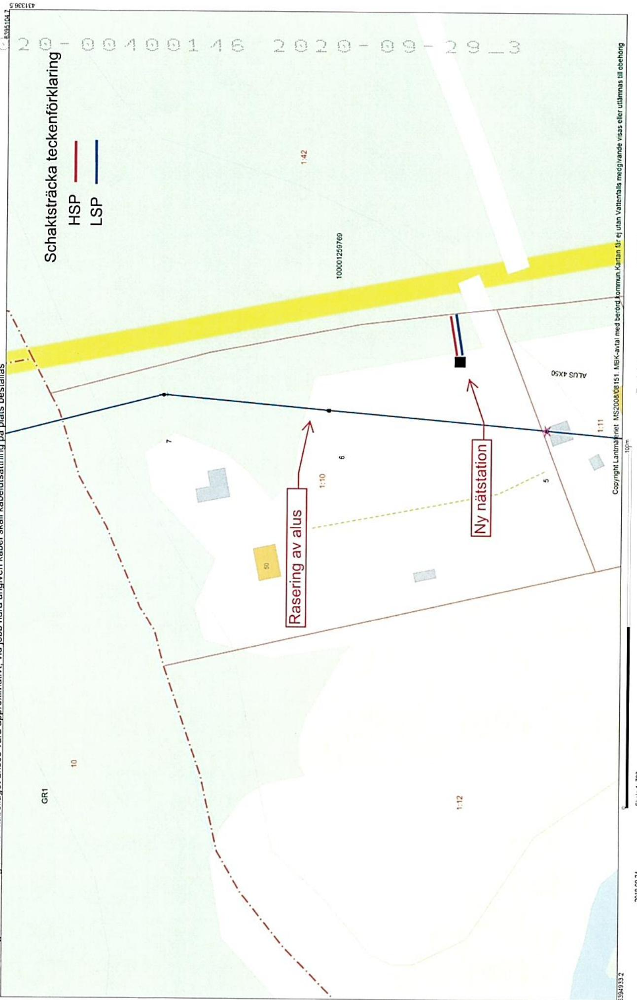
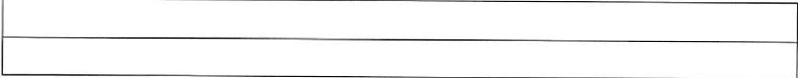

Lantmäteriet Fastighetsinskrivning SE76180Norrtalje Telefon: 0771-63 63 63

Arendenr: D-2020-00400146 Inskrivningsdatum: 2020-09-29 Innehall: Avtalsrattighet Fastighet: JONKOPING YAS 1:10

# Enligt ansökan har foljande inskrivningsatgard beviljats:

Avtalsservitut Kraftledning, Natstation D-2020-00400146:1

Om ratigheten upphor helt eller delvisskarattighetshavaren ansokaom attinskivningen ska tas bort.   
Det ska göras inom tre manader fran att rattigheten upphört.

Besluti detta arende har fattats av Rosita Wicknertz.

# Kostnadsspecifikation:

Expeditionsavgift 375 SEK

Fragor rorande beslut eller ev. avgifteri arendet besvaras av Fastighetsinskrivningen enligt kontaktuppgifter langst upp pa denna sida.

I de fall originalhandlingar, som lamnats ini samband med ansokan ska returneras (ex.   
kopebrev), gors detta iseparat försandelse.

# Delta ivar kundnojdhetsundersökning

Vad tycker du som kund om Lantmateriet? Beritta for oss genom att svara pa nagra fragor. Du kan dessutom ara med och tavla om biobilieer genom att amna e frbatingsforslag.Tack for hjalpen! Ga til ndersokningen har www.lantmateriet.se/kundsvar

Om du har en smarttelefon kan du anvanda den for att lasa av QR-koden och komma tillenkaten.

# Markupplatelseavtal avseende elektrisk starkstromsanlaggning

imark (jordkabel) nätstation

<table><tr><td rowspan=1 colspan=5>Belastad fastighet</td></tr><tr><td rowspan=1 colspan=3>Fastighet (fastighetsagarens)Yas 1:10</td><td rowspan=3 colspan=2>Kontaktperson (namn, adress, telefon)Lars-Erik BrevitzIgelkottsvägen 1 LGH 110255307 JönköpingOriginalavtalet skickas til kontaktpersonen</td></tr><tr><td rowspan=1 colspan=1>KommunJönköping</td><td rowspan=1 colspan=2>LanJönköpings Län</td></tr><tr><td rowspan=1 colspan=3>Fastighetsagare (namn, personnummer/organisationsnummer)Lars-Erik Brevitz 650520-2470Vid fler delagare se separat delagarbilaga</td></tr><tr><td rowspan=1 colspan=3>Förmansfastighet</td><td rowspan=1 colspan=2>Projektsinformation</td></tr><tr><td rowspan=1 colspan=3>Fastighet (ledningsagarens)Begonian 10</td><td rowspan=2 colspan=2>Projektnamn:            VidebäckenTrafiksakerhetskameProjektnummer(NIS):   267489Ledningslittera:          TT1391_T100 NISSANASTransformator (nr):</td></tr><tr><td rowspan=1 colspan=2>KommunVanersborg</td><td rowspan=1 colspan=1>LǎnVastra Götaland</td></tr><tr><td rowspan=1 colspan=3>Ledningsagare (namn, organisationsnummer)Vattenfall Eldistribution AB, Org.nr 556417-0800</td><td rowspan=1 colspan=2>Ansvarig Projektledare:</td></tr><tr><td rowspan=1 colspan=5>Ersättning</td></tr><tr><td rowspan=1 colspan=4>Total ersattning enligt bifogat varderingsprotokoll:</td><td rowspan=1 colspan=1>3570kr</td></tr><tr><td rowspan=1 colspan=3>Utanordning34004209</td><td rowspan=1 colspan=1>DatumQeaaau</td><td rowspan=1 colspan=1>Signaturcls</td></tr></table>

Omerningenstalaeverstire(prenaauelprisaselpeal inimieringal5.

# s1 Upplatelsens omfattning

a) Fastighetsgarenmedger leningsgaren rt atanlgga chforal framtid bibehalla samta vidbehovforya elektrisk starkstromsledning(marabel)medensystemspingavhgst1.mte tilhorndeanordningarsomtransformatorer ledningen redovisas pa bifogad kartskissoch/eller blivit utstakadpa marken, altnedan benǎmnt ledningen.

Fastighetsagaren uppater for ledningen et utymme om $\circ _ { \mathfrak { m } }$ horisontellbredi skogsmark (skogsgata),1mbreddiovrig mark (schaktbredd) samt $5 \times 5 m$ for transformatorstation.

For ledningensanlggande,tillsyunderhal reparationchfryelse farvidvaretilflleerforderlitrdeys.

c) Fastigete iafelisai ihineiia anpassade til et rationellt underhall. Fallda trd och flld vegetation forbirfastighetsgarens egendom.

d) Fastighefiii underhalreparationchforyelsevavid leningarenhaadenmaneaan skeutanvsentiolgenhet,iakv fastighetsagaren givna anvisningar betraffande ratten att ta vg.

# $\ S 2$ Föreskrifter

a) Ledningsagaren ska utova ratigheterna sa att egendomen inte betungas mer an nodvandic b) Fastighetrenintaaanninppfelingorpplage ina ledningesiallandniarunkaneetsfesrivensEiviiunkenfes teclefreirialplafinfrsfato. $3 m$ markkabeln sa att reparation och underhall forsvaras.

c) Fastigetreinutaneires iianviasoaneffeingnl attgenom sakkunnig personal anvisa eller vidta lmpliga skyddsatgarder.

de anvisade skyddsatgärderna.

d) Markabelaerhetesarfrgaspsdant abrukningseterakeak sooalavidunkenf ledningens anlaggande efter anlaggandet ska kunna utovas ovanfor markkabeln.

Markaeargssaalauservidiunkenfeinesae anlaggandet ska kunn utovas invid markkabeln och nomal tanpoter ska ku ske ver markabein Da besri ska dock atgarderna omedelbart avbrytas och ledningsagaren kontaktas.

inte försvaras.

# $\$ 3$ Tilltrade

Ledningsagaren far omedelbart ta i ansprak de ienlighet med $\ S 1$ upplatna rattigheterna.Tiltrade anses ha sket da anlaggande av med staknings- och matningsarbeten.

# $\ S 4$ Ersättning

a) Ersninfppelsfresieeaaletassinterninnrni grundernexpropriationslagen.Ersatningen renengangsersatning som ska berknas medde varderingmetoderf ledningsintrang som allmant tilimpas vid tidpunkten for tiltrade.

attǒverenskommelse om ersattning traffats och erforderlig koncession och ovriga tilstand erhalits.

Har tiltdeagt rum innan ersattningen erlggs,skaerattning for intrang upprknas enligt4kap4 $\ S$ expropriationslagen fran den dag tileenefiioeiiuntefrverenslsernineDilana expropriationslagen utga pa det upprknde beloppet fran och med tiltrdesdagen til och medbetalningsdagen.

b) Freiiae sadan ersattning erlagts tidigare.

Nar abonnemangsforhallande foreligger ska ersattning dock inte betalas for obetydlig skada.

c) Uppkoe ersninf sovisa ifreeenngseringens sluaestmandcsoie falt ska behandlas enligt detta stycke.

d) trafas med ratighetshavaren forbestammande avden ersattning som denner berattigdil

e)Kanverenseleersningintrfasaistenasieingrtningaelleavt.

# $\$ 5$ Virkeshantering mm.

Ledningsresmintersida franleeannatmainfoationiastigetsarenfresteneaerni samband med nyanlggning och underhall Ledningsgaren ska ven, om skan ske enligt dennes bedomning,erbjud fastighetsagaren at inom skali tid svara for avverkningen.

edingarefaerningeneingarervearfrirataanieeingara falls utanfor engangsersatt skogsgata.

# $\$ 6$ Ledningsförrattning m.m.

Detta avtal far laggas til grund for beslut om ledningsratt sasom overenskommelse enligt $1 4 \ S$ forsta stycket ledningsrattslagen. Avtalet overlatelseellerupplatelseavegendomen ellerav ledningen berord del dravgora forbehall om detta avtals bestnd.

Omledninggaened stddeabestmelseaseeingt bierastietsgaren-tigethavaren ana.

# s7 Overlatelse av ledningen

skyldigheteri detta avtal.

# 8 Borttagande av ledning

tillse att ledningen med tillhorande anordningar tas bort.

$\ S 9$ Särskilda bestammelser

S 10 Förekomst av arrende/nyttjanderättservitut

Areeellere soeleingellenangingsaaetaltareeaeller upplaten pa annat satt?

min/var ratt berors.

Av detta avtal har tva likalydande exemplar upprattats och utvaxlats mellan parterna

Ledningsägare Ort:

Datum:

Markägare Ot: Sonkopins Datum: 2019.10-09

Underskrift

tos Bveut

Lars-Erik Brevitz

<table><tr><td></td><td rowspan=1 colspan=6>FASTIGHET /SAMFALLIGHET Samt PROJEKTINFORMATION</td><td rowspan=1 colspan=1>FASTIGHET /SAMFALLIGHET Samt PROJEKTINFORMATION                                                       Version 2019 (2018.12.20Fastighetsbeteckning: YAS1:10</td></tr><tr><td></td><td rowspan=1 colspan=1>Fastighetsbeteckning:Kommun:Fastighetsnummer:Kontaktperson &amp; adress:</td><td rowspan=1 colspan=1>YAS1:10JönköpingLars-Erik Brevitz Igelkottsvägen 1 LGH 110255307 Jönkōping</td><td rowspan=1 colspan=3>Projektnummer:Ledning:Koncessionslöpnr:Varderingstidpunkt:Varderingsman &amp; företag:</td><td rowspan=1 colspan=1>267489_NS99235 NISSANAS19/09/24Maria Pettersson</td></tr><tr><td></td><td rowspan=1 colspan=5>1. SCHABLONERSATTNING FOR MARKLEDNING IAKER, BETE, IMPEDIMENT (Ej skogSimpediment)Beskrivning (typ,placering,etc)</td><td rowspan=1 colspan=1></td></tr><tr><td></td><td rowspan=1 colspan=3>Beskrivning (typ,placering,etc)Hǒgspnning enligt karta</td><td rowspan=1 colspan=1>Lǎngd</td><td></td><td rowspan=1 colspan=1>Ersättning</td></tr><tr><td></td><td rowspan=1 colspan=3>Hǒgspnning enligt karta</td><td rowspan=1 colspan=1>20m</td><td></td><td rowspan=1 colspan=1>80k</td></tr><tr><td></td><td rowspan=1 colspan=6>Summa:          80kr2. SCHABLONERSATTNING FOR NATSTATIONER OCH KABELSKAP (Ej inom detalplan)</td></tr><tr><td></td><td rowspan=1 colspan=6>2. SCHABLONERSATTNING FOR NATSTATIONER OCH KABELSKAP (Ej inom detalplan)Beskrivning (typ, placering, yta,etc)</td></tr><tr><td></td><td rowspan=1 colspan=2>Beskrivning (typ, placering, yta,etc)</td><td rowspan=1 colspan=3>Typ och markslag</td><td rowspan=1 colspan=1>Ersättning</td></tr><tr><td></td><td rowspan=1 colspan=2>Natstationiimpediment</td><td rowspan=1 colspan=3>Natstation- Impediment</td><td rowspan=1 colspan=1>2300kr</td></tr><tr><td></td><td rowspan=1 colspan=6>Summa:        2300kr3. ERSATTNING FOR HINDERIAKERMARK - För ersittningsberkning se bilaga</td></tr><tr><td></td><td rowspan=1 colspan=6>3. ERSATTNING FOR HINDERIAKERMARK - För ersittningsberkning se bilagaBeskrivning (typ, placering,etc)</td></tr><tr><td></td><td rowspan=2 colspan=5>Beskrivning (typ, placering,etc)</td><td></td></tr><tr><td></td><td rowspan=2 colspan=1>Ersättning</td></tr><tr><td></td><td rowspan=2 colspan=5></td></tr><tr><td></td><td rowspan=2 colspan=1></td></tr><tr><td></td><td rowspan=2 colspan=5>Summa:</td></tr><tr><td></td><td rowspan=1 colspan=1>- kr</td></tr><tr><td></td><td rowspan=1 colspan=6>4 a. ERSATTNING FOR LEDNING I SKOGSMARK - För ersittningsberäkning se bilagaBeskrivning(typ, placering, etc)</td></tr><tr><td></td><td rowspan=2 colspan=5>Beskrivning(typ, placering, etc)</td><td></td></tr><tr><td></td><td rowspan=2 colspan=1>Ersöttning</td></tr><tr><td></td><td rowspan=2 colspan=5></td></tr><tr><td></td><td rowspan=2 colspan=1></td></tr><tr><td rowspan=2 colspan=6>Summa:</td></tr><tr><td rowspan=1 colspan=1>- kr</td></tr><tr><td rowspan=1 colspan=7>4 b. ROTNETTO (Ersatts separat)- För ersǎttningsberdkning se bilagaAnvands for berkningavpslag (25%enligt expropriationslagen somt 20% srskild ersittning for verenskommelse)</td></tr><tr><td rowspan=1 colspan=7>Anvands for berkningavpslag (25%enligt expropriationslagen somt 20% srskild ersittning for verenskommelse)Totalt rotnetto enligt bilaga:</td></tr><tr><td rowspan=1 colspan=7>Totalt rotnetto enligt bilaga:                                                     Ersittning for rotnetto reglerasi bilga5. ERSATTNING FOR OVRIGT INTRANG -För ersttningsberkning se bilaga</td></tr><tr><td rowspan=1 colspan=7>5. ERSATTNING FOR OVRIGT INTRANG -För ersttningsberkning se bilagaBeskrivning (typ,placering,tc)</td></tr><tr><td rowspan=2 colspan=6>Beskrivning (typ,placering,tc)</td><td></td></tr><tr><td rowspan=2 colspan=1>Ersittning</td></tr><tr><td rowspan=2 colspan=6></td></tr><tr><td rowspan=2 colspan=1></td></tr><tr><td rowspan=2 colspan=6>Summa:6 a. ERSATTNING FOR LEDNING ISKOGSMARK ENLIGT STORSKOGSBRUKSAVTALET</td></tr><tr><td rowspan=1 colspan=1>- kr</td></tr><tr><td rowspan=1 colspan=7>6 a. ERSATTNING FOR LEDNING ISKOGSMARK ENLIGT STORSKOGSBRUKSAVTALETBeskrivning (typ, placering, etc)                   Omrade:</td></tr><tr><td rowspan=1 colspan=4>Beskrivning (typ, placering, etc)                   Omrade:</td><td rowspan=1 colspan=1>Löngd</td><td rowspan=1 colspan=1>Bredd</td><td rowspan=1 colspan=1>Ersittning</td></tr><tr><td rowspan=1 colspan=4></td><td rowspan=1 colspan=1></td><td rowspan=1 colspan=1></td><td rowspan=1 colspan=1></td></tr><tr><td rowspan=1 colspan=7>Summa:           kr6 b. ERSATTNING FOR INTRANG INOM VAGANLAGGNING ENLIGT STORSKOGSBRUKSAVTALET</td></tr><tr><td rowspan=1 colspan=7>6 b. ERSATTNING FOR INTRANG INOM VAGANLAGGNING ENLIGT STORSKOGSBRUKSAVTALETBeskrivning (typ, placering, etc)</td></tr><tr><td rowspan=1 colspan=4>Beskrivning (typ, placering, etc)</td><td rowspan=1 colspan=1>Langd</td><td rowspan=1 colspan=1>zon</td><td rowspan=1 colspan=1>Ersättning</td></tr><tr><td rowspan=1 colspan=4></td><td rowspan=1 colspan=1></td><td rowspan=1 colspan=1></td><td rowspan=1 colspan=1></td></tr><tr><td rowspan=1 colspan=7>Summa:          - kr7. SAMMANSTALLNING</td></tr><tr><td rowspan=1 colspan=7>7. SAMMANSTALLNING</td></tr><tr><td rowspan=1 colspan=7>Tillgg enligt expropriationslagen:         595krSarskild ersättning för overenskommelse:         595 krTillggfor minimiersattning:         . kr</td></tr><tr><td rowspan=1 colspan=7>TOTAL ERSATTNING      3570kr</td></tr></table>

sti utgr rnta enligt6rntelagen.Tilfllig sador regleras vid sadetilfllet.

Ovanstende godknns och ersittning stt inp foljiande konto (vriga delgare redovisas p foliande sida/sidor)   

<table><tr><td colspan="2">Fastighetsägare (födelsedotum/org.nr)</td><td>Ägd andel</td><td>Ersöttning</td><td>Fastighetsǎigarens godkǎnnande</td><td></td></tr><tr><td colspan="2">Lars-Erik Brevitz (650520)</td><td>1</td><td>3570,00kr</td><td>Underskrift/Datum: Yavseuh</td><td>2009-10-09</td></tr><tr><td colspan="2">8anknamn: Swedbanh</td><td colspan="2">Clearingnr: 815-0-5</td><td>Kontonummer, Pg/Bg,IBAN&amp;SWIFT: 4.437.286-0</td></tr><tr><td colspan="2">Referens: Telefonnummer:</td><td colspan="2">0703561365</td><td>E-post: lars6revitz@gmail</td></tr></table>

# Mindre Projekt / Nyanslutningar > 100.000kr X Nyanslutningar < 100.000kr Projekt utanfor samverkansavtalet

<table><tr><td>Projektnamn</td></tr><tr><td>Videbäcken Trafiksakerhetskamera</td></tr><tr><td></td></tr><tr><td></td></tr></table>

<table><tr><td>VF EldistributionsNIS-nr</td><td>VFEldistributions PN-nr</td><td>Beställare VF Eldistribution</td></tr><tr><td>267489</td><td>00116.018.10.16</td><td>Mikael Nystrand</td></tr></table>

110.18.10.116

<table><tr><td rowspan=1 colspan=1>SO-nummer4941399</td><td rowspan=1 colspan=1>Beredarens namnMaria Pettersson</td><td rowspan=1 colspan=1>Telefonnr076-11084814</td></tr><tr><td rowspan=1 colspan=1>BAST-nummer300737577</td><td rowspan=1 colspan=1>Projektledare VSOskar Snögren</td><td rowspan=1 colspan=1>Telefonnr070-3954019</td></tr></table>

# Kommentarer

Bifogade handlingar:

Markupplatelseavtal   
Varderingsprotokoll   
□ Fastighetsforteckning REV-avtal   
Registreringsbevis vid bolag   
Fullmakt (dar sadan finns)   
Dödsbodelägare