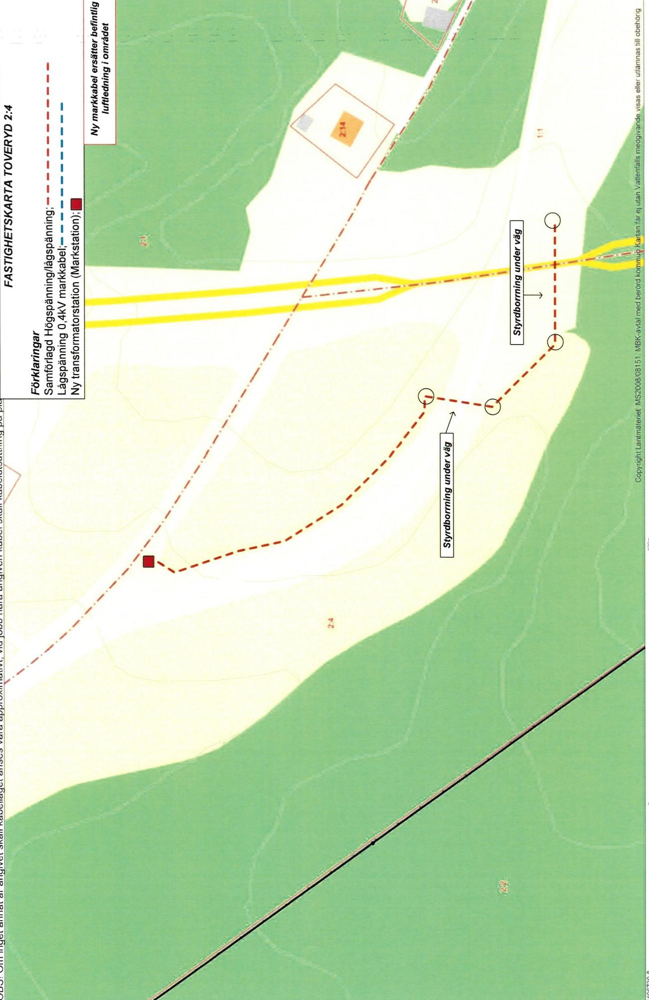
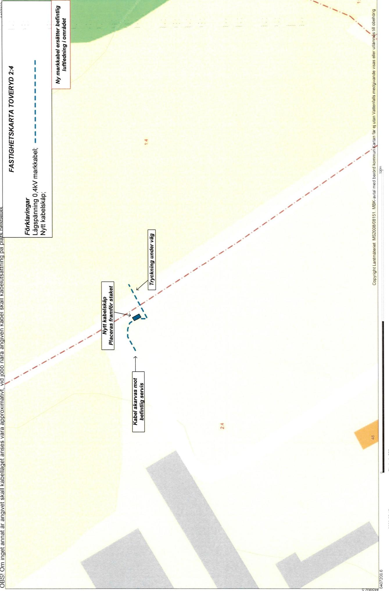
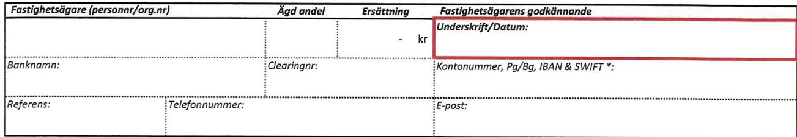
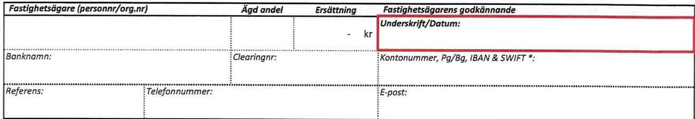
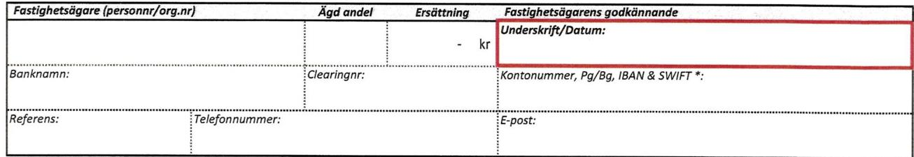
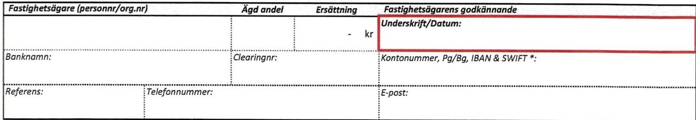
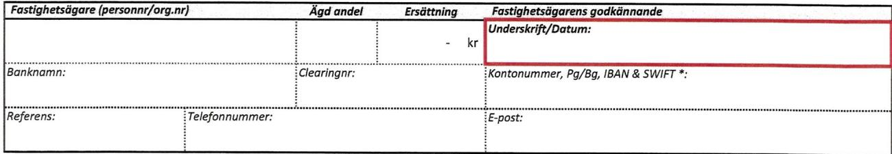
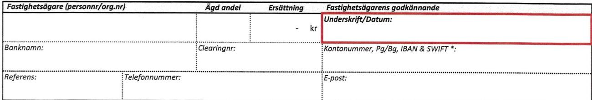

Lantmateriet Fastighetsinskrivning SE76180Norrtalje Telefon: 0771-6363 63

Arendenr: D-2020-00545991 Inskrivningsdatum: 2020-12-23 Innehall: Avtalsrattighet Fastighet: JONKOPING TOVERYD2:4

# Enligt ansokan har foljande inskrivningsatgärd beviljiats:

Avtalsservitut Kraftledning, Natstation D-2020-00545991:1

Om rattigheten upphor helt eller delvis ska rattighetshavaren ansoka om att inskrivningen ska tas bort.   
Det ska goras inom tre manader fran att rattigheten upphort.

Besluti detta arende har fattats av Pia Poggensee.

# Kostnadsspecifikation:

Expeditionsavgift 375 SEK

Fragor rorande beslut eller ev. avgifter i arendet besvaras av Fastighetsinskrivningen enligt kontaktuppgifter langst upp pa denna sida.

#

I de falloriginalhandlingar, som lamnats in i samband med ansökan ska returneras (ex.   
kopebrev), gors detta i separat forsandelse.

# Delta i var kundnöjdhetsundersökning

Vad tycker du som kund om Lantmateriet? Beratta for oss genom att svara pa nagra fragor. Du kan dessutom Vara med och tavla om biobiletter genom att amna ett forbttingsforslag.Tack for hjalpen! Ga til undersokningen har www.lantmateriet.se/kundsvar

Om du har en smartelefon kan du anvanda den föor attlasa av QR-koden och komma til enkaten.

# Markupplatelseavtal avseende elektrisk starkströmsanläggning

imark (jordkabel) natstation

<table><tr><td rowspan=1 colspan=5>Belastad fastighet</td></tr><tr><td rowspan=1 colspan=3>Fastighet (fastighetsagarens)TOVERYD 2:4</td><td rowspan=3 colspan=2>Kontaktperson (namn, adress, telefon)Lönnblad, Johan Erik Bertil Filip (19810527-2457)HALLEBO55594JONKOPINGOriginalavtalet skickas till kontaktpersonen</td></tr><tr><td rowspan=1 colspan=1>KommunJönköping</td><td rowspan=1 colspan=2>LänJONKOPING LAN</td></tr><tr><td rowspan=1 colspan=3>Fastighetsagare (namn, personnummer/organisationsnummer)Lönnblad, Johan Erik Bertil Filip (19810527-2457)Lindmark, Berit (19520110-2521)Vid fler delagare se separat delägarbilaga</td></tr><tr><td rowspan=1 colspan=3>Förmansfastighet</td><td rowspan=1 colspan=2>Projektsinformation</td></tr><tr><td rowspan=1 colspan=3>Fastighet (ledningsagarens)Begonian 10</td><td rowspan=2 colspan=2>Projektnamn:            ZT26_L205 LalerydProjektnummer (NIS):   244399Ledningslittera:          ZT26L205Transformator (nr):      NS72363</td></tr><tr><td rowspan=1 colspan=2>KommunVanersborg</td><td rowspan=1 colspan=1>LänVastra Götaland</td></tr><tr><td rowspan=1 colspan=3>Ledningsagare (namn, organisationsnummer)Vattenfall Eldistribution AB, Org.nr 556417-0800</td><td rowspan=1 colspan=2>Ansvarig Projektledare: UIf Thorén</td></tr><tr><td rowspan=1 colspan=5>Ersättning</td></tr><tr><td rowspan=1 colspan=4>Total ersattning enligt bifogat varderingsprotokoll:</td><td rowspan=1 colspan=1>9006kr</td></tr><tr><td rowspan=1 colspan=3>Utanordning34070600-34006008</td><td rowspan=1 colspan=1>Datum201707</td><td rowspan=1 colspan=1>Signatur</td></tr></table>

# s1 Upplatelsens omfattning

a) Fastighetgrenmeder leningsgaren rtaanlggachfra framtidbibehllasamatvibhoforya elktrik starkstromsledning (markkabel) med en systemspanning av hogst $\mathbf { 2 4 k V } ,$ jämte tilhorande anordningar sasom transformatorer, som ledningen redovisasp bifogadkartskiss och/eller blit utstakad pa marken, alt nedan benmnt leningen.

) Fastighetsagaren upplater for ledningen ett utrymme om $4 m$ horisontell bredd i skogsmark (skogsgata), 1 m bredd i övrig mark (schaktbredd) samt $5 \times 5 m$ for transformatorstation.

For ledningensanlggnde,tillsyn, underhal reparationch foryele, rvivaretilfilleforerigt omdeyas.

c) Fastigeten enaeeenfeeeis eeatolle ar anpassade til tt rationelt underhall. Fallda trd och falldvegetationforbli fastighetsgarens egendom.

d) Fastighetsgareneder eninggrentteforerigfatningg titrilegenmenf eningensagn tiluleaint fastighetsgaren givna anvisningar betraffande ratten at ta vag.

# $\ S 2$ Föreskrifter

a) Ledningsagaren ska utova rattigheterna sa att egendomen inte betungas mer an nödvandigt.

b) Fastigetnanippninrpp i ingeniiarinlaetfreenEnliiuefes tecknande gallande sakerhetsforeskrifter far inte brannbar byggnadsdel eller upplag finnas narmare n $\textsf { \ r { s m } }$ fran transformatorstation. Bygndeleananlnininutneinggarnedivanceinsttionppfrsast an $\textsf { \textsf { s m } }$ fran markkabeln. Inte heller futan ledninggarens medgivande pplag elle liknandenornseller marknivn ndrs ovanfor markkabeln sa att reparation och underhall försvaras.

Fstigeifr som medfor a ledningen n all skada p person ellr egendm.Exempe p sdan atrr atfllatrd sprnggrva schakaellerpanntnmarnivnutfranesntlier et leingarena redisa leinen strackning och att genom sakkunnig personal anvisa eller vidta lampliga skyddsatgärder.

Omfastigetsressfrnaniinease astevisees a ledninggareutanosnaforastighetsgaren.edinggaren arvenforemeostnadr souppmmeri fld av de anvisade skyddsatgärderna.

Markbel erchbetesakfrggaspsantstabrkninseteeak soomalavidinkenf ledningens anlaggande efter anlaggandet ska kunna utovas ovanfor markkabeln.

Marfassntaalarseidunkenfeinesaner anlaggandet ska kunna utovas invid markkabeln och normala transporter ska kunna skever markabeln. D besvrliga markforhlandenbinationmedsosbrukatrder ssomtungtranspore inet markabenuppeart riserat skadas ska dock atgärderna omedelbart avbrytas och ledningsagaren kontaktas.

Markabel sa inom vgomradeforenskildvg forlasp sdant sata nomaltnyiandeochunderhll avvgen efer anlaggandet inte försvaras.

# 3 Tilltrade

Ledingespeitetiae elleifingsefrssnse med staknings-och matningsarbeten.

# S4 Ersattning

grunderna expropriationslagen. Ersatningen r en engngserstning som ska berkns med de varderingsmetoderfor ledningsintrang som allmant tillampas vid tidpunkten for tiltrade.

attoverensommelseomersttning trfats ocherforderlioncession chvriga tilstnd erhilits.

Hai tilfiii expropriationslagen utga pa det upprknade beloppet frn och med ilrdesdagen til och med betalningsdagen.

b) sadan ersattning erlagts tidigare.

Nar abonnemangsforhallande foreligger ska ersattning dock inte betalas for obetydlig skada.

C) Upoe erinsi i feennerinnsutestansoe falt ska behandlas enligt detta stycke.

d) Aregendenelleelrasoberrpptelsenelastarrende/andertsevitusa srsildverenskoele traffas med rttighetshavaren for bestmmande avden ersttning som denner berttigd til.

e)Kanveresmelseerinint trffsa itengrasvid eingfrtningsnaellevst.

# $\$ 5$ Virkeshantering mm.

Ledingairaa，fatioiastietafestee sambandmednyanliggning ochunderhall.Ledningsgaren ska ven,om sakan skeenligt dennes bedmning，erbjuda fastighetsagaren at inom skalig tid svara för avverkningen.

Oleineeinelastitaiafei ledingaenieeingafvenaafriataaieteingan avverkninteniidundingsnterneestf som fälls utanför engangsersatt skogsgata.

Neiis attfara frisektsangrepphinder fvirkestanspoerellemernbetyigolgenet forpgenemarkanvnningppstr.

# s 6 Ledningsförrättning m.m.

Dettaavtlrgasirndfesleinstssoverensmelsenlifrstaset edingtle. attvidverlitelsellruppltelseavegendomen elleledningenberrdelravora frbehallettaavtals bestnd

Omledninggarenmed tdvdennaestmelenserleninsrtbitrerastietsgaren-ttghetshavaren nskan

# 87 Overlatelse av ledningen

skyldigheteri detta avtal.

# s8 Borttagande av ledning

leieeaiiaieost ineefa meelartieteseeeinndevalnellensisunt linren tillse att ledningen med tillhorande anordningar tas bort.

$\ S 9$ Särskilda bestammelser

# $\ S$ 10 Förekomst av arrende/nyttjanderatt/servitut

regenen elleel  soerr leningen ellean anlning sotaseatal utareneller upplaten pa annat satt?

Sasomarendatorrttigetshavae vvannmnagen ner agiforestende aal illaelardenfatnin min/var rätt berors.

Av detta avtal har tva likalydande exemplar upprattats och utvaxlats mellan parterna.

Ledningsägare Ort:

Datum:

# Underskrift

Ort: Datum 2/q-202   
bhen Smblacl   
Lönnblad, Johan Erik Bertil Filip   
Bu Lindmark, Berit

anstaende godnnsoch ersttning satt in pa foljande kontovriga delgare redovisas pa foliande sida/sid   

<table><tr><td colspan="6">FASTIGHET /SAMFALLIGHET Samt PROJEKTINFORMATION Version 2020 (2020.01.08)</td></tr><tr><td>Fastighetsbeteckning: Kommun:</td><td colspan="2">TOVERYD 2:4 JONKOPING</td><td colspan="2">Projektnummer: 244399 Ledning: Koncessionslöpnr:</td><td>ZT26 L205 Laleryd</td></tr><tr><td>Fastighetsnummer: Kontaktperson &amp; adress:</td><td colspan="2">Lindmark, Berit, HALLEB0 5 94JONKOPING,</td><td colspan="2">Varderingstidpunkt: Varderingsman &amp; foretag: Lǎngd</td><td colspan="2">2020-02-17 Dannie Andersson</td></tr><tr><td colspan="6">LOnnblad, Johan Erik Bertil Filip 1. SCHABLONERSATTNING FOR MARKLEDNING IAKER, BETE, JORDBRUKSIMPEDIMENT, Samt OVRIG MARK UTANFOR DETALPLAN</td></tr><tr><td colspan="5">Beskrivning (typ, placering, etc)</td><td>Bredd Ersättning</td></tr><tr><td colspan="4">Samforlagd lag/hogspanningskabelimark 257m Lagspanningi mark0,4kV 45m</td><td>1m 1m</td><td>1045kr 183kr</td></tr><tr><td colspan="4"></td><td>Summa:</td><td>1227 kr</td></tr><tr><td colspan="5"></td><td></td></tr><tr><td colspan="5">2. SCHABLONERSATTNiNG FOR NATSTATIONER, KABELSKAP och SJOKABELSKYLTAR (Ej inom detaljplan)</td><td>Antal Ersättning</td></tr><tr><td colspan="2">Beskrivning (typ, placering, yta, etc) Kabelskap - Övrig mark</td><td colspan="2">Typ och markslag Kabelskap - Övrig mark</td><td colspan="2">1</td></tr><tr><td colspan="2">Natstation-Jordbruksimp.</td><td colspan="2">Natstation -Jordbruksimp.(yta 6 x6 meter)</td><td>1</td><td>500kr 2700kr</td></tr><tr><td colspan="2"></td><td colspan="2"></td><td>Summa:</td><td></td></tr><tr><td colspan="6">3200kr</td></tr><tr><td colspan="6">3. ERSATTNING FOR HiNDERIAKERMARK -För ersttningsberakning se bilaga</td></tr><tr><td colspan="5">Beskrivning (typ, placering, etc)</td><td>Ersäittning</td></tr><tr><td colspan="5"></td><td></td></tr><tr><td colspan="5">Summa:</td><td>kr</td></tr><tr><td colspan="6">4 a. ERSATTNING FOR LEDNING I SKOGSMARK - För ersattningsberäkning se bilaga</td></tr><tr><td colspan="5">Beskrivning (typ, placering, etc)</td><td>Ersättning</td></tr><tr><td colspan="5"></td><td></td></tr><tr><td colspan="5">Summa:</td><td></td></tr><tr><td colspan="6">4 b. ROTNETTO (Ersatts separat)- For ersattningsberäkning se bilaga</td></tr><tr><td colspan="5">Anvinds för berkning av paslag (25%enligt exprpriationslagen samt 20% srskild ersttning förverenskmmelse)</td><td></td></tr><tr><td colspan="5">Totalt rotnetto enligt bilaga: 5. ERSATTNiNG FOR ÖVRIGT INTRANG - För ersttningsberkning se bilaga</td><td>Ersattning for rotnetto regleras i bilaga</td></tr><tr><td colspan="5"></td><td></td></tr><tr><td colspan="5">Beskrivning (typ, placering, etc)</td><td>Ersäittning</td></tr><tr><td colspan="5"></td><td></td></tr><tr><td colspan="5"></td><td>Summa: -kr</td></tr><tr><td colspan="5">6 a. ERSATTNING FOR LEDNING ISKOGSMARK ENLIGT STORSKOGSBRUKSAVTALET Lǎngd</td><td></td></tr><tr><td colspan="4">Beskrivning (typ, placering, etc) Omrade:</td><td>Bredd</td><td>Ersäittning</td></tr><tr><td colspan="4"></td><td></td><td></td></tr><tr><td colspan="5"></td><td>Summa:</td></tr><tr><td colspan="6">6 b. ERSATTNING FOR INTRANG INOM VAGANLAGGNING ENLIGT STORSKOGSBRUKSAVTALET</td></tr><tr><td colspan="4">Beskrivning (typ, placering,etc) Längd</td><td>Zon</td><td>Ersättning</td></tr><tr><td colspan="4"></td><td></td><td></td></tr><tr><td colspan="4"></td><td>Summa:</td><td>kr</td></tr><tr><td colspan="6">7. SAMMANSTALLNING Summa intrangsersättning:</td></tr><tr><td colspan="5">Tillgg enligt expropriationslagen:</td><td>4427 kr 1107kr</td></tr><tr><td colspan="5">Sarskild ersattning vid överenskommelse: Grundersattning vid överenskommelse:</td><td>1107kr 2365 kr</td></tr><tr><td colspan="5">TOTAL ERSATTNING</td><td>9006kr</td></tr><tr><td colspan="5"></td><td></td></tr></table>

utgar ränta enligt 6  rntelagen. Tilfälliga skador regleras vid skadetilfället.

Fastighetsagare (personnr/org.nr) Agd andel Ersättning Fastighetsagarens godkannande Underskrift/Datum:   
Lindmark, Berit (19520110-2521) 1/2 4503,00kr   
Nordea Clearingnr: 3083 Kontonummer, Pg/Bg, IBAN & SWIFT\*: 30831006161   
Referens: Te0707448121 berit.lindmarlblogimcon

Fastighetsägare (personnr/org.nr) Ägd andel Ersäittning Fastighetsagarens godkannande Lönnblad, Johan Erik Bertil Filip (19810527-24 1/2 4503.0 dehmnb. 2-2020 Banknamn: wclbanh Clearingnr: 8150-5 Kontonummer, Pg/Bg, BAN&SWIFT\*: C1670880-6 Referens: ohan.lonnblac@guail.com

  
For att kunna göra en utbetalning til utlindskt konto behövs 1BAN-nummer och bankens SWiFT-kod.