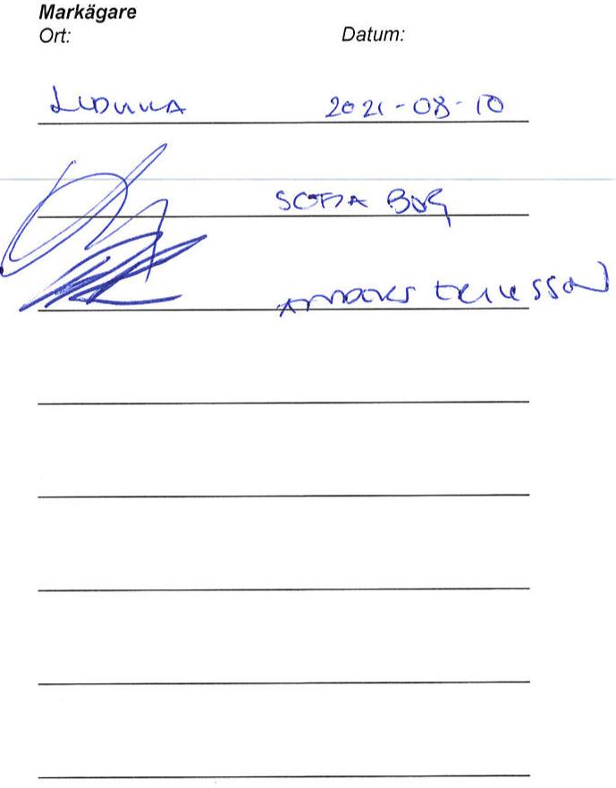
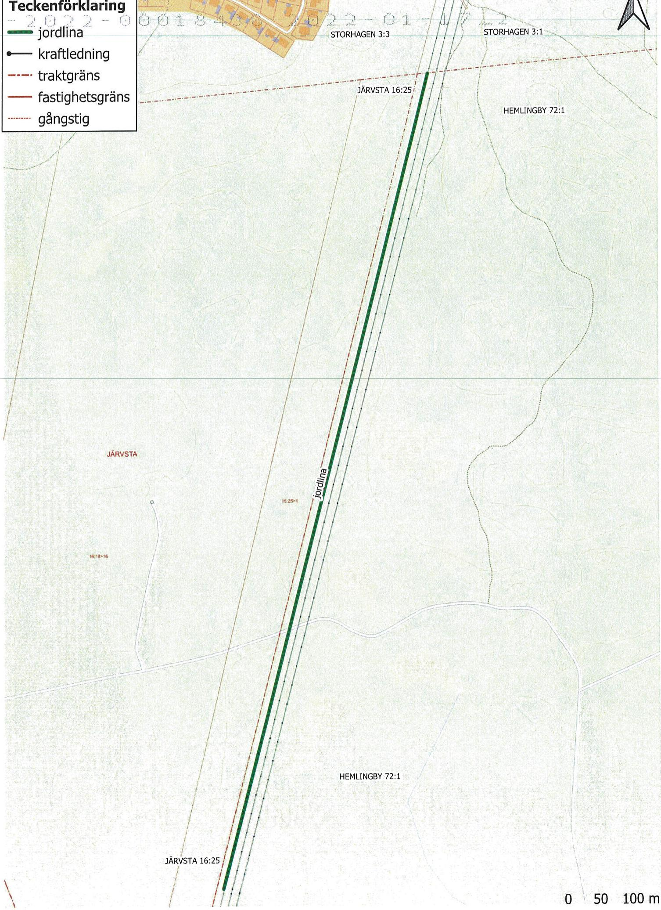
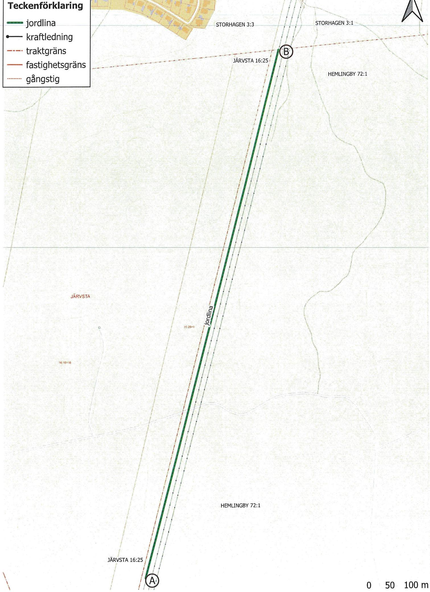

Arendenr: D-2022-00018436   
Inskrivningsdatum: 2022-01-17   
Innehall: Avtalsratighet   
Fastighet: GAVLEHEMLINGBY72:1   
sökande: 556417-0800,Vattenfall EIdistribution AB

# Enligt ansokan har följande inskrivningsatgard beviljats:

Avtalsservitut Jordlina D-2022-00018436:1

Om ratigheten upphor helt eller delvis ska rattighetshavaren ansoka om at inskrivningen ska tas bort.   
Det ska goras inom tre manader fran att rattigheten upphört.

Besluti detta arende har fattats av Carina Thorsén.

# Kostnadsspecifikation:

Expeditionsavgift 375 SEK

Fragor rorande beslut eller ev. avgifteri arendet besvaras av Fastighetsinskrivningen enligt kontaktuppgifter langst upp pa denna sida.

I de fall originalhandlingar, som lamnats ini samband med ansokan ska returneras (ex.   
köpebrev), gors detta i separat försandelse.

# Delta ivar kundnojdhetsundersökning

Vad tycker du som kund om Lantmateriet? Beratta för oss genom att svara pa nagra fragor.Tack for   
hjalpen!   
Till enkaten: www.lantmateriet.se/kundsvar

I detta brev skickar vi tillbaka originalhandlingar som lamnats in i arendet. Handlingarna har skannats och sparas elektroniskt.

Underrattelse i arendet skickas i sarskilt brev tillsammans med eventuell faktura. Ar du ansluten till Mina meddelanden kommer underrattelsen och fakturan istallet att skickas dit.

Med vanlig hälsning Lantmateriet, Fastighetsinskrivning

www.lantmateriet.se/Fastigheter/Min-fastighet

# Markupplatelseavtal avseende jordlinaljordtag

jordlina jordtag

<table><tr><td rowspan=1 colspan=5>Belastad fastighet</td></tr><tr><td rowspan=1 colspan=3>Fastighet (fastighetsagarens)Hemlingby 72:1</td><td rowspan=3 colspan=2>Kontaktperson (namn, adress, postnummer, ort)Bergvik Skog Ost ABHolding c/o HelioSveavägen 911157 StockholmOriginalavtalet skickas til kontaktpersonen</td></tr><tr><td rowspan=1 colspan=1>KommunGävle</td><td rowspan=1 colspan=2>LänGavleborg</td></tr><tr><td rowspan=1 colspan=3>Fastighetsagare (namn, personnummer/organisationsnummer)Bergvik Skog Ost Ab556644-5473Vid fler delagare se separat delagarbilaga</td></tr><tr><td rowspan=1 colspan=3>Förmansfastighet</td><td rowspan=1 colspan=2>Projektsinformation</td></tr><tr><td rowspan=1 colspan=3>Fastighet (ledningsagarens)Fullerö 18:45</td><td rowspan=2 colspan=2>Projektnamn:            Inledning KL64 station LangbroProjektnummer (NIS):   258034Ledningslittera:         KL64</td></tr><tr><td rowspan=1 colspan=2>KommunUppsala</td><td rowspan=1 colspan=1>LänUppsala</td></tr><tr><td rowspan=1 colspan=3>Ledningsagare (namn, organisationsnummer)</td><td rowspan=2 colspan=2>Ansvarig Projektledare:Nicklas Lindqvist</td></tr><tr><td rowspan=1 colspan=3>Vattenfall Eldistribution AB, Org.nr 556417-0800</td></tr><tr><td rowspan=1 colspan=5>Ersättning</td></tr><tr><td rowspan=1 colspan=4>Total ersattning enligt bifogat värderingsprotokoll:</td><td rowspan=1 colspan=1>10328 kr</td></tr><tr><td rowspan=1 colspan=3>UtanordningPID71025244</td><td rowspan=1 colspan=1>Datum211007</td><td rowspan=1 colspan=1>SignaturCAFL/MMPE</td></tr></table>

# s1 Upplatelsens omfattning

a) astigtlf ledningen.

b) Fastigeteereinn eueorisonte asabi (schaktbredd).

Forledningensanlggande tilunderhal,eparatinochfryelefrvivaretiflleerforderigordes.

Fastigetaneeeiaeeeeeelistaal aranpassade tillett rationelltunderhall.Fallda tradoch falld vegetationförbli fastighetsagarens egendom.

d) Fastigeai， underhalreprationch fryeearvid edningareadenmndeaanskeutanvsentigolgenet,iak fastighetsagaren givna anvisningar betraffande ratten att ta vǎg.

# $\ S 2$ Föreskrifter

a) Ledningsagaren ska utova ratigheterna sa att egendomen inte betungas mer än nödvandigt.

b) Fastigeaifngp ledningens bibehallande enligt vid varje tidpunkt gällande säkerhetsföreskrifter äventyras.

3mfrnmarabe.Ineeller utnleninarensedivandupplagelle linndenoraselr arnivnn ovanför markkabeln sa att reparation och underhall försvaras.

c) Fastigeiar el att genom sakkunnig personal anvisa eller vidta lämpliga skyddsatgärder.

aledningeutanstfstgtsae.einenaavnfeeroste  id av de anvisade skyddsatgärderna.

d) Markabel er-etearfgaspsdat abruningeteeak soralavidunkenf ledningens anlaggande efter anlaggandet ska kunna utovas ovanför markkabeln.

Markaelar fassantoaasrsete i iuktenfeingensagane efr anliggandet ska kunna utovasinvid markkabeln och normala transporter ska kunna ske ver markkabeln. Da besvariga markforhlandenobinatinmedsogsbrksatrder ssomung ranspreinet markaenuppenart riseraa skadas ska dock atgarderna omedelbart avbrytas och ledningsagaren kontaktas.

Markkabel ska inomvgomrade for ensid vg forlggasp sdant sata nomaltnyiande ochunderhall avvagen efe anlaggandet inte försvaras.

# s3 Tilltrade

Ledningsägaren far omedelbart ta i ansprak dei enlighet med $\ S \uparrow$ upplatna rättigheterna. Tilträde anses ha skett da anlaggande av med staknings- och mätningsarbeten.

# s4 Ersattning

a) grundernai expropritionslagen.Ersatningenrenengngsersatning som skaberknas meddevarderingsmetoderför ledningsintrang som allmant tillampas vid tidpunkten för tillträde.

Ersninedleecisflladnentieetalasseenef det att overenskommelse om ersattning trfats och erforderlig koncession och ovriga tillstand erhallits.

Har tiltrade agt rum innan ersattningen erlaggs,ska ersattning för intrang uppräknas enligt $4 k a p 4 \ S$ expropriationslagen fran den dag tiltradet skedde enligt definitioneni $\ S 3$ til idpunkten for traffande av overenskommelse om ersattningen. Dartil skaranta enligt expropriationslagen utga pa det uppraknade beloppet franoch med tiltrdesdagen tiloch med betalningsdagen.

b) rie

Ersnineietaffeaia sadan ersättning erlagts tidigare.

Nar abonnemangsförhallande foreligger ska ersattning dock inte betalas för obetydlig skada.

c) Uppke aeri aoiifrstefengeringeniaestanso na falt ska behandlas enligt detta stycke.

d) Aregelleeeuppelelaeeevee traffas med rattighetshavaren för bestammande av den ersäittning som denne ar berattigad till.

e)Kanverenselrninintrfasaistenraieingsftingsnelt.

# $\ S 5$ Virkeshantering mm.

Ledningsrensmntersidafranleernnatmnainfationiastigetsrenmfrestndeavekin sambandmednyanliggning ochunderhal Ledningsgaren ska ven，om sakan skeenlit dennes bedmning，erbjuda fastighetsagaren att inom skalig tid svara för avverkningen.

leningaferinge.einganveaiataaaietingani aerkineurerdndeietViundelningsnterdeasestf som fäills utanför engangsersatt skogsgata.

saatfarafsetsangepiefikestnseerenelgeependaannninpst

# $\ S 6$ Ledningsförrättning m.m.

Detta avtal far laggas till grund for beslut om ledningsrätt sasom överenskommelse enligt $1 4 \ S$ första stycket ledningsrattslagen. att idvertelseellerupplatelseavegendomen el ledningenberrelravra frehalloeaavtals bestnd

Omledingaenedstdenabestmeleanselingstbtde fstgegaen-igetsaarensa

# $\ S 7$ Overlatelse av ledningen

Leingee skyldigheteri detta avtal.

# $\ S 8$ Borttagande av ledning

Olingeaeningsist ianeef meddelaertieteseedleinedevsfnalnelensidsunkaleinresand tillse att ledningen med tillhörande anordningar tas bort.

$\therefore$ 022-01-17

Aregenenelleelsoereinn ellnnlgning soatasea utarenerelr upplaten pa annat sätt?

# Nej

Sasomaenatortigethavavanmagendoner agfrestedeaal illaelaenanin min/var rätt berörs.

Av detta avtal har tva likalydande exemplar upprattats och utvaxlats mellan parterna

Namnförtydligande

# Bilaga markuppatelseavtal Hemlingby 72:1 jordlina för kraftledning KL64

<table><tr><td rowspan=1 colspan=2>Organisationsnummer556644-5473</td></tr><tr><td rowspan=1 colspan=1>Objektets registreringsdatum2003-05-27</td><td rowspan=1 colspan=1>Företagsnamnets registreringsdatum2004-04-29</td></tr><tr><td rowspan=1 colspan=1>Dokumentet skapat2021-08-1810:27</td><td rowspan=1 colspan=1>Sida2(3)</td></tr></table>

# EXTERN VERKSTALLANDE DIREKTOR

840728-0281 Berg, Sofia Elisabet, Jarvsogrand 15, 162 62 VALLINGBY

# EXTERN(A) FIRMATECKNARE

671112-6638 Eriksson, Lars Anders, Backgatan 8, 771 35 LUDVIKA

# REVISOR(ER)

556029-6740 Ohrlings PricewaterhouseCoopers AB, 113 97 STOcKHOLM Representeras av: 670303-4030

# HUVUDANSVARIG REVISOR

670303-4030 Johansson, Gustav Martin, Vastmannagatan 31,113 25 STOCKHOLM

# FIRMATECKNING

Firman tecknas av styrelsen   
Firman tecknas tva i forening av ledamoterna   
Firman tecknas i forening av Berg, Sofia Elisabet Eriksson, Lars Anders

Dessutom har verkstallande direktören ratt att teckna firman betraffande lopande forvaltningsatgärder

# FORESKRIFT OM ANTAL STYRELSELEDAMOTER/STYRELSESUPPLEANTER

Styrelsen skall besta av lagst 3 och hogst 10 ledamoter med hogst 10 suppleanter.

# BOLAGSORDNING

Datum för senaste andringen: 2019-08-30

# FORBEHALL/AVVIKELSER/VILLKOR I BOLAGSORDNINGEN

Hembudsförbehall

# VERKSAMHET

Bolaget skall:

-aga 285 000- 350 000 hektar produktiv skogsmark jamte tillhörande impediment. Bolaget skall inte aga ratt att minska den langsiktiga avverkningsmojligheten (hansyn tagen till dagens kända restriktioner) under 980 O00 kubikmeter fast under bark

Bolagsverket bidades den1 juli2004genom atden tidigareBolagsavdelningen idPatent-ochregistreringsverket blevegen myndigetDrrannds frnchmeddeta datumya bevisdokument utrdadeavdenya myndigheten

<table><tr><td>Bolagsverket 85181Sundsvall</td></tr><tr><td>Organisationsnummer:202100-5489</td></tr><tr><td>Telefon: E-post:</td></tr><tr><td>0771-670 670 bolagsverket@ bolagsverket.se</td></tr><tr><td></td></tr><tr><td></td></tr><tr><td>Fax: Webbplats:</td></tr><tr><td>060-12 98 40 www.bolagsverket.se</td></tr><tr><td></td></tr><tr><td></td></tr><tr><td></td></tr><tr><td></td></tr></table>

<table><tr><td rowspan=1 colspan=2>Organisationsnummer556644-5473</td></tr><tr><td rowspan=1 colspan=1>Objektets registreringsdatum2003-05-27</td><td rowspan=1 colspan=1>Foretagsnamnets registreringsdatum2004-04-29</td></tr><tr><td rowspan=1 colspan=1>Dokumentet skapat2021-08-1810:27</td><td rowspan=1 colspan=1>Sida3 (3)</td></tr></table>

arligen och ska inte heller aga ratt att vidtaga sadana   
förandringar som medfor att det genomsnittliga transportavstandet till Gavle ökar i icke ovasentligt hanseende.   
-bedriva försaljning av virke och skogsbruksrorelse, samt darmed förenlig eller anknuten verksamhet, innefattande upplatande av rattigheter till skogstillgangarna och annan mark, marknadsföring och försaljning av produkter härrörande fran dessa tillgangar samt kǒp och försaljning av mark.   
Bolaget skall bedriva en ekologiskt hallbar skogsproduktion, vilket bland annat skall inkludera att ha stabila eller okande avverkningsnivaer.

# RAKENSKAPSAR

0101-1231

# KALLELSE

Kallelse ska ske genom brev med posten.

# TIDIGARE FORETAGSNAMN

2003-06-30 Marma Skog Ho1ding AB   
2003-05-27 Guldskalen D 128 AB

Registreringsbeviset ar skapat av Bolagsverket.

Bolagsverket bildades den 1 juli 2004genom atden tidigare BolagsavdelningenvidPatent-ch registreringsverket blevegen myndiget.Dranvnds frnchmedda datumnya bevidokument utrdadeav dennya myndigeten.

<table><tr><td>Bolagsverket 85181 Sundsvall</td></tr><tr><td>Organisationsnummer: 202100-5489</td></tr><tr><td>Telefon: E-post:</td></tr><tr><td>0771-670670 bolagsverket@bolagsverket.se</td></tr><tr><td></td></tr><tr><td>Fax: Webbplats:</td></tr><tr><td>060-12 9840 www.bolagsverket.se</td></tr><tr><td></td></tr></table>

<table><tr><td rowspan=1 colspan=2>Organisationsnummer556644-5473</td></tr><tr><td rowspan=1 colspan=1>Objektets registreringsdatum2003-05-27</td><td rowspan=1 colspan=1>Foretagsnamnets registreringsdatum2004-04-29</td></tr><tr><td rowspan=1 colspan=1>Dokumentet skapat2021-08-1810:27</td><td rowspan=1 colspan=1>Sida1 (3)</td></tr></table>

Org.nummer: Foretagsnamn: Adress:

556644-5473   
Bergvik Skog Ost AB   
c/o Billerudkorsnas Skog & Industri AB   
801 81 GAVLE   
stockholms lan, stockholm kommun

säte: Registreringslan: Anmarkning:

Detta är ett privat aktiebolag.

# BILDAT DATUM

2003-03-04

# SAMMANSTALLNING AV AKTIEKAPITAL

Aktiekapital: 100.000SEK Lagst.......: 100.000 SEK Högst 400.000 SEK

Antal aktier: 1.000   
Lagst.......: 1.000   
HOgst.......: 4.000

# STYRELSELEDAMOT, ORDFORANDE

560321-7893 Astrom, Jan Oliver, c/o Bi1lerudsKorsnas AB, Box 703, 169 27 SOLNA

# STYRELSELEDAMOTER

580108-0325 Ekelund Sundewall, Caroline B M, Sodra Kustvagen 31 A, 254 81 HELSINGBORG   
780819-1410 Lundeborg, Bo Erik Fredrik, Svalnasvagen 39, 182 63 DJURSHOLM   
790502-0025 Romberg, Katarina Anna Maria, Linnégatan 37 Lgh 1202, 114 47 STOCKHOLM   
740808-3280 Tuominen-Reini, Anna-Maria, Tulegatan 12 Lgh 1505,

Bolagsverket bildades den 1 juli 2004genomat den tidigareBolagsavdelningen vidPatent-och registreringsverket blevegen myndighet.Drfr anvnds frn och med detta datumya bevisdkument utfrdade av den nyamyndigheten.

Bolagsverket 85181 Sundsvall

Organisationsnummer:202100-5489

Telefon: 0771-670670

E-post: bolagsverket@bolagsverket.se

Fax: 060-12 9840

Webbplats: www.bolagsverket.se

Ovanstaende godknns ochersittning sitts in pa följinde konto (vriga deligare redovisas pa foljiande sida/sidr)   

<table><tr><td rowspan=1 colspan=6>FASTIGHET /SAMFALLIGHET SaMt PROJEKTINFORMATION                                                      Version 2021 (2020.12.10)</td></tr><tr><td rowspan=1 colspan=1>Fastighetsbeteckning:Kommun:Fastighetsnummer:</td><td rowspan=1 colspan=2>HEMLINGBY 72:1GävleBergvik Skog Öst AB,</td><td rowspan=1 colspan=2>Projektnummer:Ledning:Koncessionslöpnr:</td><td rowspan=1 colspan=1>NIS 258034, PN.97.012.04KL6410997, 11034</td></tr><tr><td rowspan=1 colspan=1>Kontaktperson &amp; adress:</td><td rowspan=1 colspan=2>Holding c/o Helio, Sveavagen 9</td><td rowspan=1 colspan=2>Varderingstidpunkt:Varderingsman &amp; företag:</td><td rowspan=1 colspan=1>2021-06-22Björn Amundsson/Amund Co.</td></tr><tr><td rowspan=1 colspan=5>1. SCHABLONERSATTNING FOR MARKLEDNINGIAKER, BETE, JORDBRUKSIMPEDIMENT, SamtOVRIG MARK UTANFOR DETALPLAN</td><td rowspan=1 colspan=1>NFOR DETALPLAN</td></tr><tr><td rowspan=1 colspan=4>Beskrivning (typ, placering,etc)</td><td rowspan=1 colspan=1>Längd</td><td rowspan=1 colspan=1>Bredd</td></tr><tr><td rowspan=1 colspan=5>jordlinai strackning A-Bikarta                                                            1300m</td><td rowspan=1 colspan=1>1m</td></tr><tr><td rowspan=1 colspan=6>Summa:         5298kr</td></tr><tr><td rowspan=1 colspan=6>2. SCHABLONERSATTNING FOR NATSTATIONER, KABELSKAP och SIOKABELSKYLTAR (Ej inom detaljplan)</td></tr><tr><td rowspan=1 colspan=2>Beskrivning (typ, placering, yta,etc)</td><td rowspan=1 colspan=3>Typ och markslag</td><td rowspan=1 colspan=1>Antal</td></tr><tr><td rowspan=1 colspan=2></td><td rowspan=1 colspan=3></td><td rowspan=1 colspan=1></td></tr><tr><td rowspan=1 colspan=6>Summa:             kr</td></tr><tr><td rowspan=1 colspan=6>3.ERSATTNING FOR HINDER I AKERMARK - For ersattningsberäkning se bilaga</td></tr><tr><td rowspan=1 colspan=5>Beskrivning (typ, placering, etc)</td><td rowspan=1 colspan=1>Ersattning</td></tr><tr><td></td><td></td><td></td><td></td><td></td><td rowspan=1 colspan=1></td></tr><tr><td rowspan=1 colspan=6>Summa:              kr</td></tr><tr><td rowspan=1 colspan=6>4 a. ERSATTNING FOR LEDNING ISKOGSMARK - För ersttningsberakning se bilaga</td></tr><tr><td rowspan=1 colspan=5>Beskrivning(typ, placering,etc)</td><td rowspan=1 colspan=1>Ersittning</td></tr><tr><td></td><td></td><td></td><td></td><td></td><td rowspan=1 colspan=1></td></tr><tr><td rowspan=1 colspan=6>Summa:             kr</td></tr><tr><td rowspan=1 colspan=6>4 b. ROTNETTO (Ersitts separat) - For ersattningsberäkning se bilaga</td></tr><tr><td rowspan=1 colspan=6>Anvands for berkningavpslag (25%enligt expropriationslagensamt 20%srskid erittning for overenskommelse)</td></tr><tr><td rowspan=1 colspan=6>Totalt rotnetto enligt bilaga:                                          Ersaittning for rotnetto reglerasi bilaga</td></tr><tr><td rowspan=1 colspan=6>5. ERSATTNING FOR OVRIGT INTRANG - För ersattningsberakning se bilaga</td></tr><tr><td rowspan=1 colspan=5>Beskrivning (typ, placering,etc)</td><td rowspan=1 colspan=1>Ersattning</td></tr><tr><td></td><td></td><td></td><td></td><td></td><td rowspan=1 colspan=1></td></tr><tr><td rowspan=1 colspan=6>Summa:             kr</td></tr><tr><td rowspan=1 colspan=6>6 a. ERSATTNING FOR LEDNING ISKOGSMARK ENLIGT STORSKOGSBRUKSAVTALET</td></tr><tr><td rowspan=1 colspan=4>Beskrivning(typ,placering,etc)                   Omrade:</td><td rowspan=1 colspan=1>Lǎngd</td><td rowspan=1 colspan=1>Bredd</td></tr><tr><td rowspan=1 colspan=5></td><td rowspan=1 colspan=1></td></tr><tr><td rowspan=1 colspan=6>Summa:          -kr</td></tr><tr><td rowspan=1 colspan=6>6 b. ERSATTNING FOR INTRANG INOM VAGANLAGGNING ENLIGT STORSKOGSBRUKSAVTALET</td></tr><tr><td rowspan=1 colspan=4>Beskrivning (typ, placering,etc)</td><td rowspan=1 colspan=1>Längd</td><td rowspan=1 colspan=1>Zon</td></tr><tr><td rowspan=1 colspan=4></td><td rowspan=1 colspan=1></td><td rowspan=1 colspan=1></td></tr><tr><td rowspan=1 colspan=6>Summa:              kr</td></tr><tr><td rowspan=1 colspan=6>7.SAMMANSTALLNING</td></tr><tr><td rowspan=1 colspan=6>Summa intrangsersattning:        5 298 krTillagg enligt expropriationslagen:         1325krSarskild ersattning vid överenskommelse:        1325krGrundersattning vid overenskommelse:        2380kr</td></tr><tr><td rowspan=1 colspan=6>TOTAL ERSÄTTNING      10 328 kr</td></tr></table>

utgar ränta enligt 6 s rǎntelagen. Tilfalliga skador regleras vid skadetilfället.

Fastighetsagare(personnr/org.nr) Agd andel Ersäittning Fastighetsagarens godkannande   
Billerudkorsnas Skog & Industri AB Underskrift/Datum: 201-08-10 1 10328,00 kr   
556644-5473   
Banknamn… Clearingnr Kontonummer, Pg/Bg, IBAN&SWIFT\*: 5730-6326   
Referens: Telefonnummer: E-post:

<table><tr><td colspan="3">Fastighetsagare (personnr/org.nr) Agd andel</td><td>Ersäittning Underskrift/Datum:</td><td>Fastighetsagarens godkinnande</td></tr><tr><td colspan="2"></td><td></td><td>kr</td><td></td></tr><tr><td colspan="2">Banknamn:</td><td>Clearingnr:</td><td></td><td>Kontonummer, Pg/Bg, IBAN &amp; SWIFT*:</td></tr><tr><td colspan="2"></td><td colspan="2"></td><td></td></tr><tr><td rowspan="4">Referens:</td><td colspan="3">Telefonnummer:</td><td>E-post:</td></tr><tr><td colspan="3"></td><td></td></tr></table>

<table><tr><td colspan="2">Fastighetsagare (personnr/org.nr)</td><td colspan="2">Agd andel Ersättning</td><td>Fastighetsagarens godkannande Underskrift/Datum:</td></tr><tr><td colspan="2"></td><td>Clearingnr:</td><td>kr</td><td></td></tr><tr><td colspan="2">Banknamn: </td><td colspan="2"></td><td>Kontonummer,Pg/Bg, IBAN &amp; SWIFT*: E-post:</td></tr><tr><td rowspan="3">Referens:</td><td colspan="3">Telefonnummer:</td><td></td></tr><tr><td colspan="3"></td><td></td></tr></table>

<table><tr><td colspan="2">Fastighetsigare(personnr/org.nr)</td><td>Agd andel</td><td>Ersattning</td><td>Fastighetsagarens godkannande</td></tr><tr><td colspan="2"></td><td></td><td>kr</td><td>Underskrift/Datum:</td></tr><tr><td colspan="2">Banknamn:</td><td colspan="2">Clearingnr:</td><td>Kontonummer, Pg/Bg, IBAN &amp; SWIFT*</td></tr><tr><td rowspan="3">Referens:</td><td colspan="3">Telefonnummer: -post:</td><td></td></tr><tr><td colspan="3"></td><td></td></tr></table>

<table><tr><td colspan="2">Fastighetsagare (personnr/org.nr)</td><td colspan="2">Agd andel Ersattning</td><td>Fastighetsagarens godkannande Underskrift/Datum:</td></tr><tr><td colspan="2">……</td><td></td><td>kr</td><td></td></tr><tr><td colspan="2">Banknamn:</td><td colspan="2">Clearingnr:</td><td>Kontonummer,Pg/Bg, IBAN &amp; SWIFT*:</td></tr><tr><td rowspan="2">Referens:</td><td colspan="3">Telefonnummer:</td><td>E-post:</td></tr><tr><td colspan="3"></td><td></td></tr></table>

<table><tr><td rowspan=1 colspan=5>Fastighetsagare (personnr/org.nr)                Agd andel     Ersättning    Fastighetsagarens godkannande</td></tr><tr><td rowspan=1 colspan=2></td><td rowspan=1 colspan=1></td><td rowspan=1 colspan=1>kr</td><td rowspan=1 colspan=1>Underskrift/Datum:</td></tr><tr><td rowspan=1 colspan=2>Banknamn:</td><td rowspan=1 colspan=2>Clearingnr:</td><td rowspan=1 colspan=1>Kontonummer, Pg/Bg, IBAN &amp; SWIFT*:</td></tr><tr><td rowspan=1 colspan=1>Referens:</td><td rowspan=1 colspan=3>Telefonnummer:</td><td rowspan=1 colspan=1>E-post:</td></tr></table>

<table><tr><td rowspan=1 colspan=5>Fastighetsaigare (personnr/org.nr)                Agd andel    Ersättning    Fastighetsagarens godkannande</td></tr><tr><td rowspan=1 colspan=2></td><td rowspan=1 colspan=1></td><td rowspan=1 colspan=1>kr</td><td rowspan=1 colspan=1>Underskrift/Datum:</td></tr><tr><td rowspan=1 colspan=2>Banknamn:</td><td rowspan=1 colspan=2>Clearingnr:</td><td rowspan=1 colspan=1>Kontonummer, Pg/Bg, IBAN &amp; SWIFT*:</td></tr><tr><td rowspan=1 colspan=1>Referens:</td><td rowspan=1 colspan=3>Telefonnummer:</td><td rowspan=1 colspan=1>E-post:</td></tr></table>

<table><tr><td rowspan=1 colspan=5>Fastighetsagare (personnr/org.nr)                 Agd andel     Ersättning   Fastighetsagarens godkannande</td></tr><tr><td rowspan=1 colspan=2></td><td rowspan=1 colspan=1></td><td rowspan=1 colspan=1>kr</td><td rowspan=1 colspan=1>Underskrift/Datum:</td></tr><tr><td rowspan=1 colspan=2>Banknamn:</td><td rowspan=1 colspan=2>Clearingnr:</td><td rowspan=1 colspan=1>Kontonummer, Pg/Bg, IBAN &amp;SWIFT*:</td></tr><tr><td rowspan=1 colspan=1>Referens:</td><td rowspan=1 colspan=3>Telefonnummer:</td><td rowspan=1 colspan=1>E-post:</td></tr></table>

Sr att kunna göra en utbetalning tillutlindskt konto behovs BAN-nummer och bankens SWiFT-koc

  
Bilaga varderingsprotokoll Hemlingby 72:1 jordlina A-B för kraftledning KL64

Markagare: Andel: 1/1

Ledning: VALBO-SALGSJON-LANGBRO-KARSKAR Litt/Nr: KL64 / 00330 Fastighet: Gävle HEMLINGBY72:1 NIS proj: 258034 / Inledning KL64 Stn Langbro Proj led: Inge Gustafsson / Nicklas Lindqvist

# SPECIFIKATION:

Intrangsersattning (Markintrang):   
Markkabel 130kV/ m bredd:   
Jordlinai strA-Bi karta/1300mà1 m br: 5298 kr   
Tillägg enl expropriationslagen: 1325kr   
Sarskild ersattning vid överenskommelse: 1325 kr   
Grundersattning vid överenskommelse: 2380kr   
Försaljning Rotnetto(m3fub):   
Moms pa rotnettot:   
Fördyrat tillyaratagande:

# SUMMA ersättning:

# 10328 kr

# 2560/CAFL

<table><tr><td rowspan=1 colspan=2>MottagningsgodkǎnnandeCatarina A-Floberg</td><td rowspan=1 colspan=1>Datum210831</td><td rowspan=1 colspan=1>Ny moms:</td></tr><tr><td rowspan=1 colspan=1>Baskonto</td><td rowspan=1 colspan=2>PN nr:               RU2560</td><td rowspan=1 colspan=1>Belopp</td></tr><tr><td rowspan=1 colspan=1>487011</td><td rowspan=1 colspan=2>97.12.04</td><td rowspan=1 colspan=1>10328,-</td></tr></table>

# Ers Godk av: Sofia Berg / Anders Eriksson VAT-Nr: SE556644547301

Onskas ersittning insatt på eget konto:

Bank

Onskas ersäittning insatt pa eget Plus- eller Bankgiro:

Plus- /Bankgiro